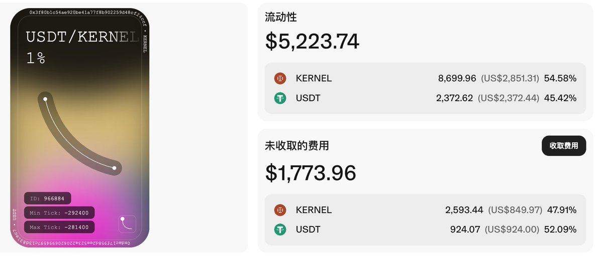

# LP Kernel 鏈上流動性挖礦策略與實踐

> **來源**: [@feikerwu](https://x.com/feikerwu/status/1912057978318131364)
>
> **日期**: 
>
> **標籤**: `LP策略` `流動性挖礦` `滑點管理`

---

> **來源**: [@feikerwu](https://twitter.com/feikerwu)
> **日期**: 2026-02-18
> **標籤**: `DeFi` `LP` `Kernel` `鏈上交易` `流動性挖礦`

---

## 策略概述

LP Kernel 鏈上先開，給了 1 小時左右的鏈上流動性機會。實際操作延續到第二天，本金加上手續費扣除無常損失，大概獲利 1.2k。

## 注意事項

這個路子下次還能玩，但需要注意以下兩點：

### 1. 池子規模與滑點問題

鏈上池子小，交易量巨大，交易滑點很高。頂著 5-10% 的磨損做的買入，所以很難塞比較大的 LP。

### 2. 價格波動與工具限制

價格波動很快，插池子的滑點很高。Uniswap 前端介面比較笨，插入 LP 沒辦法設置滑點，所以會不停觸發交易失敗。

後續需要找一些繞過前端的腳本或者工具來直接提供流動性。
