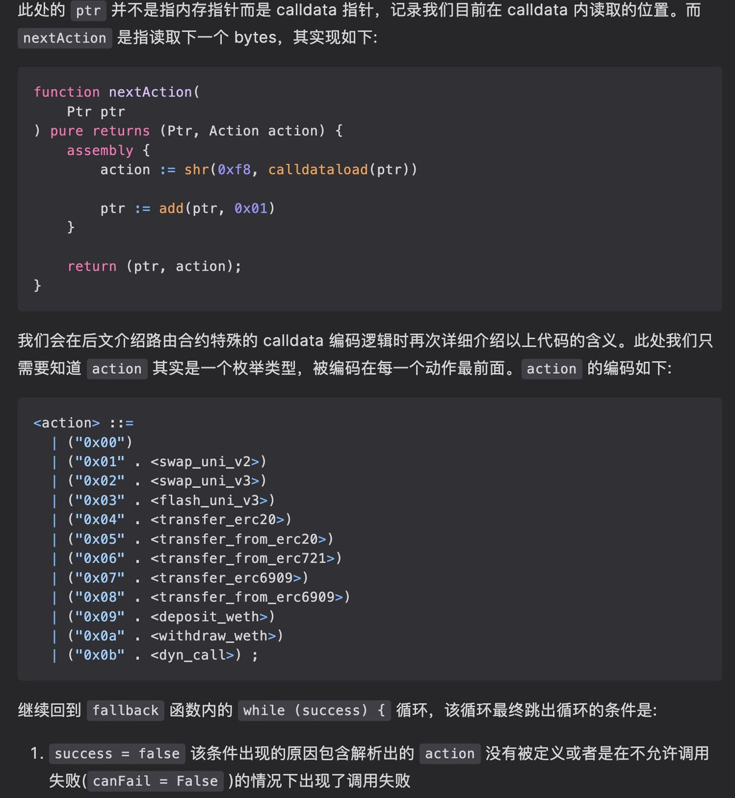

# Lotus Router 合約 Calldata 編碼設計解析

> **來源**: [@wong_ssh](https://x.com/wong_ssh/status/1911471307260395896) | [原文連結](https://twitter.com/wong_ssh/status/1911471307260395896/photo/1)
>
> **日期**: Sun Apr 13 17:27:27 +0000 2025
>
> **標籤**: `路由合約` `智能合約` `EVM`

---

> **來源**: [@wong_ssh (WongSSH)](https://twitter.com/wong_ssh)
> **日期**: 2026-02-18
> **標籤**: `smart-contract` `router` `evm` `calldata` `defi`

---

## Lotus Router 合約簡介

我個人最近對路由合約非常感興趣,而幾個月前 @jtriley2p 開源了 Lotus Router 合約源代碼,該合約有一個精巧的 calldata 編碼設計。

## 技術特點

雖然內部包含大量內聯彙編 (inline assembly),但其實都並不難讀。可能稍有一些 EVM 底層知識就可以看懂。

## 文章內容

目前文章主要介紹了 Router 合約的基礎執行原理,特別是如何處理回調 (callback)。

## 參考資源

詳細內容可參考原文: https://t.co/oQL2ssj7tx

