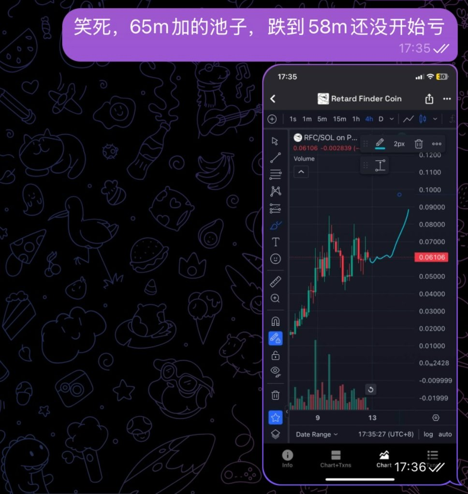
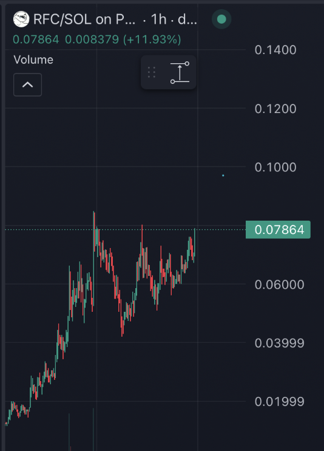

# DLMM 流動性供應策略：震盪行情下的時間朋友

> **來源**: [@QuantVela](https://x.com/QuantVela/status/1911414572197494810) | [原文連結](https://twitter.com/QuantVela/status/1911414572197494810/photo/1)
>
> **日期**: Sun Apr 13 13:42:01 +0000 2025
>
> **標籤**: `DLMM` `LP策略` `風險管理`

---

> **來源**: [@QuantVela (Vela)](https://twitter.com/QuantVela)
> **日期**: 2026-02-18
> **標籤**: `DeFi` `DLMM` `流動性供應` `震盪行情` `交易策略`

---

## 建倉策略

這次建倉 RFC 的 DLMM 在 65m 使用了 spot 配置：

- **資產配置**: 20% RFC + 80% SOL
- **價格區間**: 上下 30%
- **交易觀點**: 短期看震盪，長期看多

## 交易觀點的三個維度

一個完整的交易觀點是立體的，包含三個維度：

1. **方向**（Direction）
2. **時間**（Time）
3. **路徑**（Path）

## DLMM vs 合約交易

**合約交易**：
- 需要同時預測對方向和路徑
- 對時機和價格路徑要求較高

**DLMM 流動性供應**：
- 不要求三個維度都預測正確
- 在震盪行情中依然能持續獲利
- 做時間的朋友
