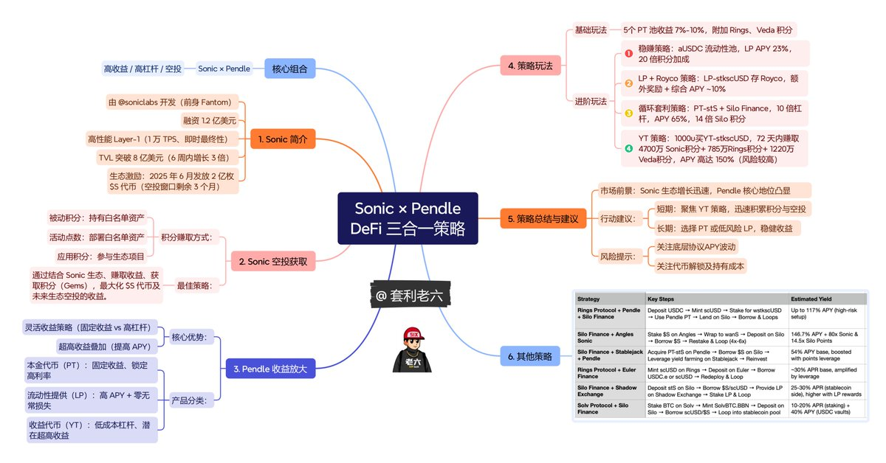

# Sonic×Pendle 指南：如何把空投放大 10 倍

> **來源**: [@taolige666](https://x.com/taolige666/status/1904351595263082537) | [原文連結](https://twitter.com/taolige666/status/1904351595263082537/photo/1)
>
> **日期**: 
>
> **標籤**: `Sonic` `Pendle` `流動性挖礦`

---

> **來源**: [@taolige666 (套利老六)](https://twitter.com/taolige666)
> **日期**: 2025-02-18
> **標籤**: `Sonic` `Pendle` `空投策略` `DeFi收益`

---

## 概述

這可能是你擼 @SonicLabs 最好的方式,根據 @BTW0205 的思路做了一張圖,結合我之前的推文方法,綜合 APY 收益 20%~150%。

## 策略方向

### 短期策略
聚焦 YT 策略,迅速累積積分與空投

### 長期策略
選擇 PT 或低風險 LP,穩健收益

## 相關協議
- @SonicLabs
- @pendle_fi
- @AndreCronjeTech
- @BTW0205
