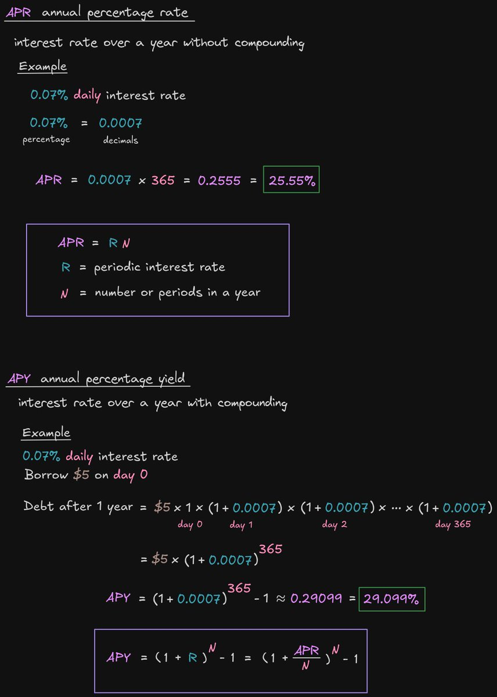

# APR 與 APY 計算指南

> **來源**: [@ProgrammerSmart](https://x.com/ProgrammerSmart/status/1885141007748259888) | [原文連結](https://twitter.com/ProgrammerSmart/status/1885141007748259888/photo/1)
>
> **日期**: Fri Jan 31 01:40:15 +0000 2025
>
> **標籤**: `DeFi基礎` `收益計算` `複利`

---

