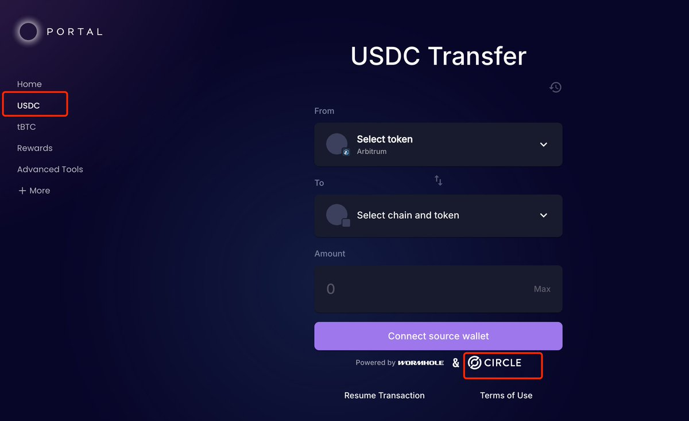

# USDC 跨鏈無損橋接技巧 — Circle 官方 API

> **來源**: [@wildrose_one](https://x.com/wildrose_one/status/1881151786746269883) | [原文連結](https://twitter.com/Robertzoux/status/1881151786746269883/photo/1)
>
> **日期**: Mon Jan 20 01:28:30 +0000 2025
>
> **標籤**: `跨鏈橋` `USDC` `Circle`

---

★ Insight ─────────────────────────────────────
• 本文介紹如何使用 Circle 官方 API 進行 USDC 跨鏈轉帳,避免中心化交易所提幣限制
• Circle 採用「一端銷毀、另一端鑄造」機制,而非傳統跨鏈橋的鎖定/釋放模型
• EVM 鏈之間可無損秒到,EVM 到 Solana 約 18 分鐘,不受其他橋接協議擁堵影響
─────────────────────────────────────────────────

> **來源**: [@wildrose_one (McDonaldss)](https://twitter.com/wildrose_one)  
> **標籤**: `USDC` `跨鏈橋` `Circle API` `Solana` `DeFi`

---

## 操作方式

使用 Circle 官方跨鏈橋功能,可在 Portal 側邊欄選擇「USDC」欄位,此功能直接調用 Circle 官方 API。

## 技術原理

Circle 官方跨鏈採用「銷毀-鑄造」(Burn-Mint)機制:

- 在來源鏈銷毀 USDC
- 在目標鏈直接鑄造等量 USDC
- 不涉及鎖定/釋放的流動性池模型

## 跨鏈效能

| 路徑 | 到達時間 | 損耗 |
|------|----------|------|
| EVM ↔ EVM | 秒級 | 無損 |
| EVM → Solana | 約 18 分鐘 | 無損 |

## 優勢

1. **不受第三方影響**:不用擔心中心化交易所暫停 Solana 提幣
2. **無擁堵風險**:不受其他跨鏈橋流動性或網路擁堵影響
3. **官方保證**:由 USDC 發行方 Circle 官方提供,安全性更高
