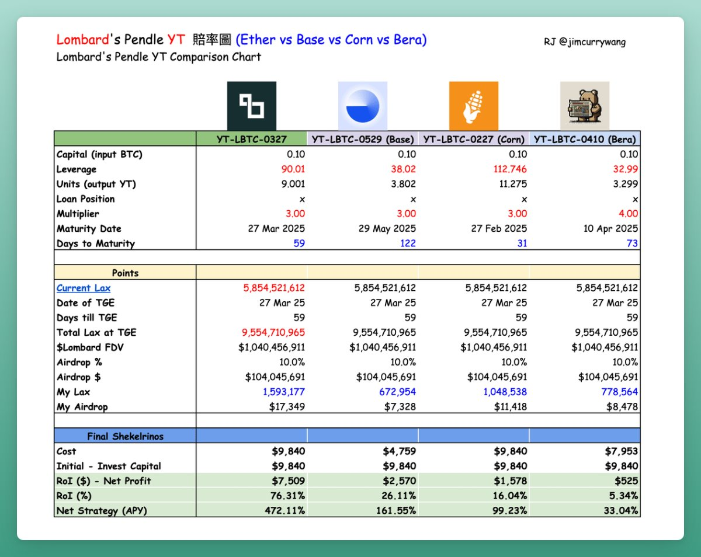

# Lombard BTCfi 龍頭地位與 Pendle YT-LBTC 投資策略分析

> **來源**: [@jimcurrywang](https://x.com/jimcurrywang/status/1883682114153128382)
>
> **日期**: Mon Jan 27 01:03:07 +0000 2025
>
> **標籤**: `BTCfi` `Pendle` `流動性挖礦`

---

> **來源**: [@jimcurrywang (RJ ♣️)](https://twitter.com/jimcurrywang)
> **日期**: 2026-02-18
> **標籤**: `BTCfi` `Lombard` `Pendle` `YT-LBTC` `Kaito` `Berachain`

---

最近完全被 @_kaitoai 洗版，有點意外看到 AttentionFi 居然這麼熱。來聊聊目前排名第四的 Lombard，它究竟有什麼機會值得關注？

## 論點

- **最大積分賭場 Pendle 三月到期的 YT-LBTC 可以賭賭看**
- **Base 和 Corn 組合，這組基本就是坑，建議避開**
- **Bera 組建議再等等，坑不坑取決於 Boyco 那包大不大包**

## 理由分析

### 1. Kaito 與 Pendle 榜單雙重背書

Kaito 與 Pendle 榜上的項目基本都是經過市場基本篩選的優質清單，若兩邊都上榜的項目，基本大概率沒問題。

### 2. Lombard 的地位

@Lombard_Finance 是名副其實的 BTCfi 龍頭，之前炒得很兇的 @SolvProtocol 充其量也只能算「龍二」。

### 3. 賽局博弈與生態合作加持

除了博弈策略，Lombard 的合作夥伴與賠率都經得起推敲,整體賠率試算 Okay。

老實說，Lombard 在『Kaito Connect』的榜單上只排到第四位，有點被看扁了。從實力到投資陣容來看，無庸置疑很頂。這週沒上榜，下週沒意外就會上了！

### 4. BTCfi 三巨頭

若按照 TVL 量排序：**Lombard > Solv > pumpBTC**

但 Solv 已經率先發幣，@Pumpbtcxyz 老三預計也會趕快趁好機會 TGE（聽說會是二月底），那按照賽局博弈，Lombard 肯定是會想要拖到最後，發動吸血鬼攻勢，吸取榨乾老二老三的流動性。

**TGE 順序預期**：
- Solv（一月）> pumpBTC（二月）> Lombard（三月）

表格中的 TGE 預期日期抓 3/27，總積分從鏈上抓回來的，大數法則下估計，應該大差不差。

## 投資策略建議

### 推薦：以太主網三月組

我最喜歡也認為最好的賠率是以太主網上三月的那組。

### 避開：Base + Corn 組合

新開在 Base 鏈上的，和 Corn 合作的應該會虧爆。

### 觀望：Berachain 組合

至於 @berachain 合作的那組，有點一言難盡，背後的博弈點太多。單純看帳面純 Lax 數據，賠率不是很高。

**建議想存 Berachain 的再等等觀望**，特別是大資金。官方質押 "Boyco 活動" 很快要上線了，到時候直接存。由於預存金庫的資金是由項目方獨立管理，並流入 @roycoprotocol 市場分散在各協議，到時候應該會有各種激勵 POL 活動，可以到時候再進行決定。

更何況 Pendle 玩家，假設隱含利率固定的條件下，買入的時間長短其實影響不大，倒是不急著馬上賭進去！

**Boyco 活動評估**：大概率會分配 1% 左右的 $BERA 代幣給 Vault 存款人，如果覺得這部分的報酬率可以補貼過 YT-LBTC-0327 的 440% APR 那就衝吧！
