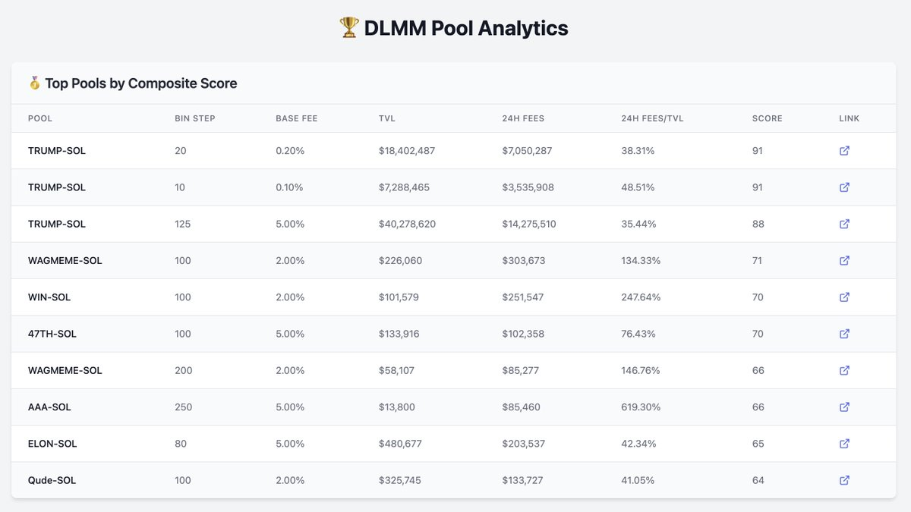

# DLMM 池子篩選工具

> **來源**: [@gm365](https://x.com/gm365/status/1880851025109905767)
>
> **日期**: Sun Jan 19 05:33:23 +0000 2025
>
> **標籤**: `DLMM` `LP流動性挖礦` `做市策略`

---

> **來源**: [@gm365](https://twitter.com/gm365)  
> **日期**: 2025-02-18  
> **標籤**: `DLMM` `Meteora` `流動性挖礦` `工具` `DeFi`

---

## 工具簡介

分享一個 DLMM Pools 篩選工具。

$TRUMP 選擇在 meteora 平台上線,一天幾十億美元的交易額,不但讓很多 LPer 賺到了豐厚做市手續費收入,也讓更多好奇的人想來這裡淘金。

由於之前高強度在 DLMM 搞了兩個多月的 LP,用過不少社區大神開發的工具,但很多不是特別符合自己的需求(或者說品味 😳),所以在 AI 加持下,造了不少新輪子。

## 功能特色

這個工具專門用來篩選當前熱門 DLMM 交易對,通過篩選 TVL、24 小時 Fees、Fees/TVL,計算綜合得分,然後排序。

目前分了 4 個版塊:

🥇 **Top Pools by Composite Score** (綜合得分排名)

🥈 **Top Pools by APR** (年化收益率排名)

🥉 **Top Pools by TVL** (總鎖倉量排名)

🎖️ **Top Pools by 24h Fees** (24小時手續費排名)

另外,工具特地過濾掉了所有 Fees/TVL 小於 5% 的池子,這樣可以幫你專注於快速篩選 DLMM 金礦(新上線、TVL 低、交易量大等)

## 注意事項

- 工具僅僅根據數據進行計算,沒有過濾 SCAM 代幣,需要自行判斷
- 僅分享,後續暫無更新計畫
