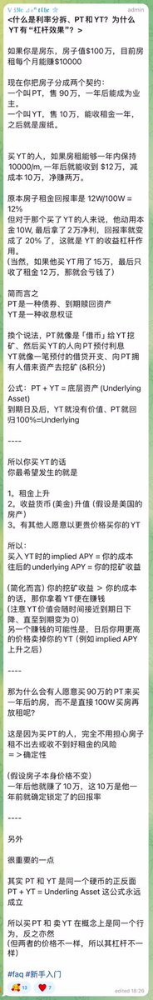
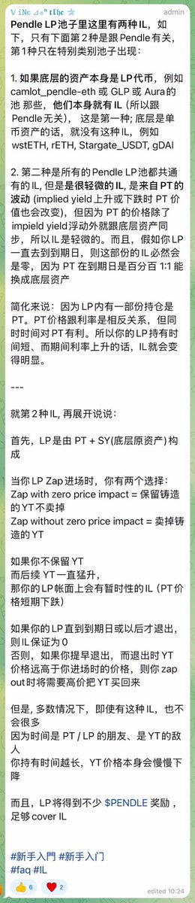
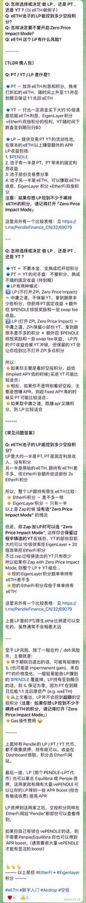

# Pendle 利率交易所 — APY 交易邏輯詳解

> **來源**: [@Miaofaoude](https://x.com/Miaofaoude/status/1872820257313964244)
>
> **日期**: Sat Dec 28 01:41:59 +0000 2024
>
> **標籤**: `Pendle協議` `利率交易` `衍生品`

---

> **來源**: [@Miaofaoude (妙法偶得)](https://twitter.com/Miaofaoude)  
> **標籤**: `Pendle` `利率交易` `DeFi` `APY` `衍生品`

---

## Pendle 是一個利率交易所

相比於 Binance 交易的是幣價，Pendle 交易的是「APY」（年化收益率）。

如果能把 Pendle 研究清楚，其它的都是小菜。Pendle 在幣圈衍生品的難度能排前三。

## 代幣價格與 Pendle 邏輯無關

代幣的 U 價格跟 Pendle 的邏輯沒有任何關係，就算 Pendle 完全沒有代幣的美元報價，Pendle 都可以正常運作。

你在 Pendle 看到任何的 $ 美元報價，純粹是方便你去了解它的美元價值。

## 如何看待 Pendle 持倉盈虧

你想了解你的 Pendle 持倉是賺是虧，建議去看「underlying」的 P&L（幣本位盈虧）。
