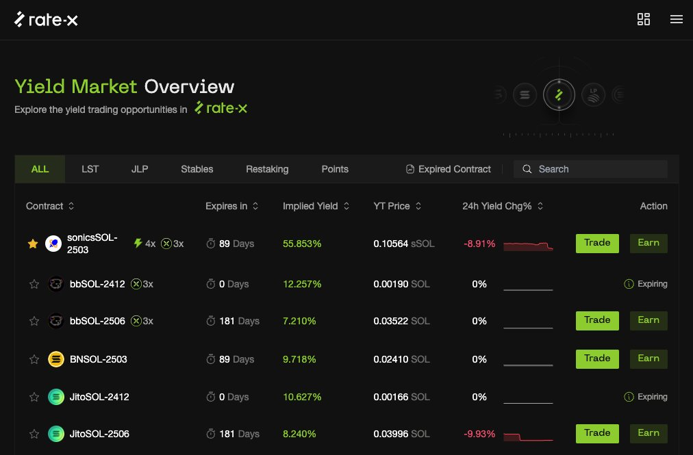

# RateX 槓桿收益交易所 — Solana 上的新興 YT 保證金交易協議

> **來源**: [@Vivi0xfish](https://x.com/Vivi0xfish/status/1873394011920294088) | [原文連結](https://app.rate-x.io/referral?ref=DW8rwEle)
>
> **日期**: Sun Dec 29 15:41:53 +0000 2024
>
> **標籤**: `YT 交易` `槓桿交易` `積分挖礦`

---

## RateX 協議簡介

RateX 是一個建立在 Solana 上的創新型利率平台,常被稱為「Solana 上的 Pendle」,但實際上與 Pendle 有著顯著的差異。

## 核心特色:槓桿化收益代幣交易

RateX 最主要的創新點在於支持 YT(Yield Token,利率代幣)的保證金交易功能。用戶可以對 YT 進行槓桿化操作,最高可開至 10 倍槓桿,這是與 Pendle 最大的區別所在。

## LP 收益來源

由於加入了保證金交易機制,作為 RateX 的流動性提供者(LP)可獲得三種收益來源:

1. 存入資產本身的收益
2. 交易手續費
3. 交易對手 YT 的盈虧(PnL) — 類似 GLP、JLP 的機制

## 目前數據與主要資金池

截至目前,RateX 的總鎖倉量(TVL)約為 1300 萬美元,在 12 月期間增長了 5 倍。主要的 TVL 來自 Points 交易板塊,可交易的點數項目包含:

- Sonic 的 $SonicsSOL
- Ethena 的 $USDe / $sUSDe  
- Solayer 的 $sUSD

### 熱門池子:$SonicsSOL

三月底到期的 $SonicsSOL 池子佔據超過 80%(約 1000 萬美元)的 TVL,也是整個協議中積分加成最豐厚的交易對,共提供:

- @solayer_labs 4x 積分
- @SonicSVM 1x 積分
- RateX 3x 積分

這三個都是目前 Solana 上的熱門積分項目,是本月內 RateX 主要增長的驅動力。因為積分機制火熱,收益鎖定的 Earn 產品 PT 目前 SOL 的 APY 也超過 50%。

## LP 機制:集中流動性

與 Pendle 的另一個差異是,RateX 的 LP 設置採用集中流動性(Concentrated Liquidity)設計,讓用戶可以根據預期來設定隱含利率範圍。整體介面設計直觀易用。

## 團隊背景與融資

- Solana Renaissance 黑客松冠軍
- 獲得 @solanafdn grants 支持
- 2024 年 7 月完成種子輪融資,投資者包含 GSR、KuCoin Ventures 和 SNZ Holding 等

RateX 目前是 Solana 上相當特別的 YT 保證金交易協議,提供了與傳統利率協議不同的槓桿化收益交易體驗。
