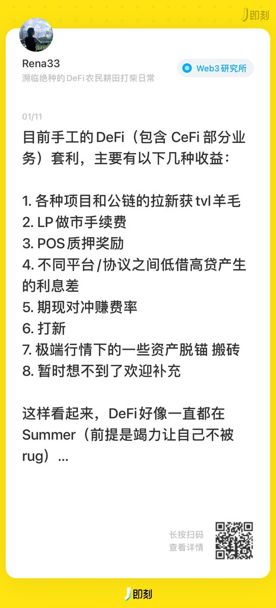

# DeFi與CeFi中性套利「收租」策略指南

> **來源**: [@re333na](https://x.com/re333na/status/1871037023534117149)
>
> **日期**: Mon Dec 23 03:36:03 +0000 2024
>
> **標籤**: `套利策略` `收益農耕` `對沖交易`

---

> **來源**: [@re333na (Rena)](https://x.com/re333na)
> **日期**: 2025-01
> **標籤**: `中性套利` `DeFi` `CeFi` `收益策略` `風險管理`

---

才發現一年前在即刻上發過卻忘記抄送到 x，當時覺得 summer 還在，但沒想到持續了那麼久⋯所以現在來更新一版：

不靠交易（因為我很垃圾），如何在 DeFi 和 CeFi 靠各種中性套利策略「收租」：

## 1/ 拉新補貼

新協議或公鏈為了吸引用戶、拉 TVL，會給早期用戶發補貼獎勵。有些收益以積分 pua 形式發放，但我等 farmer 還是更傾向回歸到真實收益或日結。自此也衍生出 Pendle-PT 等固收類產品。

## 2/ 做市

傳統組 LP 做市方式有 Uniswap 的 V2、V3，後有由 GMX 的 GLP 起頭，引出 Jupiter 的 JLP、Hyperliquid 的 HLP、dYdX 的 MegaVault 等一堆鏈上 PERP 創新的自動化做市池子。手續費、清算費、利息等收益主要來自做賭狗的對手盤（bushi。

## 3/ 單幣質押

POS 或 DAO 治理質押，邊對沖邊賺本幣，勝在穩定和相對安全。

## 4/ 借貸

不同平台/協議間「低借高貸」，賺利差。

## 5/ 期現對沖與價差

同平台/跨平台/跨鏈，同時做現貨+期貨雙腿交易，通過價差、對沖費率來獲利，適合波動大的行情。

## 6/ 打新

參加 CEX/DEX 上的 Launchpool 或 IDO，主要白嫖，或付出極低成本拿新項目 Token，但一般需要多號參與。

## 7/ 極端行情下的資產脫錨

需要在熟悉協議底層機制的前提上，迅速反應搬磚，這種利潤一般是大風刮來的。

## 8/ 在 1-6 基礎上做套娃一魚多吃/循環貸/買 YT

提高收益和資金利用率，但需要精算師們算準點，不然容易吃到滿嘴魚刺⋯

暫時想到這麼多，歡迎大佬們補充🙏
