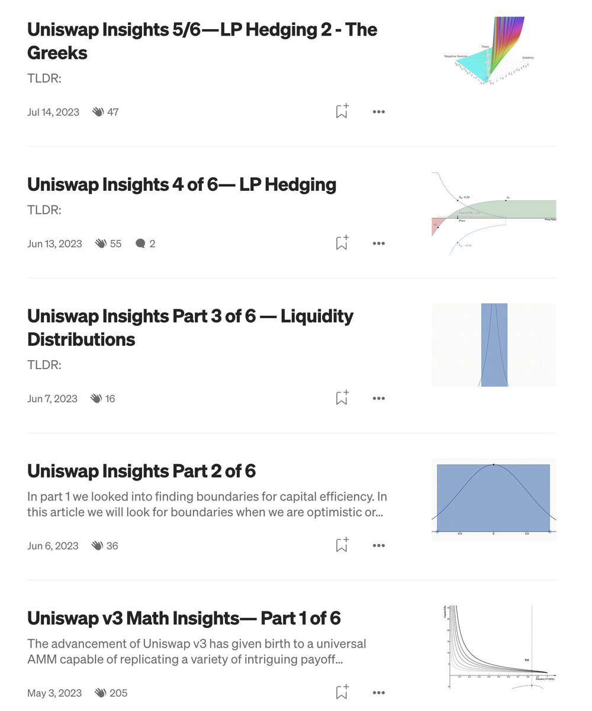

# Uniswap 區間流動性提供的金融工程分析

> **來源**: [@wong_ssh](https://x.com/wong_ssh/status/1865629032722882676) | [原文連結](https://medium.com/@med456789d)
>
> **日期**: Sun Dec 08 05:26:37 +0000 2024
>
> **標籤**: `LP策略` `區間流動性` `金融工程`

---

> **來源**: [@wong_ssh (WongSSH)](https://twitter.com/wong_ssh)
> **日期**: 2026-02-18
> **標籤**: `uniswap` `lp` `流動性提供` `金融工程` `區間流動性`

---

## 推薦文章

對於區間流動性提供的 LP，之前讀過一系列十分精彩的文章。這些文章是在 Uniswap 基金會支持下由 @CK_2049 編寫的。

## 閱讀門檻提醒

需要注意的是，這些文章基本都是金融工程和計量經濟學內容，可能比較適合傳統金融大佬閱讀。

## 文章連結

- 相關文章系列：https://t.co/HGy6XwGQoG
- 補充資料：https://t.co/pbS2Y4zztk
