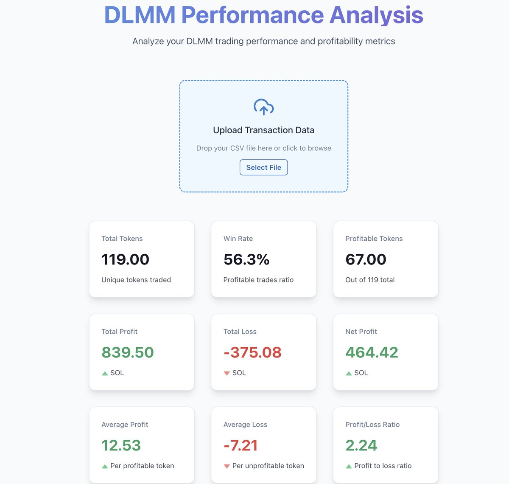
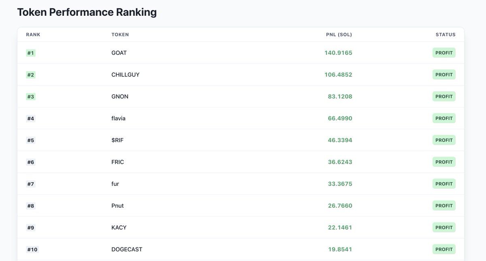
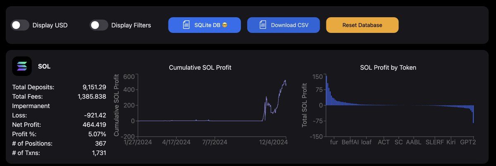
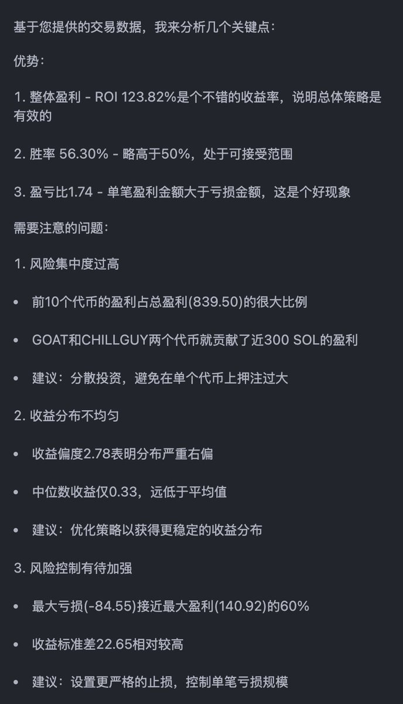

# DLMM 盈虧分析工具 — 深度數據洞察

> **來源**: [@gm365](https://x.com/gm365/status/1864228173078270431)
>
> **日期**: Wed Dec 04 08:40:06 +0000 2024
>
> **標籤**: `DLMM` `LP策略` `數據分析`

---

> **來源**: [@gm365](https://twitter.com/gm365)  
> **標籤**: `DLMM` `數據分析` `Meteora` `收益追蹤`

---

## 工具介紹

一款更直觀的 DLMM 收益分析工具。

正所謂：知己知彼，百戰不殆。

對於一個喜歡數據、希望從數據中挖掘更多有價值資訊的人而言，沒有比研究分析數據更讓人開心的了。

比如：下載你所有的 DLMM 操作、盈虧記錄，然後進行更詳盡的分析。

由於原始的 Meteora DLMM Profit Analysis v3.0 網站，給出的數據並不夠完整、詳盡、性感,於是在一眾 AI 工具的加持下,開發了一個新版的 **DLMM 盈虧分析工具**。

## 提供的數據指標

網站當前提供的數據如下：

1. 總交易代幣數量
2. 總盈利（SOL 計價）
3. 總虧損
4. 淨盈利（總盈利減去總虧損）
5. 平均盈利金額、平均虧損金額
6. 按照盈利大小從高到低排列的所有代幣盈虧資訊

## 使用方式

1. 首先打開網站 Meteora DLMM Profit Analysis v3.0，輸入你的錢包地址，等待加載完成你所有的交易數據
2. 點擊按鈕：Download CSV
3. 打開 DLMM 盈利分析網站，上傳這份 CSV
4. 一目了然展示你的盈虧數據

## 數據的用途

有了這些數據，對解讀你的交易風格、改進交易體系，有何用處？

當然有用，前提是你要會解讀它們。

如果不會，不怕，AI 可以幫你。
