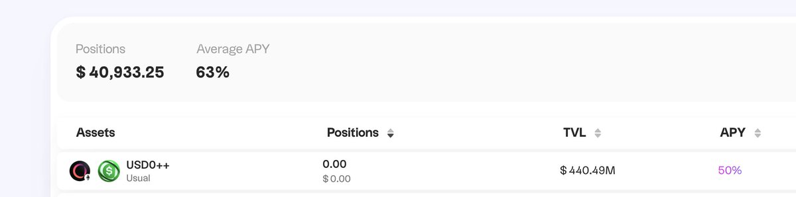

# USUAL 協議 50% APR 挖礦策略分析

> **來源**: [@lspeth](https://x.com/lspeth/status/1863234963690381419) | [原文連結](https://twitter.com/lsp8940/status/1863234963690381419/photo/1)
>
> **日期**: Sun Dec 01 14:53:27 +0000 2024
>
> **標籤**: `DeFi挖礦` `USUAL` `收益率`

---

> **來源**: [@lspeth (Lsp)](https://twitter.com/lspeth)
> **日期**: 2026-02-18
> **標籤**: `USUAL` `DEFI` `APR` `挖礦策略` `Usual Money`

---

## USUAL 協議挖礦策略更新

關於 [@usualmoney](https://twitter.com/usualmoney)

現在的 APR 50%，不挖 PILL 了，直接挖 USUAL，挺香的。

## 資金配置建議

行情好了，整體的挖礦環境好了，相信複利的力量！也建議大家：

| 資金規模 | 策略類型 | APR 範圍 | 推薦方向 |
|---------|---------|---------|---------|
| 大資金 | 穩定礦 | 30-60% APR | 穩健收益 |
| 小資金 | 中風險 | - | [@MemeFarmerWeb3](https://twitter.com/MemeFarmerWeb3) |
| 迷你倉 | 高風險高倍數 | - | 掃鏈、發現土狗 |

礦逼該醒醒了！
