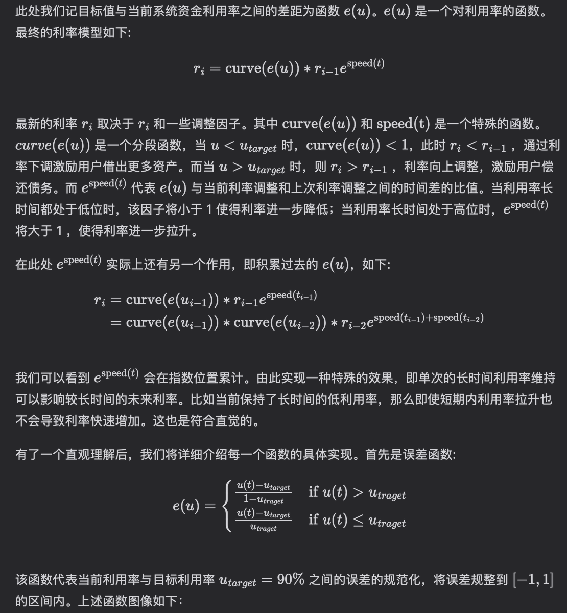

# Morpho 協議智能合約解析與利率模型詳解

> **來源**: [@wong_ssh](https://x.com/wong_ssh/status/1863257589816902135) | [原文連結](https://twitter.com/wong_ssh/status/1863257589816902135/photo/1)
>
> **日期**: Sun Dec 01 16:23:21 +0000 2024
>
> **標籤**: `智能合約` `Morpho 協議` `利率模型`

---

> **來源**: [@wong_ssh (WongSSH)](https://twitter.com/wong_ssh)
> **日期**: 2026-02-18
> **標籤**: `morpho` `智能合約` `利率模型` `defi` `adaptive-curve-irm` `清算規則`

---

Morpho 應該算是新時代智能合約工程師必讀代碼了吧，很多朋友應該都推薦過。

## 核心代碼規模

Morpho 的核心倉庫只有 350 行代碼,但還有一些輔助倉庫。

## 技術複雜度

Morpho 比較複雜的是利率計算邏輯,其支持的 adaptive-curve-irm (自適應曲線利率模型) 原理有點複雜。

## 參考資源

作者寫了一篇文章介紹 Morpho,已經完成了清算規則和利率模型的介紹。

參考連結: https://t.co/rIuKVYKDCI
