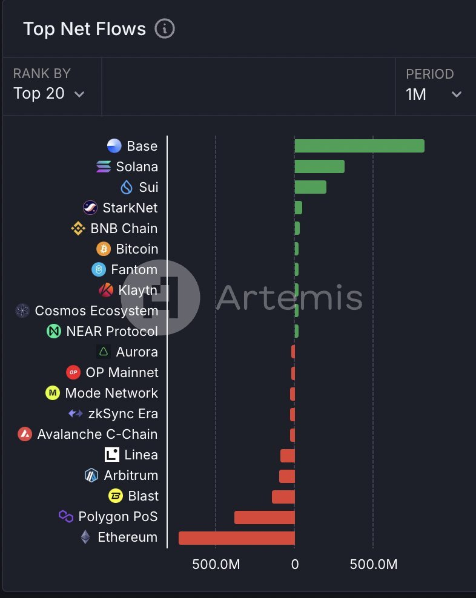
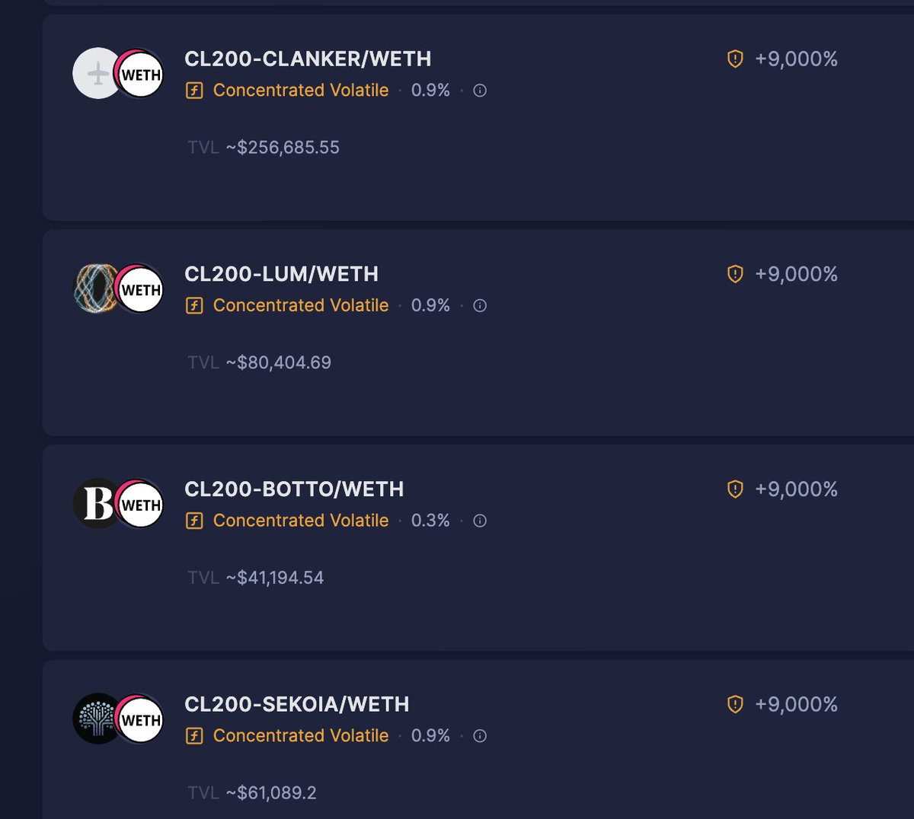
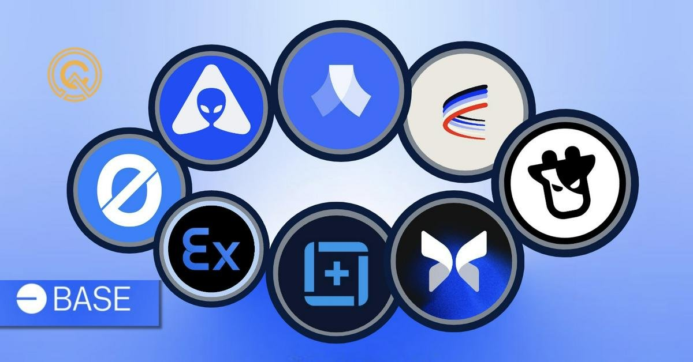

# Base 生態 DeFi 發展現況：資金淨流入蟬聯五週冠軍

> **來源**: [@Alvin0617](https://x.com/Alvin0617/status/1862866649633956058)
>
> **日期**: Sat Nov 30 14:29:54 +0000 2024
>
> **標籤**: `Base Layer 2` `DeFi 生態` `資金流向`

---

> **來源**: [@Alvin0617 (alvin617.eth)](https://twitter.com/Alvin0617)
> **日期**: 2025
> **標籤**: `base` `defi` `layer2` `tvl` `morpho` `anzen`

---

## Base 資金淨流入表現

Base 連續資金淨流入蟬聯 5 週冠軍，顯示出強勁的市場吸引力。

### TVL 與交易量表現

- **今年十月超過 Arbitrum 成為 TVL 第一的 Layer 2**
- **Base 的 DEX 在單日、7 日、單月交易量穩居第三**
  - 單論交易量 Base 僅次於 Solana 和以太坊主網，顯示生態的活躍度極高
  - 本週更有 19% 的增幅，Solana 則是 25% 的跌幅

### 資金淨流入數據

過去一個月各鏈的資金淨流入：

- **Solana 淨流入為 3.24 億美元 📈**
- **Base 則是 8.3 億美元，足足超過 Solana 的 2 倍以上 💥**

## 生態項目亮點

### Morpho

@MorphoLabs TGE 後表現亮眼，TVL 已經超過了 DeFi 1.0 的老牌借貸 Compound，$MORPHO 和 $COMP 仍有 2 倍以上的市值差距。

### Anzen Finance

@AnzenFinance 即將 TGE，@FjordFoundry public sale 於 12/2 舉行。

## 策略建議

- 關注鏈上交易量高的 pair，做做 LP
- 同時拿好藍籌 tokens 準備發財

## 生態驅動力

Coinbase 團隊積極推動生態，DeFi、memecoin、AI Agent 輪番上漲，成為 Base 超越眾 Layer 2 的關鍵因素。
