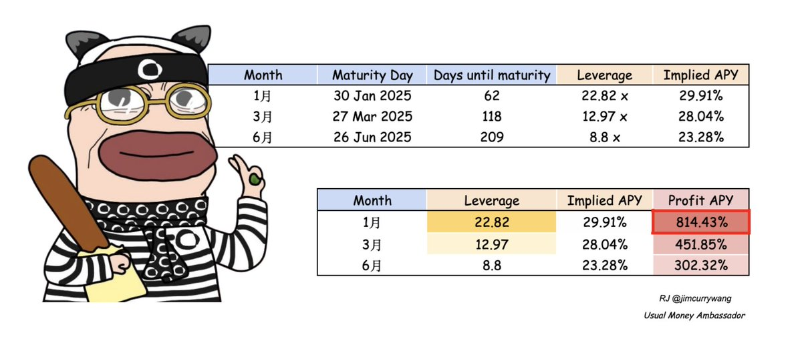
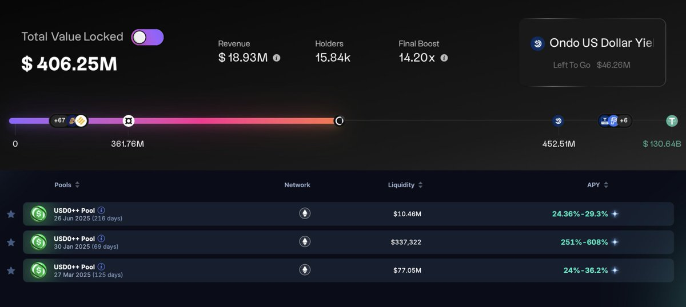

# USUAL USD0++ Pendle 槓桿收益策略分析

> **來源**: [@jimcurrywang](https://x.com/jimcurrywang/status/1862118993043005909)
>
> **日期**: 
>
> **標籤**: `DeFi` `Pendle` `USUAL`

---

## 背景與機會

繼上篇文章推薦後，USUAL V1 正式上線。白皮書出來後立即進行程式試算驗證。今天是 USUAL 上線的第 134 天，TVL 突破了 400M 關卡，據傳又有了新一輪的融資，VC 圈搶瘋了融資超購 1 倍多。

## USD0++ 收益率分析

由於可以直接每日累積 $USUAL 代幣，持有 USD0++ 的年化收益可以來到 **37%**。這個數字按照白皮書手刻出來的程式基本上和官網顯示相符。

### Pendle YT 槓桿策略

若加上 Pendle YT 的槓桿率，收益會進一步放大。用一月份 22 倍槓桿率來算：

**37 × 22.82 - 29.91 = 814.43% 年化 APY**

## 市場現狀

熱度懂的都懂，Pendle 上面的 1 月和 3 月的 USD0++ 池子都已經買滿了，火熱到溢出 AMM 設定的區間，目前只能用訂單簿吃，但 6 月池子還可以直接買入。據說 6 月池子的 Morpho PT 也在進行最後審核中馬上就會上線。

### 可用池子

- 26 Jun 2025（216 days）
- 30 Jan 2025（69 days）
- 27 Mar 2025（125 days）

## 上幣策略分析

### 盤前階段

這幾天幣安盤前理論上就是 USUAL 的至暗時刻。盤前的事，是為了上現貨時有個低估值。LaunchPool 挖完先限制買入，讓 $BNB 養老團砸盤出掉，這樣就可以低價留足夠的估值空間給二級市場，說穿了就是洗盤。

### 賣壓預測

預計賣壓會有兩波：

1. **第一波**：LaunchPool 用戶出貨
2. **第二波**：早期投資者獲利了結

賣壓消耗完了以後，之後的往上阻力小，自然就容易往上，二級市場容易賺錢，就能容易吸引到新用戶，整個代幣經濟學的正向飛輪才能展開。

### 為何接受盤前條件

很多用戶會抱怨，為何要白白送 7.5% 的免費籌碼出去，然後還要接受盤前的買賣不對等條件。但大部分的人忽略了**熱度、關注度、人脈潛力、潛在合作**等一些目前表面看不到，但確實對項目有幫助的東西，這些是上了幣安才有的資源。

首先 Usual 是個 RWA 聚合器，代幣經濟學的設計，使其不像 meme PVP，越來越多人使用，有關注度蛋糕就越大塊。

## 風險評估

### 脫錨風險

稍微研究過的同學，應該都知道 Usual 基本上沒有太大的 Depeg 風險：

- 穩定幣全部都是 **1:1 發行**
- 托底資產存放在**國庫**裡
- 不會像算法穩定幣 Luna 樣陷入脫鉤困境

關於 USD0++ 會脫錨嗎，白皮書裡有**三層機制**保護，相當難脫錨。

### 主要風險

唯一最大的風險就是**代幣價格跌導致收益率進一步下跌**，但團隊籌備搞了 2 年多，應該不至於太天真。畢竟整個團隊的激勵一年後才能領取（1 year cliff）。

## 參與建議

對於想參與但又怕的夥伴們，就不要賭 YT 了，不如考慮**組個 LP 然後記得開啟 ZPI 模式**，無損拿 $USUAL 也是一種好選擇。目前榜一大哥，就是靠組 LP 衝榜。

## 總結

DeFi 的盛世只需要一週就能重現，但只有那些在低谷堅持努力的人，才能享受到爆發初期的紅利。現在又到了大家不會質疑會不會有山寨季的階段了，$ETH、$ONDO、$ENA、$USUAL 就是如此。

---

**免責聲明**：Not Financial Advice, Always DYOR
