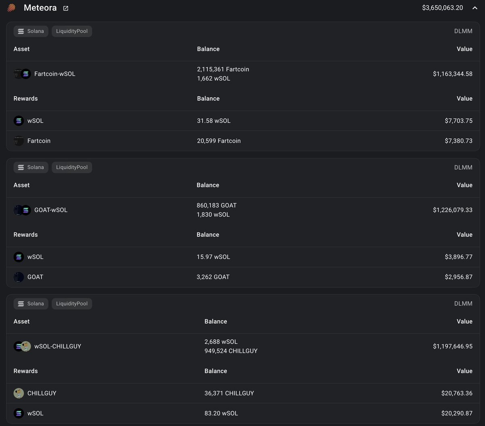
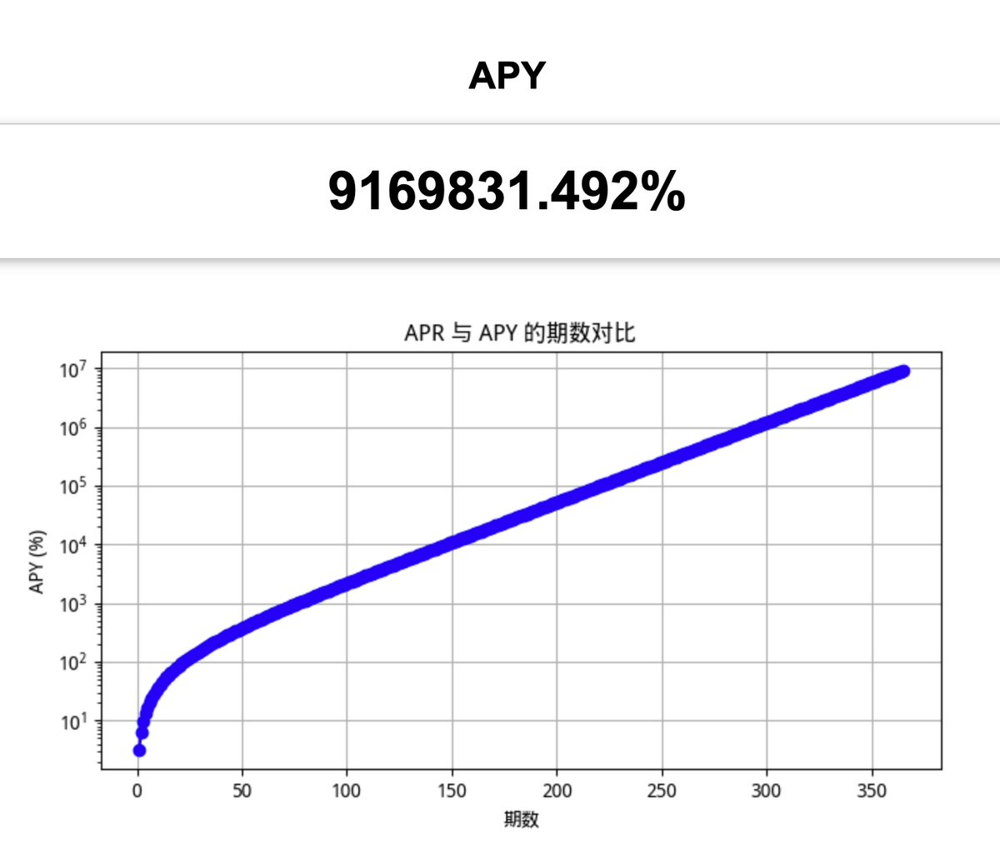
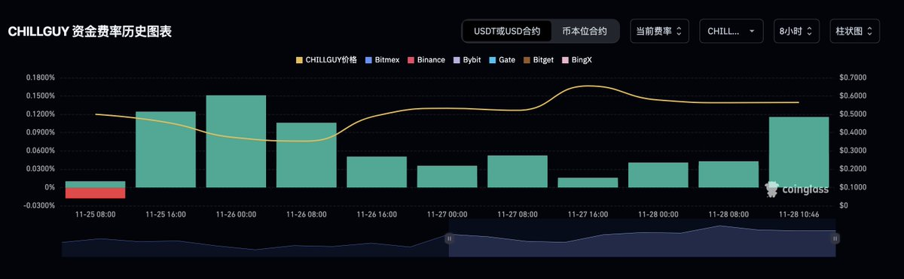

# DLMM Meme LP 資金容量分析：百萬美元策略的風險與收益

> **來源**: [@gm365](https://x.com/gm365/status/1861967185473900653)
>
> **日期**: 
>
> **標籤**: `DLMM` `流動性挖礦` `風險對沖`

---

> **來源**: [@gm365](https://twitter.com/gm365)  
> **日期**: 2025-02-18  
> **標籤**: `DLMM` `流動性挖礦` `Meme幣` `資金管理` `風險對沖`

---

## DLMM 的資金容量有多大?

資金容量，即一個投資策略能承載的最大資金量。

不同類型的策略，資金容量不同。

一般而言，低頻、趨勢型策略，資金容量大。比如指數型 ETF 基金，幾乎無上限；但高頻型策略，則資金容量小很多。

比如國外一些對沖基金，到後面可能會退還所有用戶的投資款，而轉向自營資金。

因為資金太多，會降低這類策略的收益率。

那麼，以 DLMM 這類提供流動性的策略來說，資金容量有多大呢？

注意，這裡我們僅討論偏 meme 型 LP，主流幣（比如 SOL/USDC）資金容量高很多，但是收益率太低，暫時不作考慮。

根據我自己過往這一個多月的實戰經驗，我個人感覺這類 meme 型 LP 策略，可能的資金容量大約在幾十萬刀的樣子。

意思就是說，如果你打算在 DLMM 裡搞 meme LP，那麼最多也就是幾十萬刀的投入水準。

所以，DLMM 既不是一個賺快錢的策略，也不是一個賺大錢的策略。

如果你資金太多（超過百萬 U 級別），並不適合來搞這個。

如果你目標很大，比如想要賺上百萬 U，也不適合搞這個。

## 百萬級資金的 DLMM 實例

直到昨晚我在重新找機會進 CHILLGUY 的池子（已經進了），以及調整我的 GOAT/SOL 池子時，無意中發現了一個情況。

之前我一直待在 GOAT/SOL 1%/100 的池子，接近一個月之久。

然而，昨晚發現一個新費率池子 0.8%/100，瞬間已經 200 萬 USD 的規模，而 24 小時的手續費收益卻相當低。

一番研究，被我研究出來一個真大佬。

大佬倉位請看截圖，他/她目前投入了超過 300 萬 U 在三個 DLMM 池：

1. Fartcoin/SOL
2. GOAT/SOL
3. Chillguy/SOL

每個池子大約 100 萬 U。

一下子禁錮解除、天花板被衝破。

原來在 DLMM 搞 meme LP，是可以投入百萬級別資金的。

## 百萬級策略的風險與收益

那麼問題來了，這樣搞，風險和收益到底如何呢？

能投入這麼多資金來搞 LP，肯定不是小打小鬧，也不是一時頭腦發熱。

想必是：

1. 看好這一輪的 meme 表現
2. 看好這三個標的（目前）
3. 這一輪 meme 的交易量，很大可能都發生在鏈上（而不是迄今還不捨得上現貨的幣安）

### 收益能有多高？

曾經的 DeFi 熱潮時，言必稱 APY。這些撐破網頁的驚人數字都是騙人的。

在 DLMM，只有實打實的日化 ROI。

也就是你投入 100U，每天的手續費收益有多少錢。

日化數字乘以 365 就是 APR。

想要計算虛無縹緲的 APY？自己找工具換算下就行，不過不必當真。

舉例來說：當前鎖倉超過 100 萬 U 的 CHILLGUY/SOL 0.2%/125 的池子，日化 ROI = 3.18%。

那麼年化 APR = 3.18 × 365 = 1160.7% 

按照每日提取一次手續費並複投，計算出來的 APY 是多少呢？

9169831.49%

驚人的數字。

龐氏騙局祖師爺看了這樣的收益數據怕是都要傷心落淚。

實際的收益情況，當然不可能如此誇張。因為：

1. 日化數據隨時在變動，隨著競爭加劇、交易量變動，可能會降低或波動
2. 這樣的收益能持續多久，是一個未知數

以及還有一個極其重要的情況需要被考慮在內：

**這樣的日化 ROI 水平並不是無風險收益，你需要承擔資產價格下跌和無常損失的雙重風險。**

## 風險對沖策略

### 資產價格下跌的對沖

首先，資產價格下跌的風險，可以通過交易所的永續合約來對沖。

**壞消息**：需要佔用額外資金，導致你的整體資金使用率降低，進而降低總體收益率

**好消息**：牛市多 FOMO，導致 funding rate 多為正值。這也就意味著，你在永續合約開倉對沖價格下跌時，可以額外收取資金費，賺取額外收益。

這個收益在牛市有多少呢？

按照今天的數據看，幣安的 CHILLGUY 資金費率為 0.11% × 3 × 365 = 120.45%

也就是說，你用來對沖倉位的資金，還有額外 120.45% 的年化收益率。

哇哦，雙贏。

如果你需要繼續對沖你的 SOL 倉位，同理。

### 無常損失的考量

那 DeFi 老炮兒們聞之色變的「無常損失」呢？

（我實在不想再科普有關無常損失的正確定義了，因為實在太多人壓根兒沒搞清這個詞的具體含義，以為只要本金跌了，全是無常損失的鍋。那不是無常損失，那是無知）

鑑於 meme 的超高交易量帶來的高額手續費收益，你可以安全地假定：手續費收益肯定能蓋過無常損失。

## 結論

綜上：

**MEME 類的 LP（比如 DLMM），可以是一個資金容量超過百萬 U、年化 APR 收益超過 300% 的量化策略。**

前提是：

1. 你真心看好這一輪的 meme 表現/賽道
2. 你真心好看你選擇的標的
3. 你真心懂 LP
4. 你知道如何對沖風險

以及最重要的：

**你真心熱愛這個行業、熱愛 meme、熱愛 DeFi、熱愛賺錢。**
