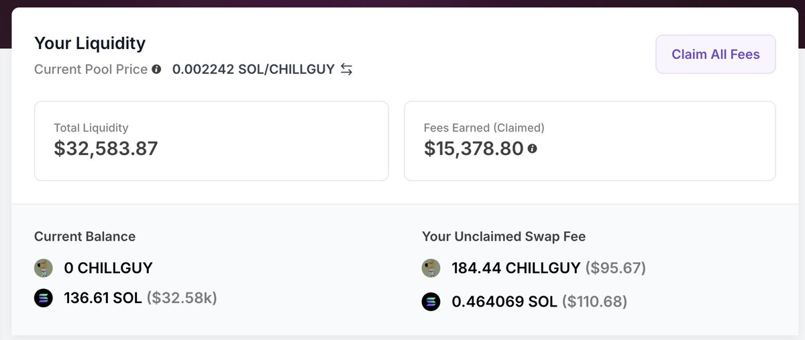

# DLMM 流動性池收益優化策略

> **來源**: [@gm365](https://x.com/gm365/status/1861327688444846319)
>
> **日期**: 
>
> **標籤**: `DLMM` `LP策略` `風險管理`

---

> **來源**: [@gm365](https://twitter.com/gm365)
> **日期**: 2024-11-21
> **標籤**: `DLMM` `流動性池` `收益優化` `做市策略`

---

## 實戰案例

隨著今天的一波上漲,我的 CHILLYGUY/SOL DLMM 池子成功漲出區間。

於是順勢提取了 LP,賣出零星的手續費倉位(沒錯,我基本從來不留什麼底倉)。

經過最終統計,我在 11 月 21 號總計開倉了 3 次 CHILLGUY 的 DLMM 池子,截止今天,全部平倉,總盈利 98 SOL。

心滿意足。

## 優化策略思考

去咖啡店點杯拿鐵,看了會兒書(《金錢心理學》)。等到下午回來,開始琢磨下一個議題:

🤔 如何進一步優化或放大 DLMM 收益?

思索一番,大概可能有以下三點:

1. 進一步精簡標的
2. 優質標的加大倉位
3. 大區間 + 耐心持有

這麼看下來,搞 LP/DLMM,不說和炒 meme 的策略一模一樣吧,起碼也是高度雷同。

唯一的區別在於,炒 meme,你賺標的價格上漲的錢;而搞 LP,則是賺它價格上下波動的錢。

所以,也很好抉擇:

- 你認為它會大漲,買入並持有
- 你認為你會上下波動,LP

## 三大策略詳解

### 1. 優選標的,看準了再出手

降低出手次數,不光能在一定程度上提高你的成功概率,也能減少在不合適的標的上反覆被折磨的挫敗感。

絕大部分標的都僅僅只是一波流的情況下,選錯標的上錯車,不光本金虧損,你耗費在這個錯誤標的上的心力,也是一項寶貴資產。

就像談戀愛,選錯人,備受折磨。

選 meme,同理。

### 2. 優質標的加大倉位

因為曾經出現過頭腦一熱,加 100 SOL 到某個標的(實在不想再提起那個名字),導致一小時不到,虧損 85 SOL。

後面就變得尤其謹慎。

這樣的好處當然是資金曲線更平滑,不再有大幅回撤。

但缺點同樣有:資金利用率不高、收益絕對值也低。

換句話說,賺錢速度同樣變慢了。

因為不敢上倉位,即便 ROI 再高,最終賺到的收益也有限。

#### 改進策略

如果真的是有敘事、有持續性的標的,可以考慮後續加倉。

同時,觀察 DLMM 裡當前標的總鎖倉量,如果絕對值很高,說明很多「聰明錢」看好,同樣可以作為一個加倉/重倉信號。

當然,沒有百分之百準確的指標,一樣要謹慎行事。

### 3. 大區間 + 耐心持有

區間太小,就太容易因為大幅波動而掉出區間。而出了區間,就比較難辦了。

如果是漲出的區間,你會恐高:高位加倉,總歸風險變大;

而如果是跌出區間,你會恐慌:越跌越買,被埋咋辦?

我依然堅持看法:**250、400 Steps 這樣的區間,才比較合適。**

至於耐心持有,還要疊加上不要害怕短期的漲跌(當然,主要是下跌)。

因為 LP 的核心收益來源,就在於標的價格的上下波動。如果它一動不動,哪還有你的交易手續費收益?

哪怕是一波上漲後再跌下來,這都算是正常現象。也沒必要懊惱沒有在高點撤掉 LP,鎖定利潤。

除非標的發生了什麼重大事件,導致不再適合繼續持有。否則,你都應該無懼波動,等待一路上漲,超出區間,提取你的 SOL。

## 當前持倉思考

不過話說回來,目前我持倉的 GOAT/SOL、RIF/SOL,對 GOAT 而言我不是很擔心,但這個 RIF 可真是讓人鬧心,不知道是不是該清倉了結。

以上三條,就是我接下來調整 DLMM 部分投入的方向和策略。

希望對你也有所啟發。
