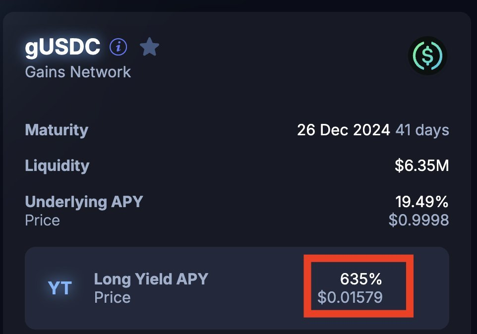
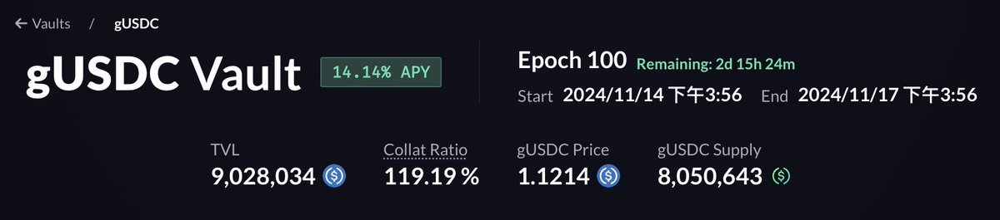

# Pendle YT-gUSDC 牛市印鈔機：635% APR 利差交易策略

> **來源**: [@trader_alvin](https://x.com/trader_alvin/status/1857275056210215100)
>
> **日期**: Fri Nov 15 04:10:54 +0000 2024
>
> **標籤**: `Pendle` `Yield Trading` `gUSDC`

---

> **來源**: [@trader_alvin (Alvin)](https://twitter.com/trader_alvin)  
> **標籤**: `Pendle` `YT` `gUSDC` `利差交易` `套利策略` `DeFi` `Gains Network`

---

## 策略概述

YT-gUSDC 是 Pendle 上適合牛市的利差交易策略，目前 APR 達 635%（為期 41 天）。相比大部分人專注於 point-fi，這個策略聚焦於 Underlying Asset Yield 的收益，具有上漲潛力巨大、虧損有限的特性。

## 核心機制

### gUSDC 基礎收益

- **來源**：gUSDC 是 Gains Network 的 Reward-bearing tokens，會自動將 Trading Fees 納入，提升每個 gUSDC 的內在價值
- **牛市表現**：近期 7-day APR 從 12% 上升至 14%，且持續增加
- **風險特性**：持有 gUSDC 即可獲得年化 14% 的穩定幣收益，幾乎無風險

### YT-gUSDC 高收益來源

600%+ 收益的組成：
- **高槓桿**：YT-gUSDC 本身約 63x 槓桿
- **利差**：7-day MA Underlying APY 約 19.49%，YT 價格本身在 15%
- **實測數據**：過去一天約可獲得 APR 20% 的 gUSDC yield

## 策略上下檔分析

### 上檔：牛市情境

- **歷史高點**：從 1D Undl APY MA 來看，比特幣大漲時 APY 一度達 47.55%
- **利差空間**：對比當時 14.14% 的 YT 成本，換算年化可達 2000%+
- **持續到 12 月**：ROI 有很高機會超過 100%，甚至更高

### 下檔：熊市情境

- **歷史數據**：平均 gUSDC 收益約 7%
- **最大虧損**：買進 YT 的 Implied APY - 熊市下的 gUSDC 收益率（~7%）
- **風險特性**：即便到熊市，YT 仍能保有部分收益而非血本無歸

## 額外有利因素

| 優勢 | 說明 |
|------|------|
| Over-Collaterized 保護 | 若交易者大量獲利，由 gUSDC Vault OC 支付（目前還有 20%），在此之前 Vault 只收 Trader Fee，幾乎無風險 |
| 低 Gas Fee | ARB Gas Fee 大幅低於主網，利於 Yield Trade 頻繁進出 |
| 低 Trading Fee | Pool 本身 Trading Fee 抽 0.1%（vs sUSDE 0.2%） |
| 穩定幣交易機會 | Yield 以 gUSDC 發放，在 ARB 滑點極低 |

## 交易優勢

- **低摩擦成本**：YT-gUSDC 在 ARB 上 + Trading Fee 低，交易摩擦成本大幅低於其他穩定幣 yield 項目（非大額）
- **靈活交易**：若對利率有交易想法，可嘗試短進短出
- **Alpha 機會**：目前 Crypto 對於利率交易的注重較少，有機會產生 alpha
- **未來展望**：樂觀看待 Boros（Pendle V3）上線

## 適用情境

- 相信牛市會延續到年底
- 願意承擔有限下檔風險換取高上檔潛力
- 希望在穩定幣資產上獲得超額收益

**DYOR. NFA.**
