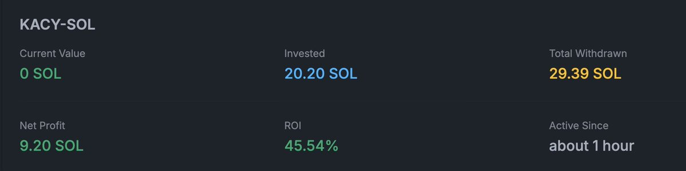

# DLMM 流動性挖礦的困境：強制止盈與被動止損

> **來源**: [@gm365](https://x.com/gm365/status/1859799415311286489)
>
> **日期**: Fri Nov 22 03:21:48 +0000 2024
>
> **標籤**: `流動性挖礦` `DLMM` `位置管理`

---

> **來源**: [@gm365](https://twitter.com/gm365)  
> **標籤**: `DLMM` `流動性挖礦` `集中流動性` `做市策略` `止盈止損`

---

## LP 的兩大核心痛點

鏈上 LP 屬於一種做市策略，不管你是在 Raydium 搞 CLMM，還是在 Meteora 搞 DLMM，其本質都沒有什麼不同，都是一種集中流動性的 V3 類做市策略。

這類策略由於其集中流動性的特性，提高了資金使用效率，同時大幅提高了賺取手續費收益的能力。

但與此同時，帶來了兩個十分致命的缺陷：

### 1. 滿倉下跌 + 不忍心止損 = 越虧越多

當價格跌出設定的流動性區間時，LP 會變成單一代幣的滿倉持倉。此時沒有任何手續費收益，但需要手動提取 LP 資產並賣出才算真的止損。許多人因為不捨得賣出止損，幻想著價格能重新被「價值發現」，結果就像現貨滿倉待漲一樣被套牢。

**案例：RIF/SOL 交易對**

目前持倉的 RIF/SOL 交易對就是滿倉下跌、越虧越多的典型案例。跌出區間後沒有任何手續費收益，但不捨得賣出止損，幻想著肯定還能重新被「價值發現」，於是類似於現貨滿倉待漲。

### 2. 快速漲出區間 = 強制止盈

當價格快速上漲超出流動性區間時，LP 會自動將代幣賣出換成另一種資產，形成強制止盈。這意味著你無法吃到完整的漲幅。

**案例：$KACY**

今天早上在約 8M 市值進入這個 $KACY，後面漲到 20M 時強制止盈出局。算上手續費收益，ROI 接近 50%（實際漲幅則有 150%+ 之多）。

目前在高位 25M 附近大幅震盪，手續費收益想必也不少，但卻不敢再進了。

## LP 與現貨 Meme 玩家的差異

這和普通買賣 meme 有一個關鍵區別：

假設某天某個一二線 CEX 突發奇想上線了這個代幣，可能會發生價格原地暴漲 N 倍的情況。

- **滿倉現貨的 meme 玩家**：基本能吃滿漲幅
- **LP 玩家**：只能吃到一小段漲幅，因為 LP 做市的特性會強制止盈

## 總結

簡單來說，這個策略會幫你**強制止盈**，但**不會幫你強制止損**（因為需要你手動提取 LP 資產並賣出才算真的止損）。

如此看來，LP 玩家與普通的 meme 玩家，大家的悲歡並不相通。

---

★ Insight ─────────────────────────────────────

**集中流動性的雙面刃**：DLMM/CLMM 等 V3 類做市策略透過集中流動性提高資金效率，但代價是**被動止損失效** + **強制止盈限制獲利**。這與傳統現貨交易形成鮮明對比：現貨玩家可以「死扛」下跌或「吃滿」暴漲，但 LP 玩家在兩種情況下都會吃虧。

**心理帳戶陷阱**：LP 下跌時變成「滿倉現貨」的心理錯覺，讓人誤以為「不賣就不虧」，實際上已經失去了賺取手續費的機會成本。而上漲時的強制止盈則讓人眼睜睜看著後續漲幅卻無法參與。

─────────────────────────────────────────────────
