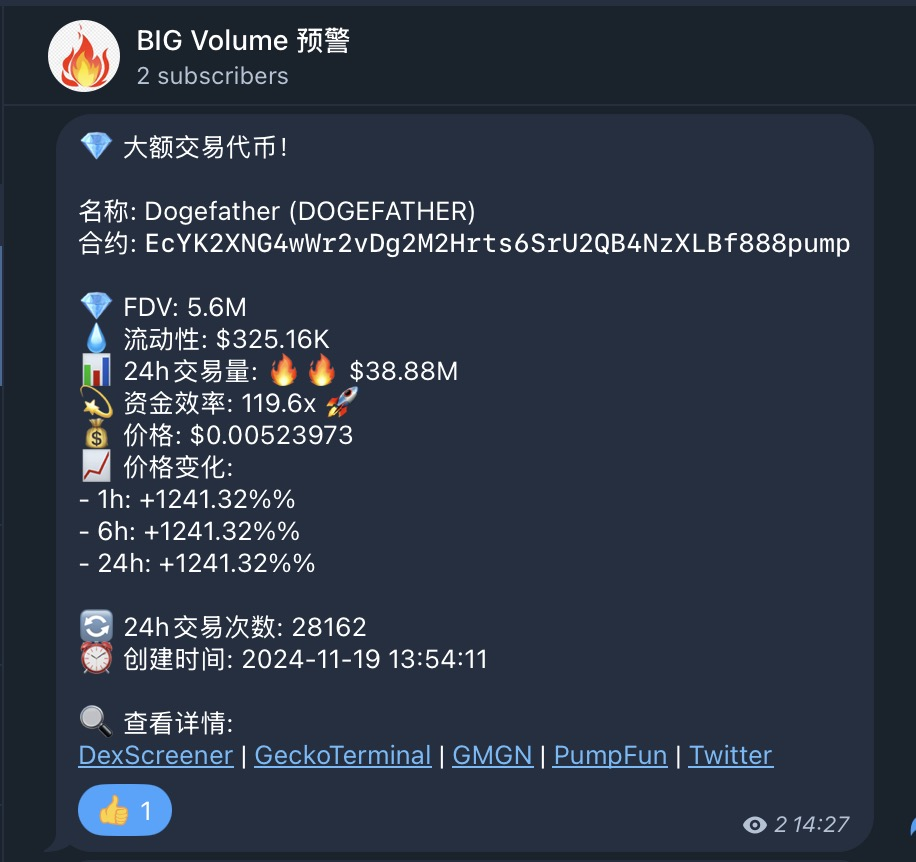
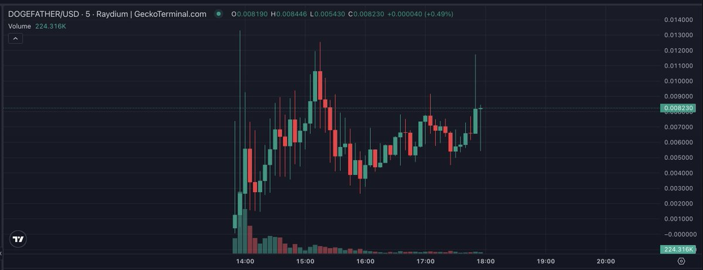
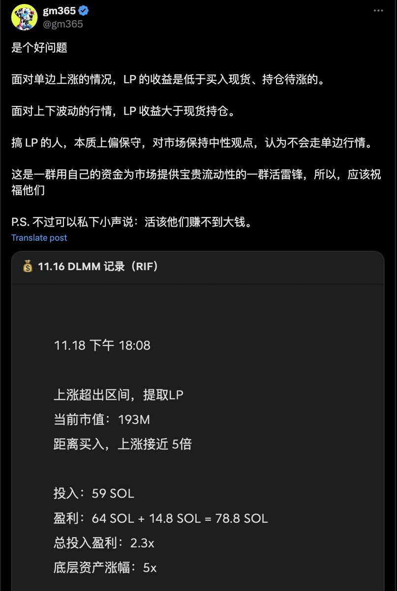

# DLMM 流動性池篩選指標：資金效率與 K 線形態

> **來源**: [@gm365](https://x.com/gm365/status/1858814701406482582)
>
> **日期**: 
>
> **標籤**: `DLMM` `LP 策略` `資金效率`

---

> **來源**: [@gm365](https://twitter.com/gm365)
> **日期**: 2025-02-18
> **標籤**: `DLMM` `流動性池` `LP策略` `資金效率` `技術分析`

---

## 核心觀點

昨天的長推分享了自己 DLMM 30 天的一些心得,其中關於如何選擇最佳的 LP 標的,今天想補充兩點資訊,同樣供大家參考。

## 一個指標:資金效率

昨天提到有一個黃金指標,我現在給它取名如下:

**資金效率 = 交易量 / 流動性池**

代表的是,當前的流動性池內的資金,創造了多少倍的交易量。

**資金效率越高,LP 收益越高;反之亦然。**

### 資金效率的概念來源

其實這個資金效率的概念,在 Uniswap V3 出來時,被他們重點提及。

因為 V3 的集中流動性通過把做市資金聚集在一個更小的價格區間,獲得了比 V2 高很多倍的資金使用率,從來帶來更高的做市收益。

當然,他們可能沒過多強調缺點:

1. 更容易跑出價格區間
2. 需要主動做市策略
3. 更高的無常損失

DLMM 和 Raydium 的 CLMM 都是 Uniswap V3 的變種,本質上都是集中流動性做市。

### 標的選擇邏輯

回到標的選擇上,資金效率越高,對 LP 的吸引力肯定越大。

這類標的代表巨大的多空分歧,大家圍繞當前價格瘋狂交易,LP 做市商自然狂喜。

## 一類 K 線:長上下影線形態

除了資金效率這個數學指標之外,這類標的在 K 線上,則呈現典型的**長上下影線的形態**。

這類 K 線,代表大家在圍繞當前價格瘋狂交易,對價格分歧巨大。

這和那種旱地拔蔥式的直線上漲,截然不同。

### 最佳標的組合

二者結合,這樣的標的,就是最適合參與 LP 的標的。

因為漲幅不見得很大,但振幅極大,交易量也極大,手續費收益會明顯超過持倉待漲。

### 實例分析:DOGEFATHER

比如今天這個 DOGEFATHER,資金效率接近 120,同時疊加超級明顯的長上下影線。

相當完美的 LP 標的!

## 為什麼不直接買現貨?

這是昨天有位老哥在推文下的提問:

為什麼不直接買 meme,而頂著如此之高的無常損失參與 LP 做市?

### 收益對比分析

簡單說:

- **單邊上漲的行情**:確實 LP 收益會低於買入現貨持倉待漲
- **大幅波動行情**:LP 收益 > 買現貨
- **單邊下跌**:LP 損失 < 買現貨

### 策略總結

所以,總結來說就是,如果你認為接下來會是一個單邊上漲類行情,那最佳策略是買入並持有。

如果是震盪行情,則 LP 收益更高。
