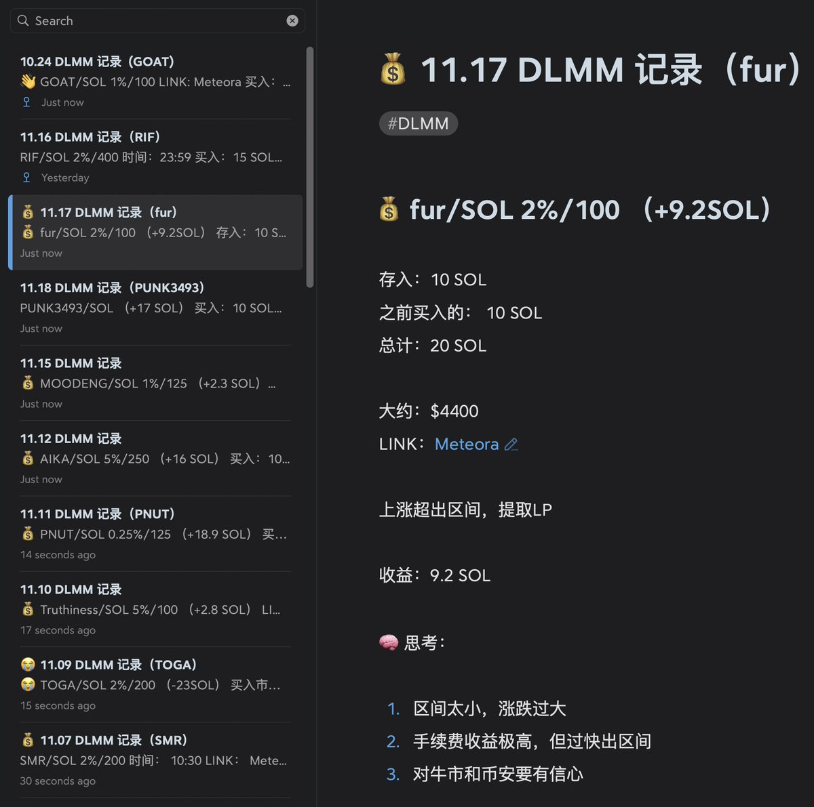
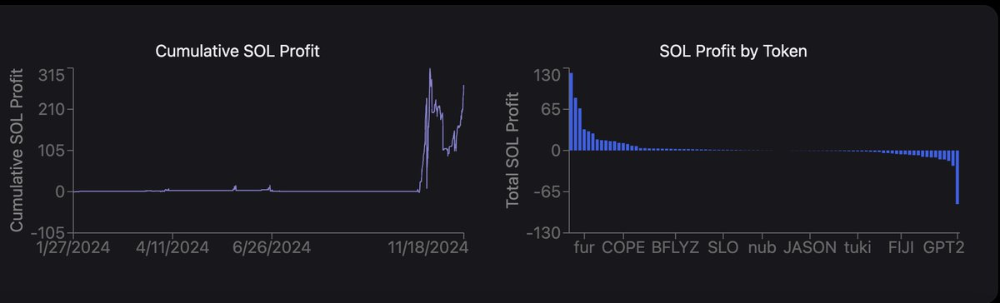
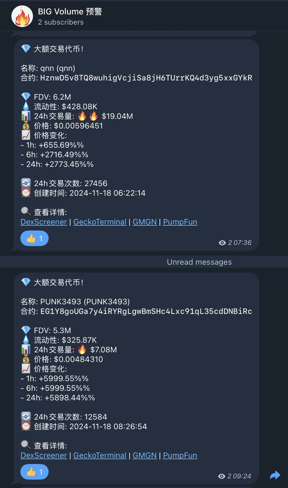
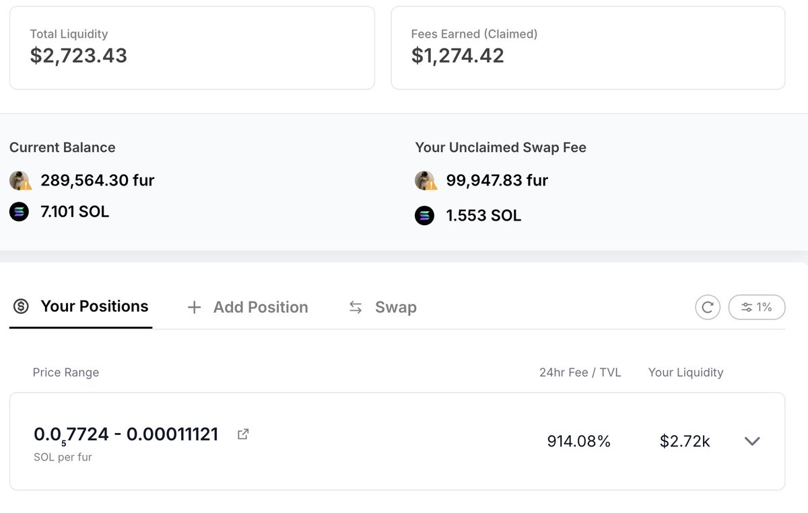

# DLMM 流動性做市 30 日經驗分享

> **來源**: [@gm365](https://x.com/gm365/status/1858414756753010866)
>
> **日期**: Mon Nov 18 07:39:40 +0000 2024
>
> **標籤**: `DLMM` `Solana Meme` `LP 策略`

---

> **來源**: [@gm365](https://x.com/gm365)
> **日期**: 2024-11-XX
> **標籤**: `DLMM` `LP做市` `Solana` `meme幣` `流動性挖礦`

---

## 30 日 DLMM 實戰回顧

最近一個月，基本上屬於高強度參與了 Solana 鏈上 meme 的 DLMM（LP 做市）

大體而言，分以下三個階段：

1. 剛開始的 10 天：GOAT 等 AI 熱，靠運氣撿錢
2. 接下來的 10 天：GPT2 等亂虧錢
3. 最近 10 天：謹小慎微、穩紮穩打

雖然前幾天 Pnut 上幣安導致我的倉位快速出區間，於是寫下了「莫要撿了芝麻丟了西瓜，放棄蠅頭小利」的話，還告訴自己不要再浪費時間在 DLMM 這些著眼於賺小錢的事情上。

但後續的 DLMM 操作記錄，也說明了這個告誡對自己基本無效，仍然每天高強度 DLMM 😳

## 為何持續投入 DLMM？

**一來可能對 LP 這事確實有癮**。畢竟也不是一時心血來潮，而是從上個週期 DeFi 挖礦起就一直在參與，屬實念念不忘。

**二來近期 Solana 鏈上熱度非凡**。Pnut/ACT 上線幣安，徹底打開鏈上 meme 天花板，現在隨隨便便一個標的，就動輒一兩千萬市值，而且還是在一天之內漲上去的，著實驚人。

**三來，自己用來參與鏈上交易的 bot 程序一直難產**，一直難產....

高強度搞了一個月的 DLMM，再次跟大家分享下近期心得，供大家參考：

## 1️⃣ 最適合 DLMM 的標的

### 三大黃金標準

1. **交易量巨大**
2. **上下波動大**
3. **交易量/TVL 比例高**

曾經我篩選 DLMM 的標準之一是：1 小時交易量超過 100 萬 USD。

但近期的很多標的，顯然大幅度超過這個標準，很多都達到了每小時 1000 萬的交易額，某些甚至超過 2000 萬。

這個數據，堪稱驚人！

你要知道，這些一小時一兩千萬交易額的標的，很多都只有幾十萬的流動性。

這也引出了第三個黃金標準：

💡 **交易量/TVL**

這個比例越高，你投入的資金其利用率越高，於是收益率 ROI 也越高

相反，某些已經有了一定時間沉澱的標的，市值很高，TVL（流動性）也高（很多超過百萬刀），即便你扔進去上萬刀，其實也很難分到多少羹。

## 2️⃣ 如何發現最佳標的

如果認真對照前面提到的三條標準，大概你能得出同樣的結論：

**最佳的 DLMM 標的，就是那些剛上線沒多久，交易量超級高，但流動性池越沒多大的黃金標的！**

### 去哪裡找？

你可以關注當前的熱門交易對，或者爬取 DLMM 官方 API 數據（但其實有一定延遲且不夠準確）。

我目前的做法是，寫了一個程序，專門用來監控這類短期爆發的熱門標的，然後在專屬的私人電報頻道進行推送。

類似的頻道，我還有好幾個。不同頻道，用來篩選不同類型的標的，用於後續不同目的。

超高交易量的，則比較適合用來參與 DLMM。

## 3️⃣ 費率的選擇

### 常見誤區

有些人誤以為費率設置的越高，手續費賺的也越多。

但這個看法明顯不對。

### 影響手續費收益的兩大因素

1. **競爭**
2. **波動性**

### 基本準則

你在 DLMM 中的流動性，其交易量來源，基本有二：

1. 聚合器分流
2. 套利機器人

### 結論

基於以上規則，可以得出以下結論：

1. **早期波動巨大的時段**，即便 5% 的流動性池，依然能創造足夠的套利空間

2. **隨著波動性降低、其他低費率流動性池的創建**，高費率池子交易量會顯著下滑

3. **Raydium 池的流動性越高**，DLMM 池吸引力隨之顯著下降

所以，早期的時候，你選 5% 問題不大，但如果你發現其他低費率池子 TVL 和交易量都開始放大，那麼你也應該「含淚」遷往低費率池才是正道，就像逐水草而居的牧民一樣。

畢竟，識時務者為俊傑嘛。

## 4️⃣ 區間 Steps 的選擇

### 基本原則

**越是早期，波動越大，區間越大才對。**

因為，作為提供流動性的做市商而言，只有當前資產價格在你配置的流動性價格區間範圍內時，你才能賺到交易手續費。

區間越小，理論上而言資金利用率越高，短期 ROI 越高，但是也越容易超出區間，導致你過早出局，錯過盛宴。

### 多大的區間最合適？

視情況而定。

如果還新幣上線，其實我最推薦的是 **Steps = 400**，再不濟，**250 Steps** 也行。

如果你進入的是 100、125 的 Steps，你會發現，不是過早賣飛，就是一個波動就下跌出局。

### 現實問題：眾人皆醉我獨醒

然而，有一個問題：眾人皆醉我獨醒的問題。

如果某人創建了一個 Steps 100 的池子，而且這個池子的 TVL 巨大。

如果你嫌區間太小，自己單獨開一個 400 的池子。除非你資金量巨大，否則你會發現一個很沮喪的事實：

**你的池子，交易量太小。**

- 獨木難支。
- 胳膊擰不過大腿。

底層原因在於，TVL 太小的池子，交易滑點變高，交易聚合器是不會把交易量路由到你的小池子的。

比如昨晚睡前，我把自己的 fur 倉位挪到了 100 的池子，結果一晚上過去，大部分時間我都在價格波動範圍之外，白白錯失了大把的手續費進賬。

### 建議

所以，如果你是第一個創建池子的，或者資金量夠大，對於那些超級早期的標的，我強烈建議你選 **250、400 的 Steps**。

如果你來晚了，或者好幾個不同的池子、費率，那你根據前面說的幾個原則，認真權衡。

## 5️⃣ 投入多少資金

### 基本原則

這個肯定要視自己情況而定。

但一般而言，**越是成熟的標的、流動性池裡資金量越大，說明這個標的越安全**，理論上，承載的資金量也越大。

如果是超級早期的標的，太多資金（幾萬到十幾萬刀），那肯定就過於冒險了。

### 血淋淋的教訓

到現在，我也忘不了當初投入 100 SOL 到 GPT2 的池子，結果一小時虧了將近 90 SOL 的悲慘事實。

經此一役，我如今變得謹慎多了。雖然也錯失了不少賺更多錢的機會，但資金曲線的增長，也相應穩健多了。

### 我的配置策略

基本上，對於十分早期的項目，我一般投入 **20～30 SOL**（買入一半、攢 LP 一半）；

如果已然成長為某個賽道龍頭，可以考慮投入 **50～100 SOL**，甚至更高。

比如我目前倉位最大的兩個，分別是 GOAT 和 RIF。

其他倉位，基本都控制在 50 SOL 以內了。

人窮，沒辦法。

## 6️⃣ 總結

當下，Solana 鏈上 meme 很火，DLMM 則給我們提供了一個成為 meme 做市商的機會。

**交易量很大、波動很大、風險很大、收益呢，也還可以。**

如果是上個週期的 NFT，以及年初的銘文，則沒有這樣的機會。

這是專屬於 ERC20 類代幣的 LP 做市機會，珍惜吧。
