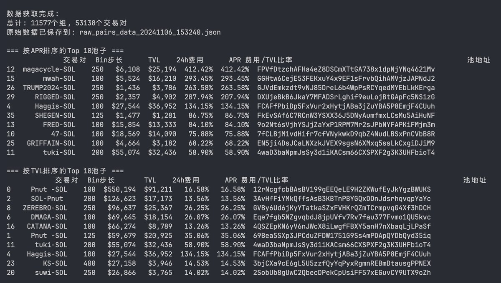
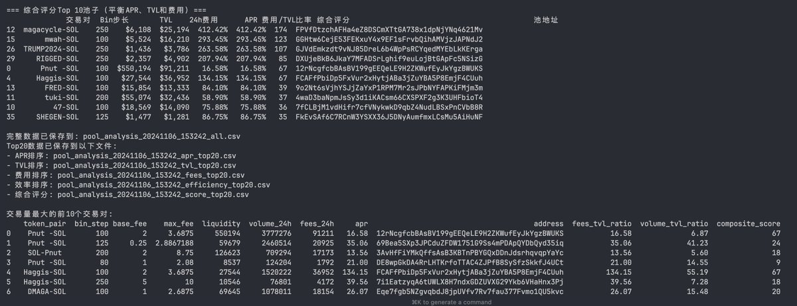
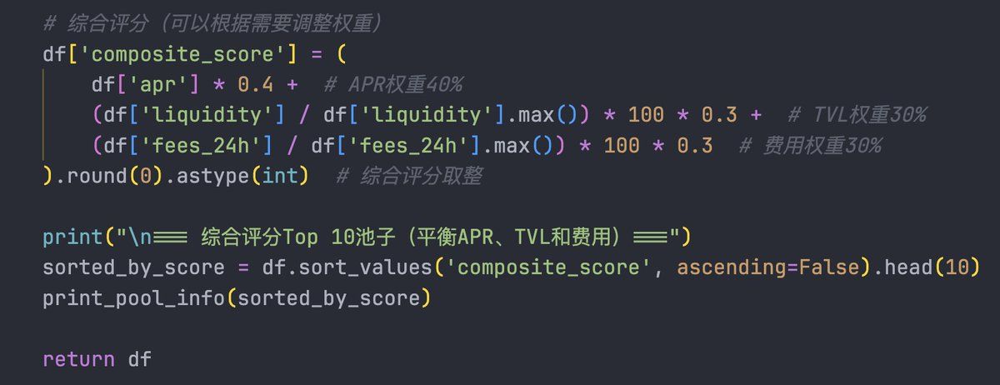
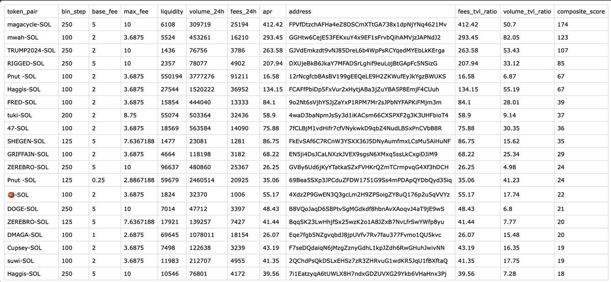

# DLMM 池子篩選工具——實時數據抓取分析

> **來源**: [@gm365](https://x.com/gm365/status/1854068964751757610)
>
> **日期**: Wed Nov 06 07:51:02 +0000 2024
>
> **標籤**: `DLMM` `流動性挖礦` `數據分析`

---

> **來源**: [@gm365](https://twitter.com/gm365)  
> **日期**: 2024  
> **標籤**: `DLMM` `流動性池` `數據分析` `篩選工具` `Meteora`

---

## 核心概念

實時抓取、分析、統計 DLMM 池子的全量數據。

敘事可能是假的、K 線圖也可能是人為拉的，但數字總不會騙人。

在 DLMM 選池子，或自己新建池子，其中有個難點在於「標的」選擇：

- 過於求穩，可能收益率不高
- 過於冒險，APR 上去了，本金可能就沒了

還有個偏穩妥，但不會拉下熱點太多的思路：抓取 DLMM 池子的全量數據，再進行數據處理、分析，根據你的需求，篩選對應的池子，組 LP。

網上其實已經有一個現成的解決方案了，就是這個 metlex。不過，每次要手動打開，等加載，手動篩選，再過濾，多少有些麻煩。

所以，還可以考慮：自己動手、豐衣足食。

## 實作流程

### 1. 原始數據

Meteora 公開了一個 DLMM API 接口，獲取所有的 Pairs。

注意，最好是分批獲取，避免獲取數據不全。

目前測試，獲取到的池子總量大約在 5 萬個左右。

### 2. 數據加工

對所有數據進行清洗，過濾掉 TVL 過低、APR 太低的數據。

然後根據一定權重，計算每一個池子的評分（比較主觀，可以根據自己側重點進行調整）。

過濾範例：
- 過濾掉所有 TVL < 1000 的池子（TVL 太低沒有參考意義）
- 過濾掉所有 APR < 10% 的池子（APR 過低沒有參與價值）

然後，就可以對所有池子打分、排序、呈現了。

### 3. 擇優選取

整個抓取、分析過程，大概一分鐘就能搞定。

然後就可以打開過濾排序好的結果，進行手動挑選了。

**重要提醒**：

記得這些數據都是過去的數據，真正打算進去組 LP 之前，務必手動打開 K 線網站，看看當前的價格、交易量等信息。

某些 APR 很高的池子，完全可能是過去幾個小時某個階段突然放量的結果。

如果價格已經開始下跌，現在再進去，就是給大家提供退出流動性的了。

### 4. 進階

除了手動運行程序外，還可以將程序部署到服務器/雲函數，然後定時執行。

篩選過後的池子信息，可以第一時間推送到你的 Telegram 私人頻道、Discord 社群、甚至微信、短信都可以。

這樣一來，就基本不會拉下 DLMM 的各種熱門 + 高收益池子了。
