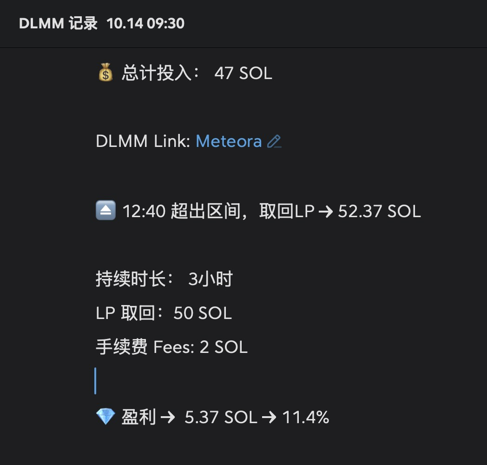

# DLMM 流動性提供策略經驗分享 — Meteora 上的 Meme 牛市 LP 實戰

> **來源**: [@gm365](https://x.com/gm365/status/1845700782588620889)
>
> **日期**: Mon Oct 14 05:38:52 +0000 2024
>
> **標籤**: `DLMM` `流動性挖礦` `Meme 牛市`

---

> **來源**: [@gm365](https://twitter.com/gm365)  
> **日期**: 2024-XX-XX  
> **標籤**: `DLMM` `Meteora` `LP策略` `Meme幣` `Solana`

---

## 實戰收益表現

MEME 牛市的 DLMM → YYDS

meme 行情井噴，鏈上 PVP 熱鬧非凡。但礙於年紀大了、體力不好，也只能換個方式參與 meme 熱潮：LP

這幾天看幾位大佬安利 @MeteoraAG 的 DLMM，說每天 LP 手續費收益在 $5000~1 萬刀左右，一時驚掉下巴。

DLMM 堪稱大佬們的印鈔機啊 🤤

今天實在忍不住，四處搜刮了幾十枚 SOL，開了兩個池子。

但其中投入較多的池子，3 個小時剛過就超出區間了（幸好是漲出區間），隨即撤了 LP，簡單統計了下：

💸 **投入**：47 SOL  
💵 **取回**：52.37 SOL（包含手續費收益兌換的 SOL）  
💰 **收益**：5.37 → 11%

價格波動過快（好事）、過大，才 3 個小時就超出區間，可見選的 Steps 太小，不太理想。

## DLMM 策略心得

簡單分享一些 DLMM 的心得，供大家參考：

### 1. LP 標的選擇

LP 標的首選：交易量巨大、TVL 相對沒那麼大（競爭沒那麼激烈）

### 2. 收益率指標

核心還是看 24 小時手續費收益/TVL 的數值（10%+ 就不錯）

### 3. 參數設定策略

選好標的後，需要選擇 Steps、費率、波動策略，建議：

- **波動越大，Steps 也要越大**
- **費率前期高，後期要一路降低**
- **波動策略首選 Spot，特別有把握可選 Curve**

### 4. 標的篩選原則

新開盤的 meme、交易量下降過快的，都不是好標的。LP 需要的是長期收益，並不追求速戰速決。

### 5. 心態管理

心態要穩：進入池子的資產，也會隨標的價格漲跌而波動，但一般只要不超出區間，可以放寬心。

## 關鍵要素總結

**標的、Steps、費率**，這三項基本最重要。親自嘗試過不同組合、吃過幾次虧，慢慢你也有經驗了。
