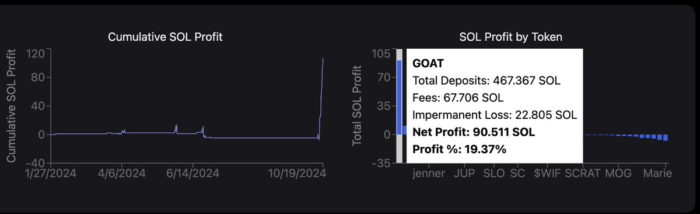
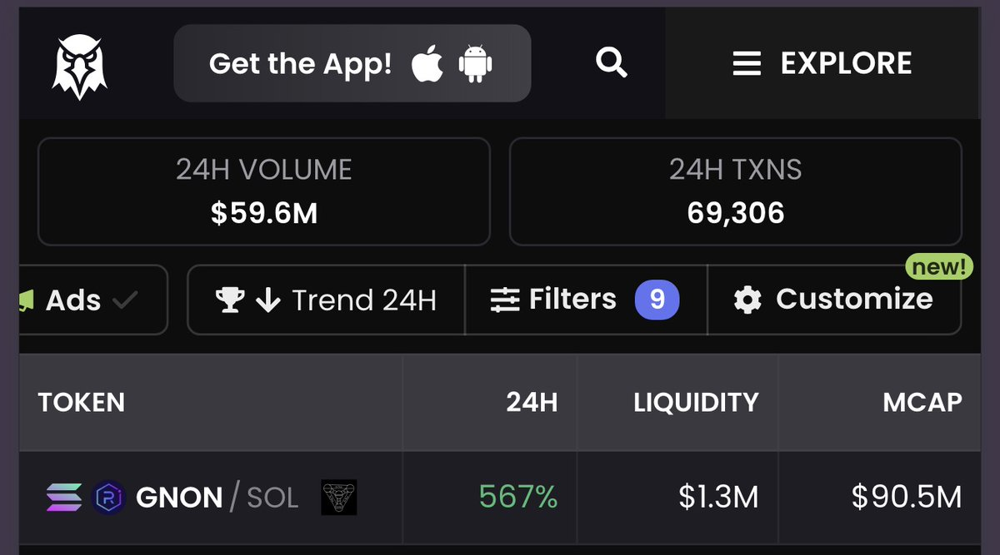
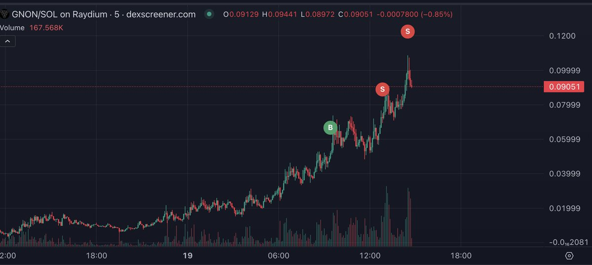
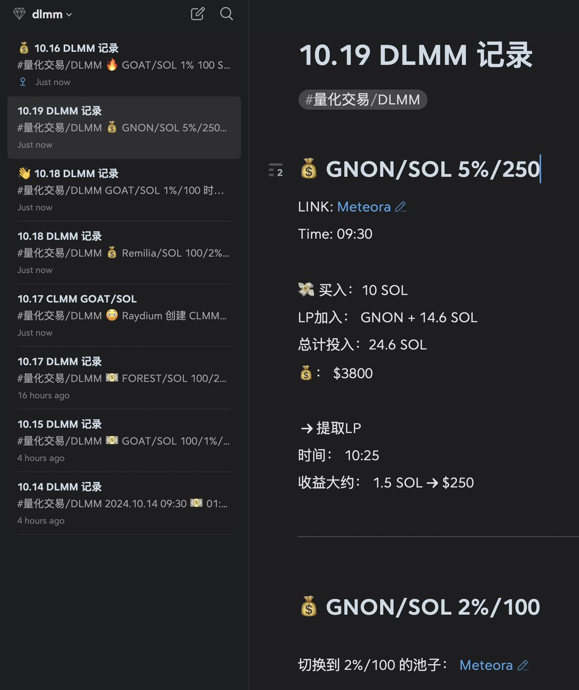

# DLMM 流動性提供者篩選策略與心態管理分享

> **來源**: [@feikerwu](https://x.com/feikerwu/status/1847606205042348479)
>
> **日期**: Sat Oct 19 11:50:20 +0000 2024
>
> **標籤**: `DLMM` `篩選標準` `風險管理`

---

> **來源**: [@feikerwu](https://twitter.com/feikerwu)
> **日期**: 2024
> **標籤**: `DLMM` `Meteora` `流動性挖礦` `風險管理` `交易心態`

---

打完遊戲回來發現多了一堆粉絲... 感謝 @gm365，並不是什麼大佬，只是在 Meteora 玩的時間久點，多點經驗。最近在踐行 @weremeow 提的 #PPP，也是利他，平時發帖比較少，這些過來的朋友肯定是對 DLMM 感興趣，線程分享一些工具用來輔助做 DLMM LP，希望都有所得。

---

## 引用：一週 DLMM 有感（@gm365）

最近一週高強度搞了下 Solana 上 Meteora 的 DLMM（集中流動性做市）。

總計投入大約 110 SOL，目前總盈利大約也剛好在 110 SOL。絕對值並不多，跟其他大佬比起來簡直不值一提。

但相比於年初我在 DLMM 上的一通瞎操作，有賺有賠（最終當然以小賺大賠收場），目前這個回報率算是相當可以了。

雖然就短短一週，但操作邏輯和心態也有很大變化，大致分以下幾個階段：

### 1️⃣ 運氣：GOAT

第一個重倉進去的是 GOAT，回頭看，純屬就是運氣好。

這個交易對可能貢獻了絕大多數盈利，平台統計有 90 SOL，個人感覺可能有點虛標。

然而，憑運氣賺來的錢，當然也會憑實力虧出去。

### 2️⃣ 大坑：盲目追求 ROI

DLMM 由於較高的費率、MEME 短期巨大的交易量、集中的價格區間，導致很多新開盤土狗的交易對，日化 ROI 驚人（起碼數字看上去如此）。

比如動不動日化 100%+ 的交易對，比比皆是。

什麼概念？

你存入 10 SOL，一天下來手續費收益就有 10+ SOL。

然而這只是理論值，實際情況是你盯著交易手續費，砸盤跑路的 DEV 們盯著的可是你提供的流動性。

最後，你收獲了手續費，別人收獲了流動性。

後面的一個標的：Marie 正是如此。看著超高的手續費收益，前期投入 11.5 SOL，最終回收只有 3.5 SOL，血虧 70%。

**貪心不一定全是壞的，但過度的貪婪只會讓你墜入萬劫不復的深淵。**

### 3️⃣ 過濾與篩選：安穩的一批

之前很多標的是絕對不敢過夜的，很多時候甚至得實時盯盤，就怕一根大紅柱子下來砸個底朝天。

擔驚受怕的滋味實在不好過。

後面幸得某位神秘大佬 @feikerwu 點撥，說他也被很多新開的盤子割怕了，後面就只選下面這種標的：

1. 開盤時間一天以上
2. 市值 1000 萬以上

頓時醍醐灌頂。

P.S. 根據這位大佬的貼圖，大佬從 DLMM 賺取了 $1M+ 的手續費，我給跪了（後續大佬說是統計有誤，實際也就 10 萬+，大佬這過於謙虛了）

於是按照大佬指點，加上自己的一番摸索和調整，後面就把過濾條件加到了 9 個。

目前來看，這個篩選標準還是相對靠譜的。

一般而言，這個列表裡只有 1-2 個標的，前天最多的時候有 4 個。

大部分情況，我看到新標的出現時第一時間買入、組 LP，後續基本都還不錯。

（P.S. 有點奇怪，好幾次都是早上 9 點看到新出現的標的，難道只是因為我 9 點才開電腦？）

這些標的，日化收益很多也在 100%+，而且幾個小時後可能還會漲破價格區間上限，於是收菜、換回 SOL、統計收益。

比如這幾天的 FOREST、Remilia、MEDUSA，以及今天的 GNON。

今天上午看到這個標的時，看了下市值、過去 1 小時交易額，立馬就買入開倉組 LP 了。

當時價格 $0.05，下午漲到 $0.1 時出了區間，於是就順勢撤了 LP。

現在，不需要面對滿屏的 TICKER 和讓人流哈喇子的 ROI 數據，狗咬刺猬，無法下喳了。

省心、省力，收益還相對穩定。

### 4️⃣ 總結

牛市機會多，消息越多，Ticker 滿天飛。

但絕大多數，這些信息只能算作噪音。

**如何過濾噪音，提取真正有價值的信息，才真的考驗一個人的功力。**

不想被噪音淹沒，你得想辦法去蕪存菁。

首先，你得承認自己抓不到所有機會、沒辦法在第一時間買入、沒法在高點賣出、無法避免虧損。

這樣你就不用背負太大的心裡壓力，不會想要賺到所有錢，而且要是那個賺最多的人。

重點是平穩自己的心態、調和自己內心不切實際的慾望。

殊不知，正是這樣無底洞般的貪婪和慾望，才讓絕大多數人在牛市虧掉最多的資產、錯過最大的機會。

就像很久之前地主哥說的那樣：**「允許自己不完美、允許自己是個普通人」**。

心態調整好了，整個人也沒那麼擰巴、沒那麼急功近利，也許才有機會更好的享受這個牛市。

## 核心策略要點

### 標的篩選條件（feikerwu 經驗）

1. **開盤時間**：一天以上
2. **市值門檻**：1000 萬以上

進階篩選：可擴展到 9 個條件（具體條件未詳述，但核心是過濾高風險新盤）

### 風險管理原則

- **避免盲目追求高 ROI**：日化 100%+ 的新盤往往是流動性陷阱
- **承認局限性**：不追求抓住所有機會、不追求完美進出場
- **心態優先**：允許自己是普通人，控制不切實際的貪婪

### 操作節奏

- 發現符合條件的標的 → 第一時間買入組 LP
- 價格突破區間上限 → 順勢撤 LP 獲利了結
- 不過夜高風險標的，避免實時盯盤的心理壓力
