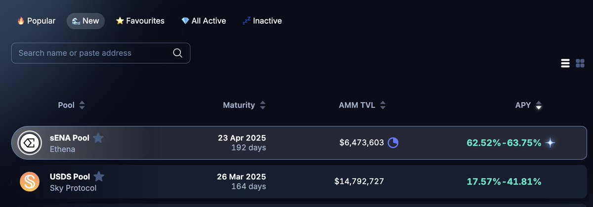

# Pendle sENA LP池高收益持續性分析

> **來源**: [@ViNc2453](https://x.com/ViNc2453/status/1845419927878107316)
>
> **日期**: Sun Oct 13 11:02:51 +0000 2024
>
> **標籤**: `Pendle協議` `LP策略` `收益農場`

---

> **來源**: [@ViNc2453 (ViNc)](https://twitter.com/ViNc2453)
> **日期**: 2025-02-18
> **標籤**: `Pendle` `sENA` `LP` `收益分析` `DeFi`

---

## 核心問題

如何判斷 Pendle $sENA LP 池高收益的持續性？

## 關鍵觀察

新上架的 @ethena $sENA LP 池能在幾乎零 $PENDLE 排放的情況下做到 63% 年化，並且日後池子年化下週將再次爆發。

## 深度解析

這是只有 Vinc 能解讀的 @pendle_fi 深度秘笈。

---

**註**：原文為 Twitter 推文開頭，作者預告將發布完整分析串文。完整內容建議追蹤後續推文。
