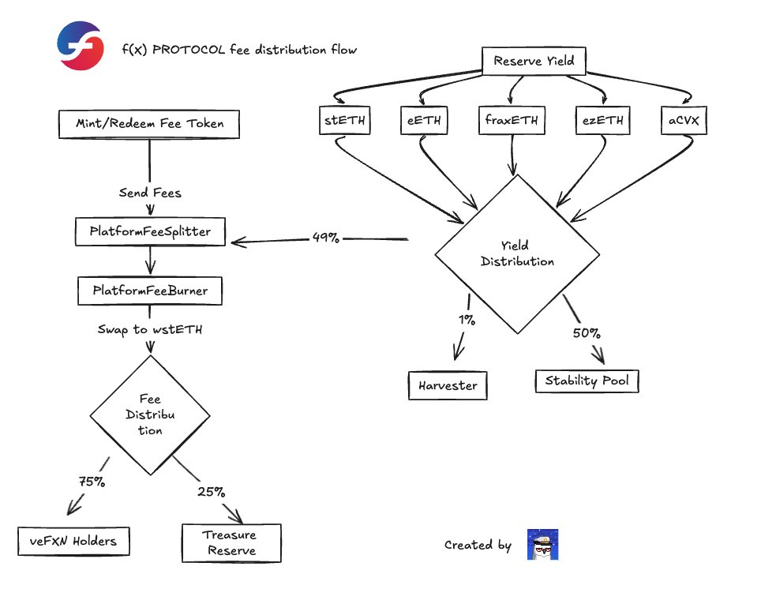
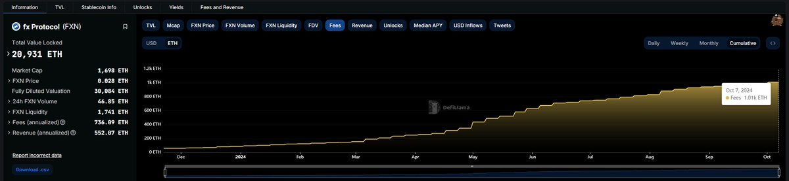

# Protocol FX 鏈上收益分析 - 從第一天就賦能協議的代幣設計

> **來源**: [@taowang1](https://x.com/taowang1/status/1844632646560907756)
>
> **日期**: Fri Oct 11 06:54:29 +0000 2024
>
> **標籤**: `DeFi協議` `鏈上數據分析` `代幣經濟學`

---

> **來源**: [@taowang1 (Tao)](https://x.com/taowang1)
> **日期**: 2025-02-18
> **標籤**: `protocol-fx` `鏈上數據` `收益分析` `代幣設計` `veFXN`

---

## 為什麼喜歡鏈上交易 - 因為公開透明

究竟是簡單相信項目方的文檔，還是自己去鏈上自己確認一下？

為什麼 @protocol_fx 能賺這麼多，而且從代幣第一天就賦能協議的收益？

先放我自己畫的協議收益圖，然後實操如何通過鏈上公開確定的信息了解協議。

## Protocol FX 收益數據

根據 @protocol_fx 官方披露：

- **總收益**：約一年內捕獲超過 1,000 $ETH
- **分配給 $veFXN 持有者**：超過 750 ETH

