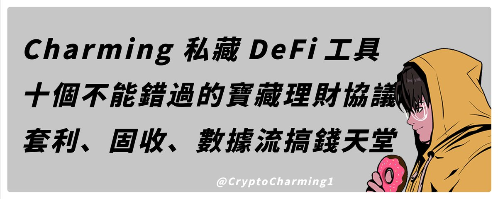

# DeFi 冷門協議實戰指南：Contango、Morpho、Pendle 等低波動農場

> **來源**: [@CryptoCharming](https://x.com/CryptoCharming/status/1834895526023905671)
>
> **日期**: Sat Sep 14 10:02:38 +0000 2024
>
> **標籤**: `DeFi策略` `循環貸` `固定收益`

---

> **來源**: [@CryptoCharming](https://twitter.com/CryptoCharming)  
> **日期**: 2024-01-18  
> **標籤**: `DeFi` `收益聚合` `循環貸` `固定收益` `套利策略`

---

## 前言

其實不少人常常私訊問我最近在看什麼 DeFi。近期手動擼毛接近死亡，加上我已經沒時間這樣擼，因此把有限時間換去找低波動 Farming 的香礦，同時包含 PT YT 這類花式虧錢的路徑。

我喜歡各種套利、固定收益、數據型的玩法，越多數據需要算我越興奮，因為門檻較高，相對不卷。

以下是我平常會看的、最近實際在參與的協議，相對冷門，但玩這塊的基本都觀察差不多的項目。啥都有：借貸、PerpDEX、聚合器、穩定幣、Dex 等等。

## 核心推薦協議

### Contango

**最強力推薦**

Contango 是個非常好用的循環貸聚合器，聚合很多頂級協議。熟悉介面後你就會發現有超級多 Alpha 機會，我很多錢都在裡面跑，非常多穩定理財的好策略。

幾乎華語圈沒看到人玩這個，是個冷門好東西。OI 其實已經 300m+，算是一個沒被發現的寶地。

**⚠️ 風險提示**：千萬注意風險，如果花很多時間還看不懂怎麼玩，我建議直接跳過或者準備好問題留言問我。

🔗 app.contango.xyz

### Timeswap

Timeswap 我也非常喜歡，常常有撿錢理財機會。雖然他包裝得很好了，但同樣是複雜的協議，需要謹慎注意風險，看不懂就不要無腦上。

🔗 app.timeswap.io

### Pendle & Spectra

Pendle、Spectra 這倆基本上就是很類似的產品，懂的都懂。如果運氣好數據算得準的話，這都是可以讓你暴富的好工具。不愛 YT 的話，PT 也是個躺平資金理財好工具。

🔗 app.spectra.finance  
🔗 pendle.finance

### Morpho

Morpho 是法國頂級協議，用起來很讓人放心。同樣是整合非常多的協議，不少理財好機會。這邊我也是建議搭配 Contango 服用。

🔗 app.morpho.org

### Usual Money

UsualMoney 之前說過了，這邊不再多說。近期算是我真的押了賭了最多錢的協議...活動還有 50 天，想要加入的還是能夠跟上！

🔗 app.usual.money/#FBPSI

### Huma Finance

HumaFinance 是最近融資 38m 的大熱項目。我挺喜歡他們的解決方案的，真實應用落地。現在也有 APR 15% 的理財機會，又有潛在空投，加上實際參與人數極少，值得參與一下的。

🔗 app.huma.finance/#/?referralCode=455d80

### Init Capital

InitCapital 是我追了非常久的協議，快一年吧...最早我就開始使用了，是我覺得很不錯的借貸協議。可以低成本去擼很多項目，像之前的 Ethena。

加上他們又搞了 Infinit Labs 做全鏈敘事，背景不錯，我其實覺得他們有上幣安的潛力...哈哈

🔗 app.init.capital/points?ref=52C501

### Vessel Finance

Vessel Finance 是最近融資 10m 被我看到的協議，搞得是 ZK Dex。個人研究了下覺得還挺不錯的，主要太少人玩，融資又不錯，就值得搞一下。隨便放個幾百刀就 Top50 了，收益也好，可以玩玩。

🔗 app.vessel.finance

### Aries Markets

Aries 曾經是我最喜歡的理財借貸協議之一。我大部位放這邊嚕了大概半年，APR 40~60 香得很。但一個月前某知名 DeFi 博主拍了影片，直接塌掉。

不過還是可以持續關注有沒有循環貸高利機會，Aptos 安全又讓人放心，真的很不錯。

🔗 points.ariesmarkets.xyz/AptosAirdrop

## 其他值得關注的協議

以上就是我最近在玩的大部分相關 DeFi，其他還有：

- Superform
- Beefy Finance
- ExtraFi
- Dolomite
- Gearbox Protocol
- Origami Finance
- Hourglass
- Merkl

裡面機會很多，比較多衍生產品玩法複雜、機制難懂，所以務必做好功課再上，不然怎麼輸錢的都不知道。

## Babylon LSD 參與項目

額外補充一下 Babylon LSD 的部分，有人問我到底參與了哪個 Babylon Labs LSD。這邊也一併列出來，我目前只玩以下四個，各有各的好，也是自己做下功課再上最好。

### Lombard Finance

TVL 最大、合作協議最多、巨鯨潛伏之地

🔗 www.lombard.finance/app

### Lorenzo Protocol

玩法新穎、之後估計會有其他特色週邊協議

🔗 app.lorenzo-protocol.xyz/staking?code=mPwT9co6

### Bedrock

節點技術在線、ETH BTC 爽 LSD 賽道通吃選手

🔗 app.bedrock.technology?invite=CKU4R3

### PumpBTC

合作協議頂級、技術在線、LSD 黑馬之一

🔗 pumpbtc.xyz

---

**註**：這篇文有幫助歡迎幫我分享出去幫助更多人！也可以留言或加入群組一起討論策略～身兼多職，我已經幾乎完全沒休息時間了，睡覺都是奢侈，文章出得很慢請各位多包涵。
