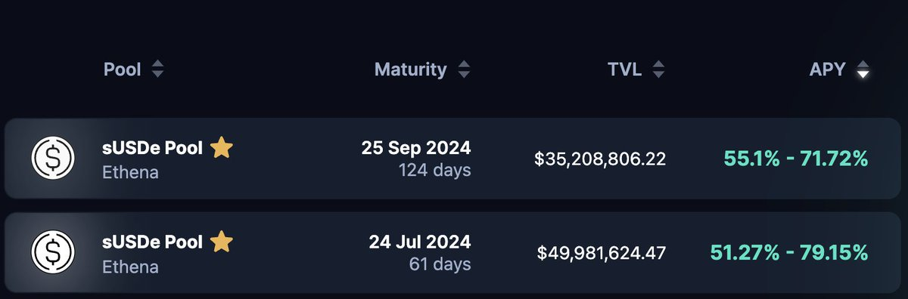

# Pendle LP 穩定幣高收益策略

> **來源**: [@ViNc2453](https://x.com/ViNc2453/status/1793901840599601456)
>
> **日期**: Fri May 24 07:08:22 +0000 2024
>
> **標籤**: `Pendle` `LP流動性挖礦` `穩定幣收益`

---

> **來源**: [@ViNc2453 (ViNc)](https://twitter.com/ViNc2453)
> **日期**: 2026-02-18
> **標籤**: `Pendle` `LP` `穩定幣` `收益策略` `DeFi`

---

## 策略概述

穩定幣神礦，年化收益 52%-79%。

@pendle_fi LP 的一大特點是低 IL（無常損失），持至到期 IL 更保證為零；另外池子部分為 PT（固定收益），有平滑底層收益率波動的作用。適合投進閒置資產增加收益。

## Pendle LP 常見新手問題教學

給新手一個 Pendle LP 的常見新手問題教學 🧵
