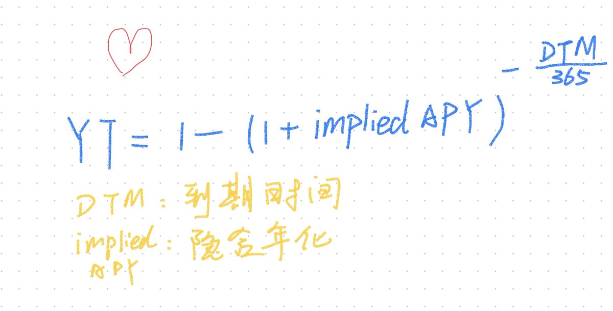

# Pendle YT 價格下降機制與收益率杠杆交易

> **來源**: [@quant_sheep](https://x.com/quant_sheep/status/1800674510716498334) | [原文連結](https://twitter.com/quant_sheep/status/1800674510716498334/photo/1)
>
> **日期**: 
>
> **標籤**: `Pendle` `YT代幣` `隱含年化收益率`

---

> **來源**: [@quant_sheep (Labrin)](https://twitter.com/quant_sheep)  
> **標籤**: `Pendle` `YT` `收益率杠杆` `DeFi`

---

## YT 價格下降機制

有些朋友說，@pendle_fi 上面 YT 都快歸零了，為什麼還要買？這是誤解。

**當隱含年化收益率 (APY) 固定時，YT 價格隨時間呈現近似線性下降的趨勢。**

## 買入時機與杠杆關係

- **早一些買入**：持有時間長，但買入時 YT 價格高，杠杆低
- **晚一些買入**：持有時間短，但買入的 YT 價格低，杠杆高

這是 YT 價格下降機制的核心邏輯——價格下降並非代表虧損，而是反映了時間價值的消耗與杠杆倍數的變化。
