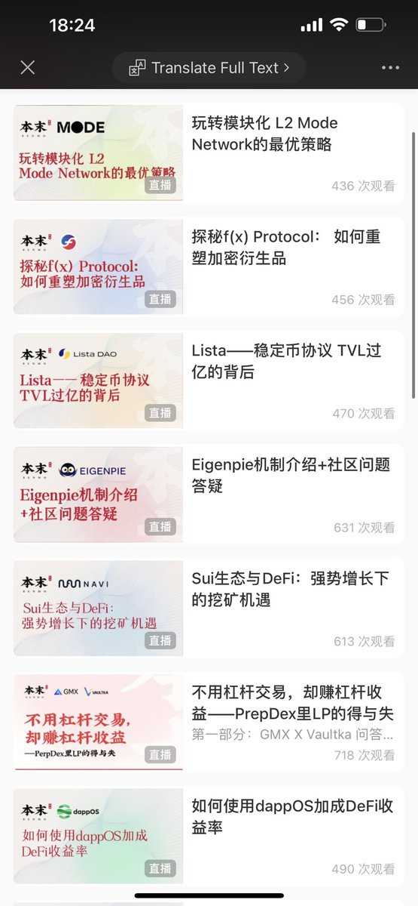

# DeFi 礦池教學公開課程指南

> **來源**: [@Riconomi](https://x.com/Riconomi/status/1775471918549999645)
>
> **日期**: Wed Apr 03 10:34:26 +0000 2024
>
> **標籤**: `DeFi礦池` `新手教學` `流動性挖礦`

---

> **來源**: [@Riconomi (Rico本末里里)](https://twitter.com/Riconomi)
> **日期**: 2026-02-18
> **標籤**: `DeFi` `礦池教學` `新手指南` `公開課程`

---

## 課程概述

本末公開課的內容基本都是社群比較關注的 DeFi 礦池的教學影片，內容對外公開，推薦新手學習。

## 相關連結

- 課程連結：https://t.co/dxmMxNtALd
- 補充資料：https://t.co/rN6oFOmmsA
