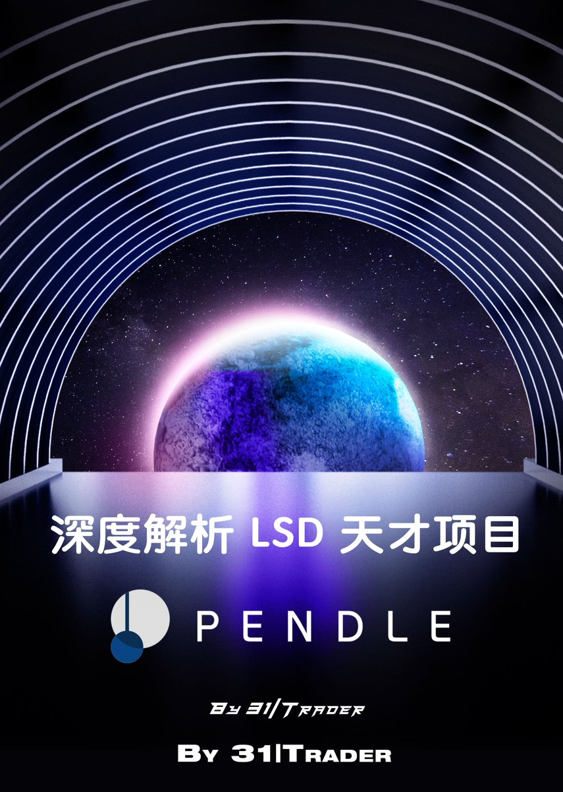

# Pendle LSD 項目深度分析：半年 10 倍的天才模型

> **來源**: [@althunter31](https://x.com/althunter31/status/1672507783290454017) | [原文連結](https://twitter.com/althunter31/status/1672507783290454017/photo/1)
>
> **日期**: Sat Jun 24 07:31:43 +0000 2023
>
> **標籤**: `Pendle` `LSD` `DeFi 策略`

---

> **來源**: [@althunter31 (PeakBuyer31)](https://twitter.com/althunter31)
> **日期**: 2024
> **標籤**: `Pendle` `LSD` `DeFi` `收益策略` `TVL` `投資分析`

---

## 項目表現概述

@pendle_fi 在半年內實現了 10 倍的幣價增長，TVL 快速突破 100M。該項目無論在基本面還是模型設計上都屬於頂級水平。

作者在 Pendle 上已經賺取了數萬 U 的收益，認為無論是投資還是投機，它都能滿足需求，或許是真正的「永賺」標的。

## 內容特點

本文結合實際案例進行硬核科普，即使是 #DeFi 新手也能讀懂。由於乾貨濃度高，建議先收藏後閱讀。
