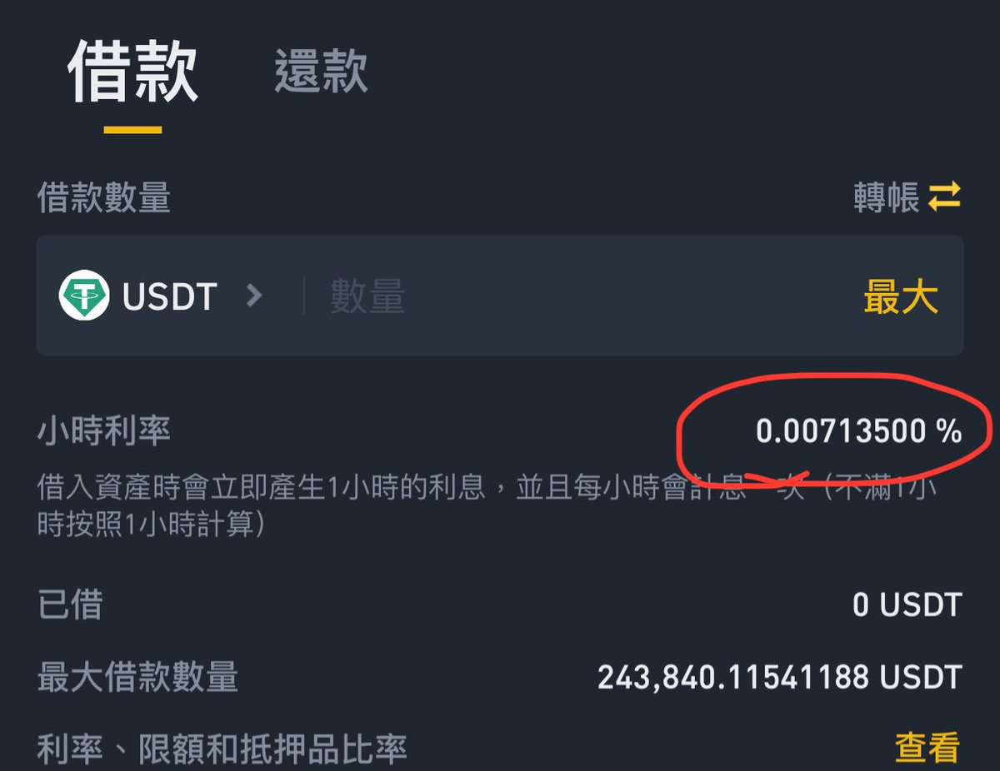
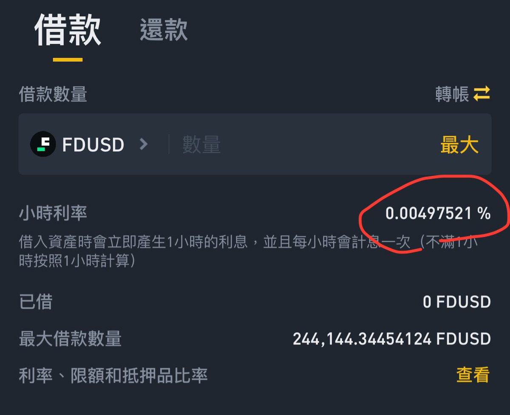

# 不賣幣增加流動性教程：抵押借貸與現貨合約策略

> **來源**: [@hank06171](https://x.com/hank06171/status/1763755402284662978)
>
> **日期**: Sat Mar 02 02:37:11 +0000 2024
>
> **標籤**: `流動性管理` `抵押借貸` `資金管理`

---

> **來源**: [@hank06171 (幣玩hank-lighter版-已囤幣完成😍)](https://twitter.com/hank06171)
> **日期**: 2026-02-18
> **標籤**: `DeFi` `流動性管理` `槓桿借貸` `套保策略`

---

這是一篇大幅增加你流動性的教程（好像很多人不知道，大老闆就放過我吧）

## 應用場景

基本上現在大部分的人手上都是幣，沒有 u，那如果出現比如說幣安 launchpool、OKX jumpstart 或是鏈上那種非常吃流動性的該怎麼辦？

**教程以不賣幣為前提增加流動性**

## 兩種主要方法

### 方法一：抵押資產借幣

這邊主要看兩個交易所（安全性為最優先）：#Binance 與 #OKX，這兩所都有抵押借幣，詳解差別如下：

#### 幣安全倉槓桿

- **優點**：可以吃全部幣種，等於你有任何有價值的垃圾幣也可以放進去借 u 出來
- **限制**：抵押品保證金水平必須在 2 以上才能轉出，意即「放 10000 等值 u 資產進去，只能轉出 5000u 等值資產」
- **利息**：目前約在 0.004-0.007% 每小時

#### OKX 借貸

- **限制**：只能抵押 OKX 認可的資產，如果是太小或太新的幣可能不支援（如 $STRK 就不能抵押）
- **優點**：只要抵押主流幣（$BTC, $ETH, $USDT 這種），可以抵押 10000u，轉出 7000u，比幣安硬生生多 20% 的流動性
- **利息**：遠低於幣安的借貸

### 方法二：現貨賣出 + 合約開多

這邊比較簡單，如有 3000 等值 u 資產要取流動性：

1. 先把現貨賣掉
2. 合約拿 1000u 開 3 倍槓桿做多

這樣就能有 2000u 的流動性，當然資金費率、滑點價差都會有成本。

## 最大化策略

這兩種方法是我比較常用的，要最大化轉出資產都是：

1. 用幣安全倉槓桿把小幣抵押
2. 把主流幣抵押到 OKX

可以最大化借出來的 u。

### 小撇步

幣安的穩定幣利息通常都不會一樣，通常受挖礦影響，可以比較看看要借哪個比較划算（利息差了 30%）。

## 其他選項

目前也有用過 Bitget 的逐倉槓桿，無利息，也蠻不錯的。

**注意**：此處只提到轉出是因為最終目的是把幣轉到其他地方用，只在交易所交易的不在此限。
