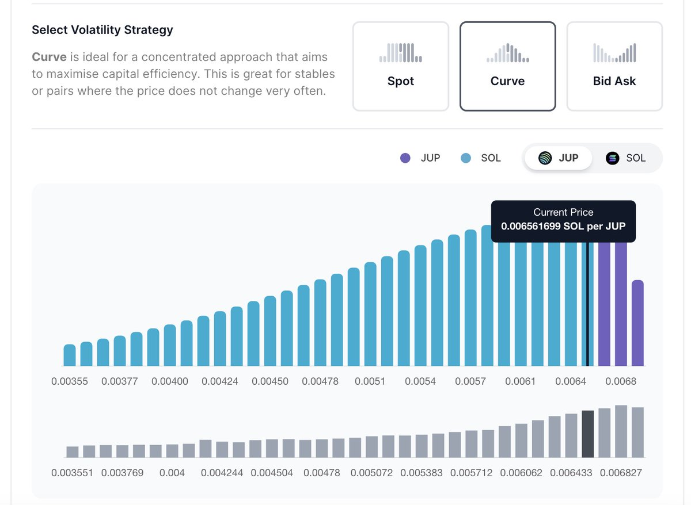

# DLMM LP 獲利能力實測分析

> **來源**: [@gm365](https://x.com/gm365/status/1752913102793019796) | [原文連結](https://x.com/gm365/status/1752643549601079736?s=20)
>
> **日期**: 
>
> **標籤**: `DLMM` `LP策略` `手續費收益`

---



> **來源**: [@gm365](https://twitter.com/gm365)
> **日期**: 2025-02-18
> **標籤**: `DLMM` `流動性挖礦` `JUP` `DeFi` `收益分析`

---

## 實測背景

按照昨晚發的帖子，在 JUP 上線前，分別選擇了兩個不同的 DLMM 的 JUP 池子：

- **池子 A**：JUP-SOL，1% 費率，Bin Step 200，Curve 曲線
- **池子 B**：JUP-SOL，1% 費率，Bin Step 100，Bid-Ask 曲線

現在 12 小時過去了，以下是具體收益分析。

## 第一個問題：賺了還是虧了

**整體 ROI 計算公式**：

```
整體 ROI = (當前持倉價值 + 未領取手續費) / 當初投入本金
```

**結果**：

- 兩個池子都沒虧錢，雖然賺的也不算多（相比於其他交易策略來說，比如昨晚提到的 DEX 價格套利）
- 按照目前 $0.65 的價格，即便算上 JUP 下跌（從你進入池子時設置的初始價格）導致的虧損，整體依然是有盈利的
- **整體收益約為本金投入的 7%**
- 也就是說，**12 小時的 ROI 為 7%**

## LP 手續費收益有多高

**手續費收益計算公式**：

```
手續費收益 = LP 手續費 / 當初投入的本金
```

**結果**：

- 單獨看 LP 的手續費收益，大約有 **13%+**
- 但其實在 JUP 開盤的第一個小時，就產生了約 10% 的收益
- 後續 11 個小時，也才增加了 3% 而已

## 心得總結

### 三大規律

1. **新幣上線當天，LP 收益可能會很豐厚**
2. **存在多個費率池子（1%、0.3%、0.05%）的情況下，初期選最貴的那個，收益更高**
3. **隨著時間推演，交易額會逐漸遷移到更低費率的池子去**。高費率池子到最後，只剩下套利機器人創造的交易額。要像游牧民族逐水草而居一樣，跟著交易量趨勢，遷移池子

## 進階心得

### LP 整體收益公式（以 U 本位計算）

```
LP 整體收益 = (本金投入 - 下跌損失) + (LP 手續費收益 - 無常損失)
```

### 風險分析

很多對此一知半解的人，往往喜歡張口閉口談無常損失，**其實最大的風險來自於代幣下跌造成的損失**。

**如何規避？**

- 普通人沒必要
- 進階選手可以考慮通過使用合約對沖此代幣的下跌風險

### 理想情況

組 LP 賺手續費收入，**最好的情況**是：

1. **前期**：上下波動、創造巨額交易量
2. **後期**：一路拉升，超出池子的設置區間，留下單邊資產（SOL、ETH、USDC）
3. **退出**：提資產 + 手續費收益走人

這樣既賺到了交易手續費收入，也賺到了另一半資產上漲的收益。

### 現實建議

當然，世事不會總如你所願。所以**提前做好規劃，或者做好充分的心理建設再衝，才是正經事**。
