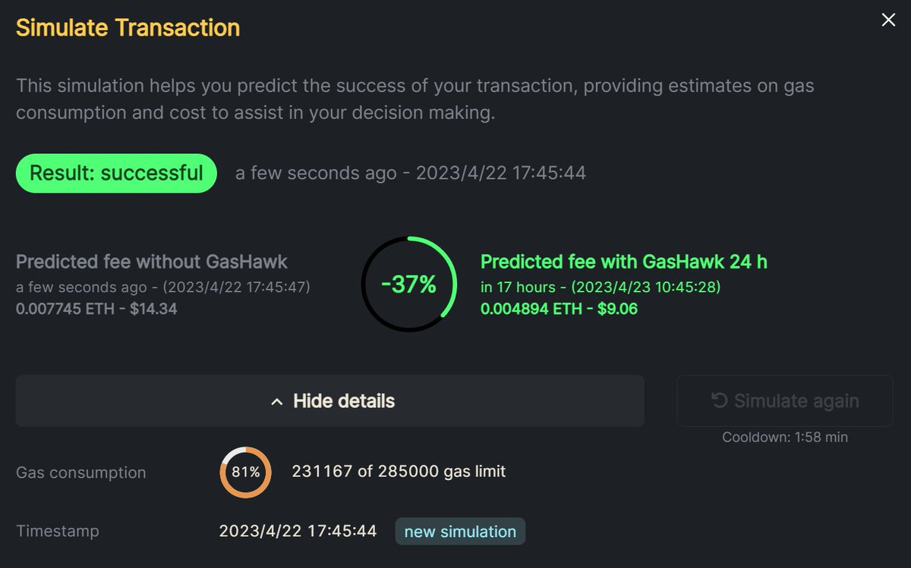

# ETH 主網省 Gas 費用技巧 — GasHawk 自動化交易

> **來源**: [@0xPutao](https://x.com/0xPutao/status/1649717521954787329) | [原文連結](https://twitter.com/TingfengMM/status/1649717521954787329/photo/1)
>
> **日期**: Sat Apr 22 10:11:22 +0000 2023
>
> **標籤**: `Gas 優化` `智能合約` `省費策略`

---

> **來源**: [@0xPutao](https://twitter.com/0xPutao)
> **標籤**: `ETH` `Gas優化` `GasHawk` `自動化交易`

---

最近主網 gas 爆炸！分享一個 ETH 主網省 95% ETH gas 費的小技巧，適用於不急著處理的交易，24 小時內會找最低的時候給你交易。

## 適用場景

1. 適用於 XEN 小號、mintfun 小號、質押 ETH、ENS 域名註冊等等
2. 再配合 OKX 錢包每天免費一次轉帳，簡直無敵
3. 安全性可靠，ensDAO 資助產品，還是建議小號使用

## 工具

GasHawk（@gashawkio）— 自動化交易工具，會在 24 小時內選擇 gas 費最低的時段執行交易。
