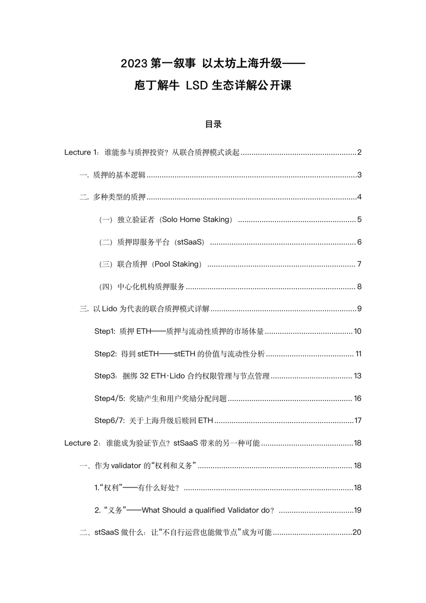
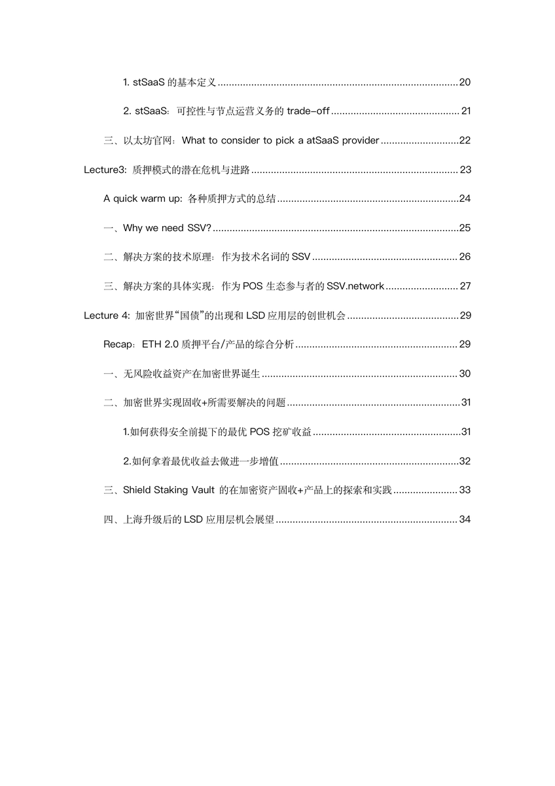

# 以太坊質押完全指南：Lido 聯合質押模式詳解

> **來源**: [@0x_claudia](https://x.com/0x_claudia/status/1637871193780002816) | [原文連結](https://twitter.com/0x_claudia/status/1637871193780002816/photo/1)
>
> **日期**: Mon Mar 20 17:38:17 +0000 2023
>
> **標籤**: `以太坊質押` `Lido` `LSD`

---

> **來源**: [@0x_claudia (Claudia)](https://twitter.com/0x_claudia)  
> **日期**: 2024  
> **標籤**: `以太坊` `質押` `Lido` `LSD` `DeFi`

---

今晚系統學習了 @shield_dao 公開課內容，徹底搞懂了「以太坊質押」。本文涵蓋大師課的所有內容，包含兩大核心主題：

（一）誰能參與質押？質押都有哪些類型？  
（二）以 #Lido 為代表的聯合質押模式到底有哪 7 步？

## （一）誰能參與以太坊質押？質押類型有哪些？

### 質押參與門檻

以太坊質押的最低要求是 **32 ETH**，這對普通用戶來說門檻較高。因此出現了多種質押模式來降低參與門檻。

### 質押類型分類

1. **單獨質押（Solo Staking）**
   - 需要自己運行驗證節點
   - 最低 32 ETH
   - 技術門檻高，需要硬體設備和維護能力

2. **質押即服務（Staking as a Service）**
   - 將節點運營外包給專業服務商
   - 仍需 32 ETH
   - 降低技術門檻，但仍有資金門檻

3. **聯合質押（Pooled Staking）**
   - **Lido 等協議的模式**
   - 無最低金額限制，任何人都能參與
   - 獲得流動性質押衍生品（LSD），如 stETH
   - 不需要自己運行節點

4. **中心化交易所質押**
   - 在交易所（如 Coinbase、Binance）直接質押
   - 最簡單但失去資產控制權
   - 信任交易所管理

## （二）Lido 聯合質押模式的 7 個步驟

Lido 是目前最大的以太坊流動性質押協議，其運作機制包含 7 個關鍵步驟：

### Step 1：用戶存入 ETH

用戶將任意數量的 ETH 存入 Lido 智能合約，無最低限制。

### Step 2：鑄造 stETH

Lido 協議 1:1 鑄造 stETH（Lido Staked ETH）給用戶：
- stETH 是流動性質押衍生品（LSD）
- 可以自由交易、轉移或用於其他 DeFi 協議
- 解決了原生質押鎖定資產的流動性問題

### Step 3：ETH 分配給節點運營商

Lido DAO 將用戶存入的 ETH 分配給經過審核的節點運營商（Node Operators）：
- 這些節點運營商負責實際運行驗證節點
- 需要經過 DAO 治理投票批准
- 分散化運營降低單點故障風險

### Step 4：節點運營商運行驗證節點

節點運營商使用分配到的 ETH 運行驗證節點：
- 每個驗證節點需要 32 ETH
- 節點運營商負責硬體維護、網路連接等技術工作
- 參與以太坊共識機制，驗證交易和區塊

### Step 5：獲得質押獎勵

驗證節點正常運行後，會獲得以太坊網路的質押獎勵：
- 區塊提議獎勵
- 證明獎勵（Attestation Rewards）
- MEV（Maximal Extractable Value）收益

### Step 6：stETH 自動複利（Rebase）

Lido 的 stETH 採用 **rebase 機制**：
- 每天自動調整 stETH 持有量，反映累積的質押獎勵
- 用戶持有的 stETH 數量會每日增加
- 無需手動領取獎勵，自動複利

例如：持有 10 stETH，年化收益 4%，一年後你的錢包會顯示約 10.4 stETH。

### Step 7：提款或繼續質押

以太坊上海升級後，用戶可以選擇：
- **提款**：將 stETH 兌換回 ETH（需要排隊等待）
- **繼續質押**：保持 stETH 持倉，享受持續收益
- **DeFi 應用**：將 stETH 用於借貸、流動性挖礦等

---

## Lido 模式的優勢

1. **無門檻**：任意金額都能參與質押
2. **流動性**：stETH 可自由交易，不鎖定資產
3. **自動複利**：rebase 機制自動累積收益
4. **去中心化**：多個節點運營商分散風險
5. **DeFi 可組合性**：stETH 可用於其他協議

## 風險提示

- 智能合約風險
- 節點運營商表現風險（可能被罰沒）
- stETH 與 ETH 可能出現價格脫鉤（市場流動性問題）
- DAO 治理風險
