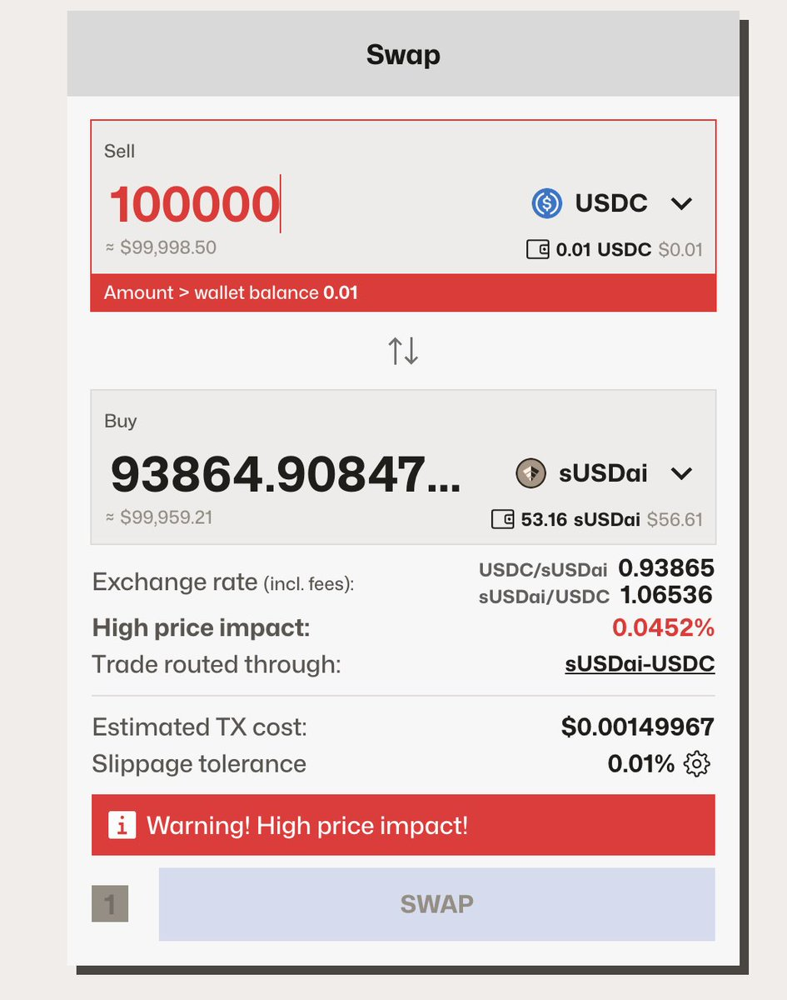
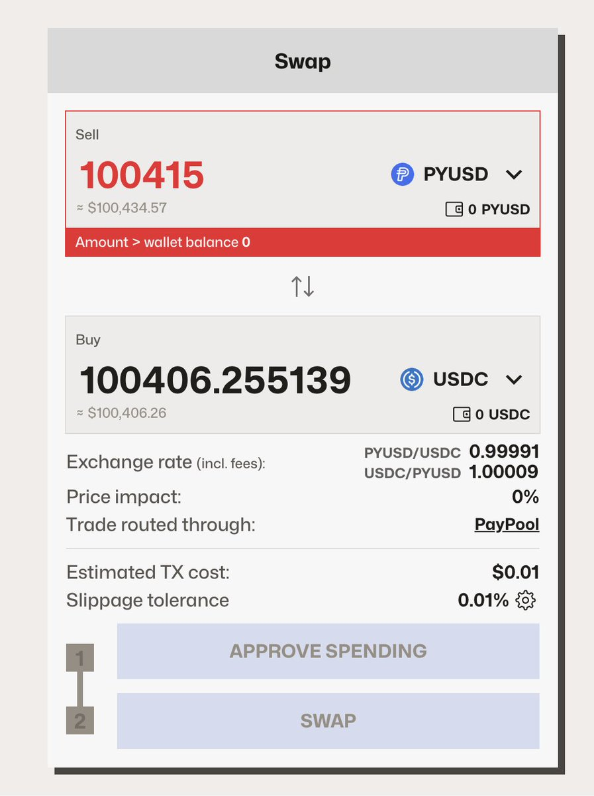
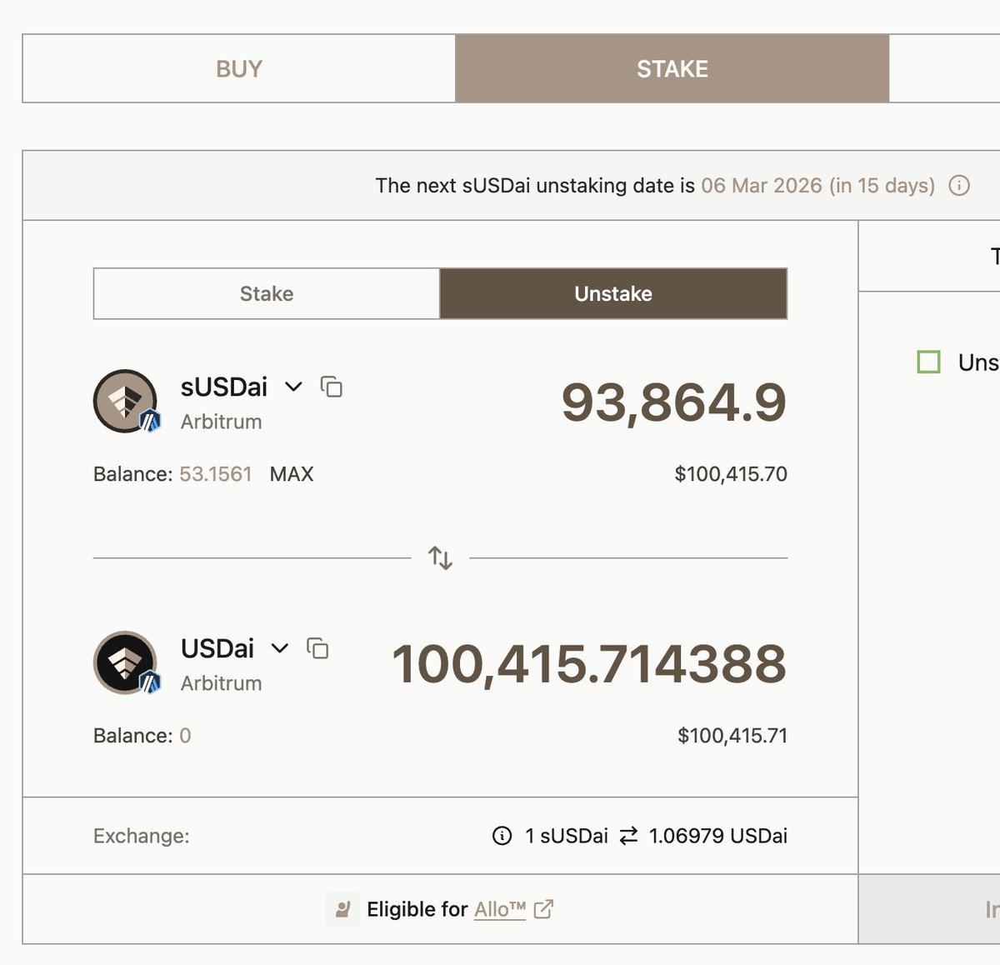

# sUSDai 跨協議套利策略 - 15 天 11% APY

> **來源**: [@Cryptophileee](https://x.com/Cryptophileee/status/2024372291510132786)
>
> **日期**: 
>
> **標籤**: `DeFi套利` `Curve交換` `跨鏈橋接`

---

> **來源**: [@Cryptophileee (Cryptophile)](原始連結)
> **日期**: 2026-03-06
> **標籤**: `套利策略` `sUSDai` `DeFi` `跨鏈橋接`

---

## 策略概述

- **APY**: 11%
- **ROI**: +0.4%
- **期限**: 15 天
- **流動性**: 500k 美元

## 操作步驟

### 步驟 1：在 Curve 上兌換

將 USDC 兌換為 sUSDai：
- 投入：100,000 USDC
- 獲得：93,865 sUSDai

### 步驟 2：發起解除質押

將 sUSDai 解除質押為 USDai：
- 投入：93,865 sUSDai
- 獲得：100,415 USDai（3 月 6 日到期）

### 步驟 3：贖回 USDai

以 1:1 比例將 USDai 兌換為 PYUSD：
- 投入：100,415 USDai
- 獲得：100,415 PYUSD

### 步驟 4：跨鏈橋接

透過 @LayerZero_Core 將 PYUSD 從 Arbitrum 橋接到 Ethereum。

### 步驟 5：兌換回 USDC

將 PYUSD 兌換為 USDC：
- 投入：100,415 PYUSD
- 獲得：100,406 USDC

最終獲利：406 美元（15 天內從 100,000 USDC 本金獲得 0.4% 收益，年化約 11%）
