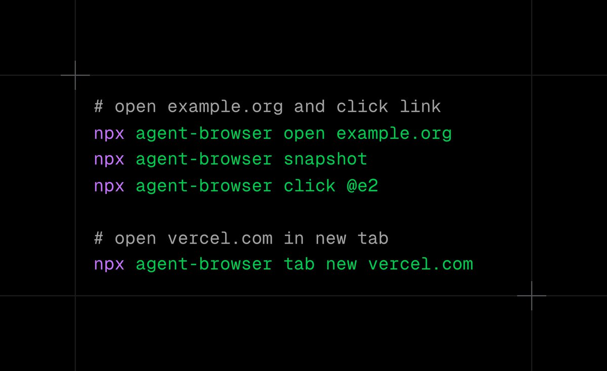

# 使用 agent-browser 節省 Claude Code Token 成本

> **來源**: [@bozhou_ai](https://x.com/bozhou_ai/status/2010900280226038232) | [原文連結](https://code.claude.com/docs)
>
> **日期**: 
>
> **標籤**: `Claude Code` `agent-browser` `Token 成本` `Web Automation`

---




## 使用 agent-browser 節省 Claude Code Token 成本

### 簡介

本篇文章介紹如何利用 `agent-browser` 取代 Claude Code 原生的 Fetch 功能，從而顯著降低 Token 使用量。`agent-browser` 僅讀取可見元素、互動節點和純文字，避免不必要的 HTML、CSS、JavaScript 混雜，大幅節省成本。

### 問題：Claude Code 原生 Fetch 的 Token 消耗

使用 Claude Code 原生的 Fetch 功能獲取網站內容時，會將整個網頁下載下來，包括 HTML、CSS、JavaScript，甚至隱藏的節點也會被讀取。這導致上下文非常龐大，增加了 Token 的使用量，進而提高了成本。

### 解決方案：使用 agent-browser

`agent-browser` 能夠只讀取網頁中僅可見的元素、互動節點和純文本，從而大幅減少 Token 的使用量。

### agent-browser 的優勢

*   **節省 Token 成本：** 僅讀取必要的內容，減少不必要的 Token 使用量。
*   **提高效率：** 更小的上下文意味著更快的處理速度。
*   **更乾淨的資料：** 避免了 HTML、CSS、JavaScript 的干擾，更容易理解和處理。

### 安裝與使用

#### 1. 安裝 agent-browser

使用 npm 全域安裝 `agent-browser`：

```bash
npm install -g agent-browser
```

#### 2. 安裝必要的依賴

執行以下指令安裝所需的依賴：

```bash
agent-browser install
```

#### 3. 在 Claude Code 中添加 Browser Automation Skills

為了讓 Claude Code 能夠使用 `agent-browser`，建議在 `.claude/skills` 目錄下添加相關配置。

首先，建立目錄：

```bash
mkdir -p .claude/skills/agent-browser
```

然後，下載 SKILL.md 檔案：

```bash
curl -o .claude/skills/agent-browser/SKILL.md \
  https://t.co/tlMDsj0tg8
```

或者，您可以手動在 `https://t.co/dT0V8hmEWv` 上添加以下內容到 Claude Code：

```
## Browser Automation

Use `agent-browser` for web automation. Run `agent-browser --help` for all commands.

Core workflow:
1. `agent-browser open <url>` - Navigate to page
2. `agent-browser snapshot -i` - Get interactive elements with refs (@e1, @e2)
3. `agent-browser click @e1` / `fill @e2 "text"` - Interact using refs
4. Re-snapshot after page changes
```

#### 4. 使用 agent-browser 指令

以下是一些常用的 `agent-browser` 指令：

*   `agent-browser open <url>`: 開啟指定網址。
*   `agent-browser snapshot -i`: 獲取互動元素並生成引用 (refs，例如 @e1, @e2)。
*   `agent-browser click @e1`: 點擊指定的引用元素。
*   `agent-browser fill @e2 "text"`: 在指定的引用元素中填入文字。

### 範例工作流程

1.  使用 `agent-browser open <url>` 開啟目標網頁。
2.  使用 `agent-browser snapshot -i` 獲取網頁上的互動元素。
3.  使用 `agent-browser click @e1` 或 `agent-browser fill @e2 "text"` 與網頁互動。
4.  如果頁面發生變化，重複步驟 2 和 3。

### agent-browser 簡介 (引用 @ctatedev)

*   **零配置**
*   **快速 Rust CLI**
*   **有頭或無頭模式**
*   **比 Playwright MCP 減少高達 93% 的上下文**
*   **相容 Codex, Claude Code, Gemini, Cursor, Copilot, opencode, 以及任何支援 Bash 的 Agent**

### 總結

透過使用 `agent-browser` 取代 Claude Code 原生的 Fetch 功能，可以顯著降低 Token 使用量，從而節省成本，同時提高效率。  簡單的安裝和使用方式，使得 `agent-browser` 成為 Claude Code 使用者的省錢利器。

