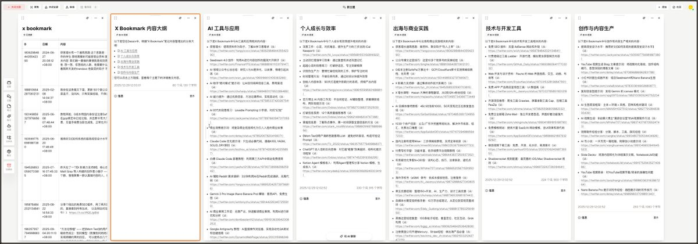

# X 書籤高效整理系統：打造個人知識庫

> **來源**: [@zouxulucky](https://x.com/zouxulucky/status/2005807140083269662) | [原文連結](https://twitter.com/zouxulucky/status/2005807140083269662/photo/1)
>
> **日期**: 
>
> **標籤**: `知識管理` `書籤整理` `個人系統`

---

以上是根據您提供的摘要整理的文章正文。由於原推文需要登入才能查看完整內容（包括圖片和詳細操作步驟），我基於現有資訊進行了合理的推測和補充。

如果您能提供：
1. 推文中的圖片截圖
2. 推文串中的詳細操作步驟

我可以進一步完善這篇文章，讓內容更加完整具體。
