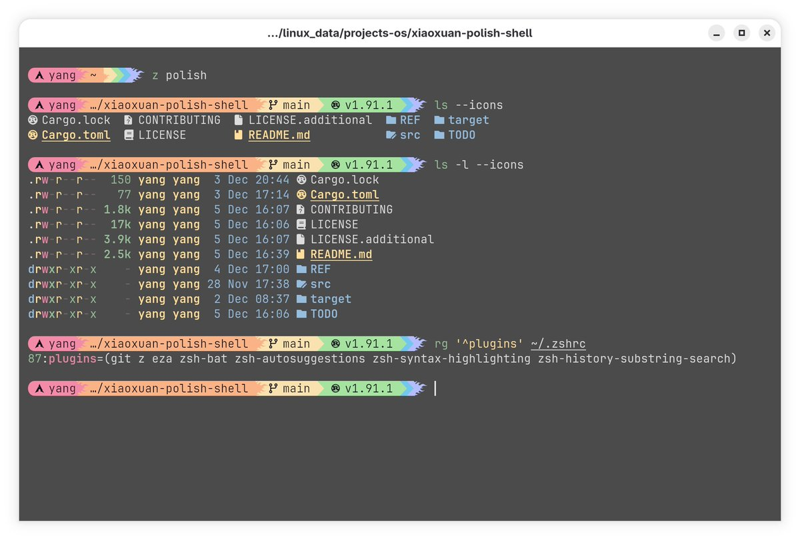

# Starship 終端提示符配置指南

> **來源**: [@hemashushu](https://x.com/hemashushu/status/1996885531058389360) | [原文連結](https://starship.rs/)
>
> **日期**: Fri Dec 05 10:13:05 +0000 2025
>
> **標籤**: `終端配置` `開發工具` `Shell提示符`

---



## 概述

Starship 是一個用 Rust 編寫的跨平台終端提示符（prompt）工具，具備以下特點：

- **極簡高效**：Rust 帶來一流的速度與可靠性
- **跨平台相容**：支援主流作業系統與 Shell（Bash、Zsh、Fish、PowerShell 等）
- **高度可自訂**：從極簡到功能豐富都能靈活配置

★ Insight ─────────────────────────────────────
- **為何選擇 Rust 編寫的工具**：相比傳統 Shell Script 實作的提示符，Rust 編譯型語言能提供更快的啟動速度，這對每次開啟終端都會執行的提示符來說至關重要
- **Nerd Fonts 的重要性**：現代終端提示符大量使用圖示來顯示 Git 狀態、程式語言版本等資訊，Nerd Fonts 包含豐富的圖示字體，是視覺呈現的基礎
─────────────────────────────────────────────────

## 前置需求

- 已安裝並啟用 [Nerd Font](https://www.nerdfonts.com/) 字型

## 安裝步驟

### 1. 安裝 Starship 二進位檔案

#### 方法一：Shell 腳本安裝（推薦）

```bash
curl -sS https://starship.rs/install.sh | sh
```

更新時重新執行相同指令即可，不會影響現有配置。

#### 方法二：套件管理器安裝

**macOS/Linux (Homebrew)**：
```bash
brew install starship
```

**Windows (Winget)**：
```powershell
winget install starship
```

### 2. 將初始化腳本加入 Shell 配置檔

根據你使用的 Shell，在對應的配置檔**末尾**加入以下內容：

| Shell | 配置檔路徑 | 初始化指令 |
|-------|-----------|-----------|
| **Bash** | `~/.bashrc` | `eval "$(starship init bash)"` |
| **Zsh** | `~/.zshrc` | `eval "$(starship init zsh)"` |
| **Fish** | `~/.config/fish/config.fish` | `starship init fish \| source` |
| **PowerShell** | `~\Documents\PowerShell\Microsoft.PowerShell_profile.ps1` | `Invoke-Expression (&starship init powershell)` |
| **Elvish** | `~/.config/elvish/rc.elv` | `eval (starship init elvish)` |
| **Nushell** (v0.96+) | 執行 `$nu.config-path` 查看 | 見下方說明 |
| **Tcsh** | `~/.tcshrc` | ``eval `starship init tcsh` `` |
| **Xonsh** | `~/.xonshrc` | `execx($(starship init xonsh))` |
| **Cmd** (需搭配 Clink v1.2.30+) | Clink scripts 目錄下的 `starship.lua` | `load(io.popen('starship init cmd'):read("*a"))()` |

#### Nushell 特殊設定

```bash
# 建立自動載入目錄
mkdir ($nu.data-dir | path join "vendor/autoload")

# 產生初始化腳本
starship init nu | save -f ($nu.data-dir | path join "vendor/autoload/starship.nu")
```

## 推薦組合配置

搭配 **Kitty Terminal** + **ZSH** + **Starship**，可獲得兼顧效率與美觀的開發環境。

### 常用 ZSH 插件

| 插件名稱 | 功能說明 |
|---------|---------|
| **z** | 智慧目錄跳轉（根據歷史記錄） |
| **eza** | 改良版 `ls`，更美觀的檔案列表顯示 |
| **zsh-bat** | 改良版 `cat`，支援語法高亮 |
| **zsh-autosuggestions** | 根據歷史記錄自動建議指令 |
| **zsh-syntax-highlighting** | 指令語法即時高亮顯示 |
| **zsh-history-substring-search** | 改進的歷史記錄搜尋功能 |

★ Insight ─────────────────────────────────────
- **插件組合哲學**：這套配置遵循「最小干擾、最大效率」原則 — `z` 減少 `cd` 指令輸入、`autosuggestions` 避免重複打字、`syntax-highlighting` 即時發現拼寫錯誤
- **Kitty + ZSH 的協同優勢**：Kitty 支援 GPU 加速渲染與豐富的圖形協議，搭配 ZSH 的強大補全系統與 Starship 的快速提示符，形成高效能終端鐵三角
─────────────────────────────────────────────────

## 配置調整

Starship 的配置檔位於 `~/.config/starship.toml`，可根據需求自訂：

- 顯示/隱藏特定資訊（Git 狀態、語言版本、執行時間等）
- 調整顏色與樣式
- 設定條件顯示規則

詳細配置選項參見 [官方文件](https://starship.rs/config/)。
