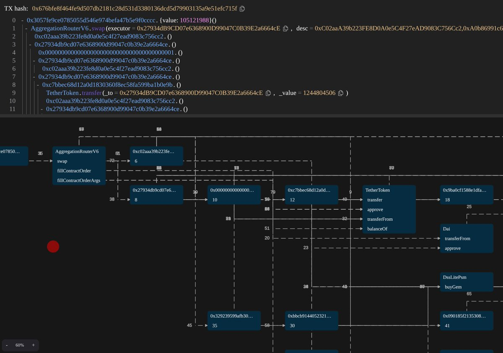

# TX Graph - 交易視覺化工具

> **來源**: [@ProgrammerSmart](https://x.com/ProgrammerSmart/status/1994796882951115211) | [原文連結](https://tx-graph-eight.vercel.app/)
>
> **日期**: Sat Nov 29 15:53:33 +0000 2025
>
> **標籤**: `區塊鏈工具` `交易分析` `可視化`

---

根據我的查找，TX Graph 的原始連結已經失效，但這是一個**區塊鏈交易視覺化工具**的概念。由於原始連結無法訪問，我只能根據推文資訊和類似工具整理出簡短內容：

---

> **來源**: [@ProgrammerSmart](https://twitter.com/ProgrammerSmart) (🐸Smart🐸Contract🐸Programmer🐸)  
> **日期**: 2025-02-16  
> **標籤**: `blockchain` `visualization` `transaction` `developer-tools`

---

## 工具簡介

TX Graph 是一個交易視覺化工具（Transaction Visualizer），用於將區塊鏈交易以圖形化方式呈現，幫助開發者和分析師理解交易流向與結構。

**注意**：原始專案連結（https://txgraph.github.io/）已失效。

## 類似工具參考

目前市面上有多個活躍的區塊鏈交易視覺化工具：

- **TxStreet.com** - 以動畫方式即時顯示比特幣與以太坊交易
- **TxCity.io** - 將交易視覺化為城市場景
- **BitConeView** - 提供交易圖譜探索功能，輸入起始交易哈希值即可追蹤資金流向

這類工具的核心價值在於：將複雜的交易資料轉換為直觀的圖形表達，方便偵測異常模式、追蹤資金流向、分析鏈上活動。

---

**Sources:**
- [Blockchain Transaction Visualizer - TxStreet.com](https://txstreet.com/)
- [Blockchain Transaction Visualizer - Txcity.io](https://txcity.io/)
- [BitConeView: Visualization of Flows in the Bitcoin Transaction Graph](http://www.bitconeview.info/)
- [GitHub - awesome-blockchain-visualisation](https://github.com/xpfio/awesome-blockchain-visualisation)
