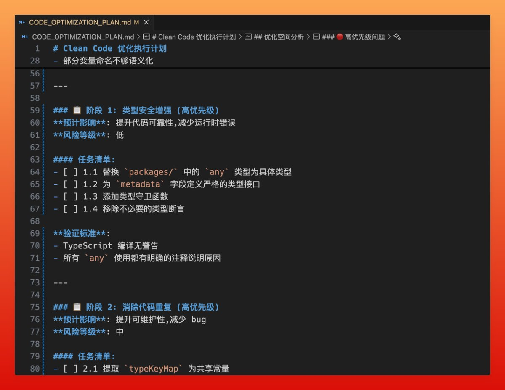

# Clean Code 漸進式重構策略：AI 時代的程式品質優化

> **來源**: [@hellokaton](https://x.com/hellokaton/status/1991384868891292137)
>
> **日期**: 
>
> **標籤**: `程式品質` `程式碼重構` `Clean Code`

---



> **來源**: [@hellokaton (katon)](https://x.com/hellokaton)
> **日期**: 2026-02-17
> **標籤**: `Clean Code` `重構` `AI 程式設計` `程式品質`

---

## 核心觀點

大部分人用 AI 寫完程式碼就直接上線，作者會多花點時間做一輪整體專案優化。這樣上線後 bug 變少，容易維護。

之前閱讀了 Clean Code 這本書，簡直是高品質編碼的聖經。

## 漸進式重構策略

這個策略屢試不爽：

1. 先按 Clean Code 編碼準則，分析一遍專案
2. 列一個漸進式重構清單，按優先級從高到低排序
3. 一條一條執行，每完成一項就更新 todo 狀態
4. 每一步都必須經過確認，才能做下一步

## 補充：編碼規則參考

引用 @indie_maker_fox 的 user rules 配置：

```
- Always respond in 中文，但註解一律用英文
- 不要過度設計，保證程式碼簡潔易懂，簡單實用
- 寫程式碼時，要注意圈複雜度，程式碼盡可能複用
- 寫程式碼時，注意模組設計，盡量使用設計模式
- 改動時最小化修改，盡量不修改到其他模組程式碼
```
