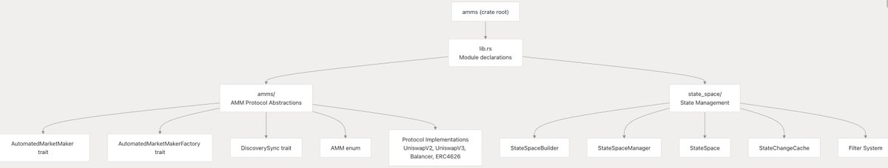
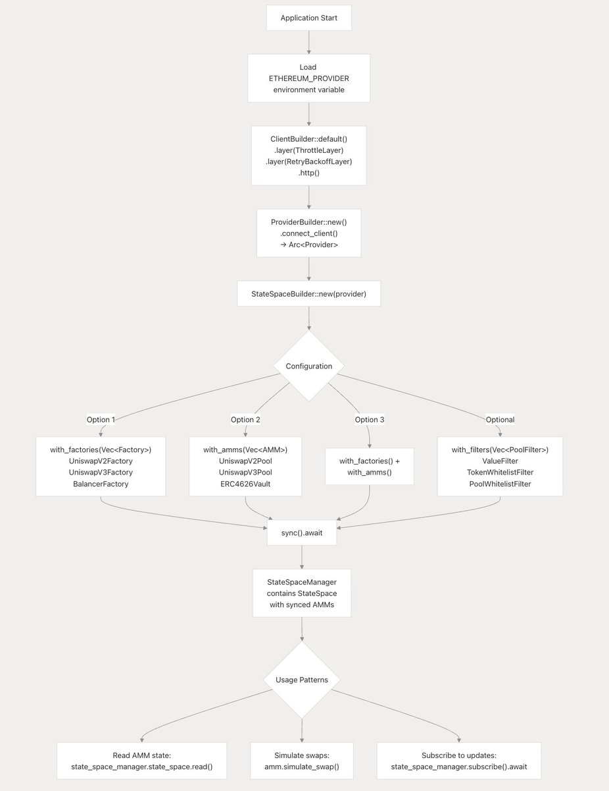
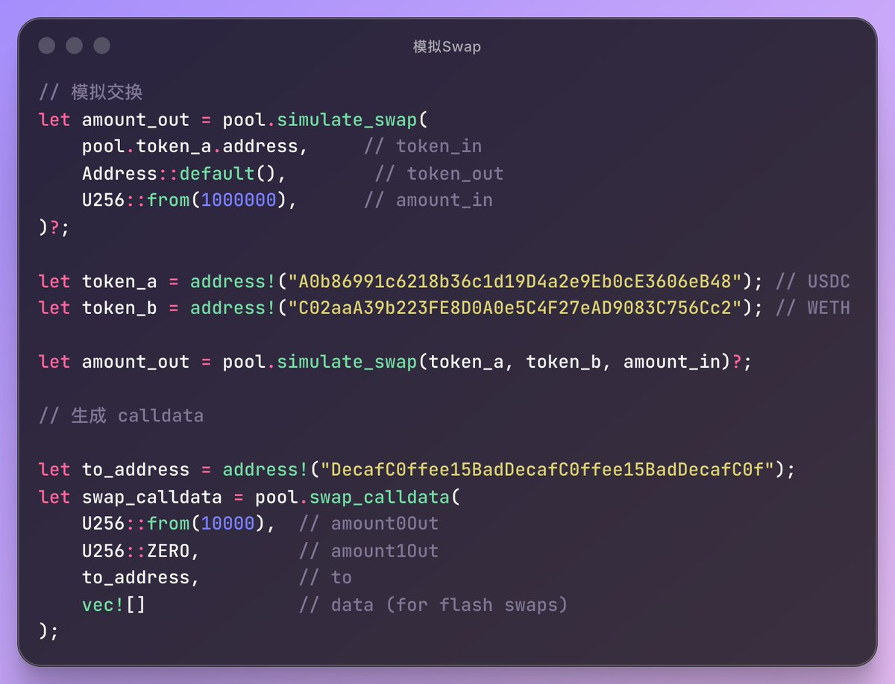

# Amms-rs：EVM 區塊鏈上的 Rust AMM 工具包

> **來源**: [@0xmomonifty](https://x.com/0xmomonifty/status/1990431073201959238)
>
> **日期**: Mon Nov 17 14:45:22 +0000 2025
>
> **標籤**: `Rust工具` `DeFi開發` `AMM協議`

---

> **來源**: [@0xmomonifty (0xMomo🕊️)](https://x.com/0xmomonifty)
> **日期**: 2026-02-17
> **標籤**: `rust` `amm` `dex` `defi` `toolkit`

---

## 什麼是 Amms-rs

Amms-rs 是一個用於在 EVM 相容區塊鏈上與自動化做市商（AMMs）互動的 Rust 工具包。它的前身是 cfmms-rs，也是一個非常知名、非常強大的函式庫！

它常用於構建 DEX（去中心化交易所）工具、交易機器人（bots）或套利系統，用於監控 AMM 池子價格、執行模擬交易等操作。

目前支援的協議：
- UniswapV2
- UniswapV3
- Balancer
- ERC4626 Vaults

你也可以直接 Fork 它進行修改來適用自己的程式。

## 主要模組

Amms-rs 主要分為兩個模組：

### state_space 模組

池子 AMM 狀態管理，負責池發現、同步等工作：

- **StateSpaceBuilder** - 用於配置和狀態初始化
- **StateSpaceManager** - 透過 WebSocket 訂閱進行持續同步
- **StateSpace** - 以地址為鍵的 AMM 實例雜湊映射存儲 (HashMap)
- **StateChangeCache** - 用於處理鏈重組狀態變更的快取緩衝區
- **StateSpaceError** - 狀態管理操作中的錯誤類

### AMM 模組

AMM 抽象層透過 `AutomatedMarketMaker` 特徵和 `AMM` 枚舉定義通用介面，主要擁有：

- **address()** - 回傳池合約地址
- **sync_events()** - 回傳狀態更新的事件簽名
- **sync(log: Log)** - 從事件日誌更新池狀態
- **simulate_swap()** - 在不修改狀態的情況下計算交換輸出
- **simulate_swap_mut()** - 計算狀態變更後的兌換輸出
- **tokens()** - 回傳池中的代幣地址
- **calculate_price()** - 計算兩種代幣之間的價格

## 初始化以及同步方法

### StateSpaceBuilder

StateSpaceBuilder 是初始化和配置 amms-rs StateSpace 的主入口點，可以設定同步的起始區塊號，以及：

- **with_factories()** - 配置工廠合約同步
- **with_amms()** - 直接將 AMM 實例添加到同步
- **with_filters()** - 配置過濾器同步

這幾個相互之間可以搭配混合使用。

### StateSpaceManager

StateSpaceManager 可以在新區塊到達時進行狀態更新，原理是：

1. **subscribe()** - 創建與 RPC 節點的 WebSocket 連接
2. 監聽區塊
3. 匹配池子的變更簽名
4. 更新 AMM 狀態

其中 **StateSpace.sync()** 是狀態同步的核心：

- **輸入**：`[Log]` - 當前區塊的事件日誌陣列
- **輸出**：`Result<Vec<Address>, StateSpaceError>` - 獲取更新後的 AMM 地址

## 模擬交易

**AutomatedMarketMaker::simulate_swap()** 方法在本地計算輸出金額而不執行交易，這非常適用於套利檢測、價格報價和 MEV 策略！因為 amms-rs 擁有強大的 AMM 協議實現。

可以直接計算輸出數量、生成 Calldata 等。

---

*以上內容是作者複習總結，如有問題請指正！*
