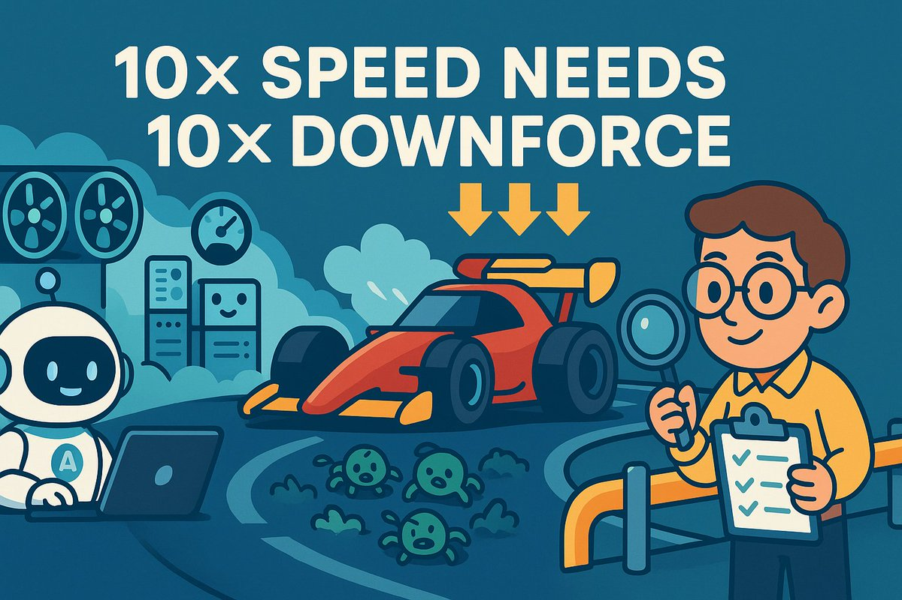

# 智能體編碼：AI 時代軟體工程的新計算方式

> **來源**: [@dotey](https://x.com/dotey/status/1983385425860333599) | [原文連結](https://blog.joemag.dev/2025/10/the-new-calculus-of-ai-based-coding.html)
>
> **日期**: Wed Oct 29 04:08:29 +0000 2025
>
> **標籤**: `AI 輔助編程` `軟體工程實踐` `CI/CD 流程`

---

> **來源**: [@dotey (宝玉)](https://twitter.com/dotey)
> **日期**: 2025-10-19
> **標籤**: `AI編程` `軟體工程` `Agentic Coding` `測試` `CI/CD`

---

## 背景：10倍產出的真實案例

Joe Magerramov（Amazon 工程師）與他的資深工程師團隊，過去三個月借助 Coding Agent，代碼產出效率達到普通高效團隊的 10 倍。但他並非來宣揚「人類程式設計師將被取代」，反而是用親身經歷說明：**當速度提升 10 倍時，風險和瓶頸也可能放大 10 倍**。

AI Coding 帶來的真正變革是：它徹底改變了軟體工程中關於「成本」和「收益」的傳統計算方式。

## Agentic Coding：智能體編碼工作流

他們的用法不是「Vibe Coding」，而是「Agentic Coding」。AI 扮演「能力超強、但沒有責任感」的初級程式設計師；人類工程師則是經驗豐富的「技術主管」或「架構師」。

工程師提交的代碼中，約 80% 由 AI 撰寫，但工作流程如下：

1. **拆解任務**：自己先想明白，或與 AI 一起頭腦風暴
2. **給 AI 下指令**
3. **逐行審查 AI 的輸出**
4. **反覆迭代**：直到對質量完全滿意
5. **最終提交 PR**：並為這些代碼負全責

人的作用最為重要，只是工作重心從手寫代碼轉移到「提要求」和「代碼審查」。

## 10倍速度的代價：10倍的風險

### 賽車比喻

當你以 200 mph 的速度狂飆時，需要巨大的「下壓力」把車死死按在地面上，否則會在第一個彎道飛出去。在軟體工程裡，「飛出去」指的是 Bug 和系統崩潰。

### 問題放大

- **過去**：一個團隊可能一年才遇到一兩次嚴重的生產環境 Bug
- **現在**：以 10 倍速度提交代碼時，哪怕 Bug 出現的**機率**不變，遇到 Bug 的**絕對數量**也會翻 10 倍。以前一年一次的事故，現在可能每週都來一次

這種「事故率」是任何團隊都難以承受的。很多吹捧 Vibe Coding 的人有意無意忽略了這些問題。

### 核心原則

要享受 AI 帶來的 10 倍編碼速度提升，必須把「出問題的機率」降低 10 倍，甚至更多。

## 具體建議：如何駕馭 10 倍速度

### 1. 借助 AI 降低本地搭建開發測試環境的成本，做好「風洞測試」

#### 什麼是風洞測試

就像造飛機在真正上天前，會把模型放進風洞裡吹。在軟體裡，這是指在本地搭建「高仿真模擬環境」。

**範例**：系統依賴 10 個外部服務（資料庫、認證、支付等），就把這 10 個服務全在本地運行或模擬出來。在電腦上就能完整跑一遍端到端測試，甚至模擬各種極端失敗情況。

這種測試能抓出大量隱藏在「組件」之間縫隙的 Bug。

#### 為什麼以前不做

太貴了！模擬和維護這些服務的工作量太大，大多數團隊都放棄了。

#### 為什麼現在能做

**AI 擅長幹這個！** AI 智能體非常擅長寫這種邏輯清晰、行為明確的模擬服務。作者團隊在 AI 幫助下，只花幾天時間，就為複雜系統搭建起完整的本地「風洞」。過去要幾週甚至幾個月的活，現在幾天搞定。

#### 實際成果

他們的專案借助 AI agent，維護外部依賴的假實作（fake implementations），包括：
- 認證（authentication）
- 儲存（storage）
- 鏈式複製（chain replication）
- 推論引擎（inference engine）

然後寫了測試框架，用這些假服務在開發者機器上啟動整個分散式系統，包括所有微服務。建置時測試針對完整組裝的堆疊啟動金絲雀測試，驗證整體系統運作。

這種方法能抓到過去只有提交到測試環境後才能發現的那類 Bug。幾年前這類想法會被認為「很好，但太貴」。這次只花了幾天就為相對複雜的系統實作完成。

### 2. 做好持續整合部署（CI/CD）

#### 持續整合的價值

早年瀑布開發時，模組劃分好後各自開發，開發後再整合，整合時會有很多問題，要花很長時間才能穩定。後來持續整合開始流行：

> 越早整合越早得到回饋，越頻繁整合越能減少問題複雜度。

#### 現狀問題

現在 CI/CD 已是公認的軟體工程最佳實踐，但真正做好的團隊不算太多，原因是搭建和維護這套流程成本不低。另一個問題是很多團隊雖然做了 CI/CD，但流程耗時巨長：一個 PR 跑完所有測試、發佈，少則十分鐘，多則上個小時。

以前沒有 AI 時這些問題還不明顯，現在 AI 能力強了反而成了障礙。特別像汽車引擎速度上來了，還是跑在土坑路上。

#### 需要的升級

CI/CD 需要跟著一起升級，把反饋循環從「小時級」壓縮到「分鐘級」。需要一套快到誇張的基礎設施，能在幾分鐘內發現、隔離並回滾有問題的改動，讓其他沒問題的改動繼續前進。

#### 高速度下的混亂

當團隊以每小時數十個提交的速度移動時：
- 在建置、打包、測試一組提交的時間內，可能又有十幾個提交在等待
- 當一組變更準備部署到生產環境時，可能包含 100 個以上的提交
- 如果其中一個提交有問題，部署需要回滾，導致管道停擺
- 同時，更多變更繼續累積，增加混亂和風險

#### F1 賽車的黃旗比喻

這讓作者想起 F1 賽車：賽道上發生事故時會舉起黃旗，所有賽車必須在安全車後方減速。原本激動人心的比賽變成悠閒地繞圈，直到清理完殘骸、賽道恢復安全。

為了最小化這種減速，賽事組織者會為各種事故做好準備，確保能在幾分鐘內清理賽道並重新開始比賽。

### 3. 決策和溝通系統也要升級

#### 10 倍產出需要 10 倍以上的溝通和決策效率

以前開發系統需要各種開會討論很久，最後才開工。因為要依賴其他人的模組，要先定義好協議，否則後面無法整合。

各種技術決策也要反覆討論很久，因為那時開發成本高，如果決策錯了返工代價太大。

現在如果還是以前的溝通效率，會極大拉低整體效率。

#### 解決方案

**減少協調需求**：最高效的是盡可能減少溝通，每個人做的事情盡可能不依賴其他人。包括微服務方案，也許在 AI 時代是個不錯的選擇。

**允許更多試錯**：對技術決策來說，現在反而可以有更多機會試錯了，不必像以前一樣過於嚴謹地反覆論證技術決策。

#### 實際案例

作者團隊採用的方法：
- **團隊坐在同一層樓**：這對他們的速度至關重要
- **快速面對面決策**：當某人需要做可能影響其他人的決策時，可以走過去在白板前幾分鐘內討論清楚
- **即時對齊**：討論權衡，兩位工程師都能回去工作。決策快速、正確地做出，不會造成被阻塞的工作堆積

作者承認這無法解決分散式團隊的問題——這仍是一個開放的挑戰。

#### 餐廳運營的啟發

如果你曾觀察過繁忙餐廳的後場，乍看可能覺得是混亂。但仔細觀察細節，會發現所有成員不斷彼此協調。廚師、服務員、清潔人員、經理持續來回傳遞資訊。透過保持持續同步，經營良好的餐廳即使在高峰時段也能服務顧客，不犧牲品質或速度。

#### 決策數量的爆炸性增長

當產出提高一個數量級時，不只是寫更多代碼——而是做更多決策：
- 應該用這個快取策略還是那個？
- 如何處理這個邊界情況？
- 正確的抽象是什麼？

正常速度下，團隊可能每週做一兩個這樣的決策。10 倍速度下，每天要做多個。

挑戰在於許多決策影響其他人正在做的事情。工程師 A 決定重構認證流程，影響工程師 B 即將擴充的 API。這不只是實作細節——是會在整個程式碼庫中產生連鎖反應的架構選擇。

#### 傳統協調機制的延遲問題

傳統協調機制在這裡引入太多延遲。等待 Slack 回覆或安排稍後的快速同步會議，意味著：
- 建立瓶頸——決策阻礙進度
- 或冒著走錯路的風險，在意識到衝突之前就已經走偏

**在高產出下，協調的成本可能占主導地位！**

## 總結：真正的變革

AI 帶來的 10 倍編碼速度，更像是給汽車升級了全新的「引擎」。如果只是把它裝在原來的「老爺車」上，得到的不會是 10 倍的速度，而是 10 倍的問題。

### AI Coding 的真正價值

不僅僅是寫得快，更是它讓那些過去「好是好，但太貴」的最佳軟體工程實踐（比如 CI/CD、自動化測試）變得便宜可行了。

就像不僅僅升級汽車的引擎，還把汽車經常跑的馬路一起升級。以前的老司機不是讓 AI 替代，而是讓他們能適應新的高速引擎，給他們舒適和安全的駕駛環境。

### 成功的關鍵

成功使用 agentic development 的團隊，將是那些認識到**整個軟體開發生命週期需要協同演進**的團隊。

收益是真實的——我們團隊 10 倍的產出提升不是理論，是可測量的。但關鍵在於：如果我們只是把 AI agents 簡單地加到現有開發實踐上，這些收益不會實現。就像給一輛窄輪胎、舊剎車的車加渦輪增壓器，結果不會是更快的圈速——而是撞車。

在 10 倍代碼速度下，當前的測試、部署和團隊協調方法會成為限制因素。瓶頸只是移動了位置。

這意味著我們需要從根本上重新思考如何構建軟體：
- 為每天 10 個提交設計的 CI/CD 管道，在 100 個提交下會崩潰
- 在正常速度下「足夠好」的測試策略，在高速度下會讓太多 Bug 通過
- 以前運作良好的溝通模式，現在會造成持續的工作阻塞

### 機會所在

好消息是我們已經有很好的想法：全面測試、快速部署、高效協調——這些想法已經顯示出潛力，但沒有被廣泛採用，因為它們實作和維護成本太高。

**改變的是**：agentic development 本身可以大幅降低這些成本。提高我們代碼產出的同樣 AI agents，也可以幫助我們構建維持該產出所需的基礎設施。

這才是真正的機會：不只是更快地寫更多代碼，而是**用 AI 讓以前不切實際的工程實踐變得切實可行**。

---

**原文**：[The New Calculus of AI-based Coding](https://www.joemag.dev/2025/10/the-new-calculus-of-ai-based-coding.html)  
**譯文**：[AI 編程帶來的新變革](https://baoyu.io/translations/ai/the-new-calculus-of-ai-based-coding)
