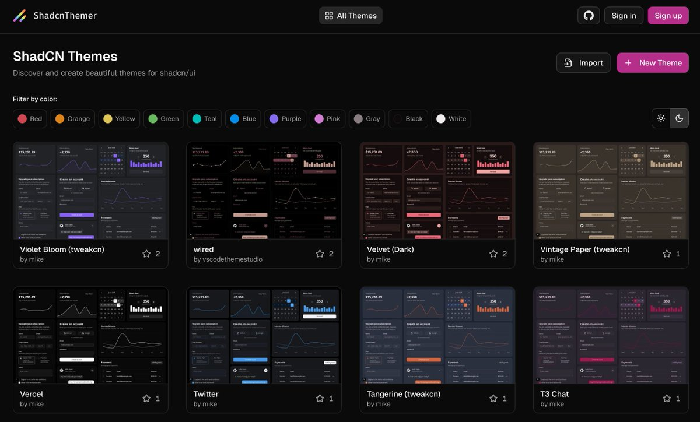

# shadcn/ui 主題合集資源與定制化指南

> **來源**: [@vikingmute](https://x.com/vikingmute/status/1982621951630975386) | [原文連結](https://shadcnthemer.com/)
>
> **日期**: Mon Oct 27 01:34:43 +0000 2025
>
> **標籤**: `shadcn/ui` `UI 元件庫` `主題定制`

---

> **來源**: [Viking (@vikingmute)](https://twitter.com/vikingmute)
> **日期**: 2026-02-17
> **標籤**: `shadcn/ui` `主題定制` `前端開發` `UI設計`

---

## ShadCN Themes 主題合集資源

ShadCN Themes (https://shadcnthemer.com) 是一個新的 shadcn/ui 主題合集資源平台，提供以下功能：

- **創建主題**：使用直觀的主題編輯器建立自訂色彩方案
- **定制主題**：調整和優化現有主題以符合需求
- **分享主題**：與社群分享你創建的主題
- **主題預覽**：支援多種不同 blocks 的預覽展示

平台已收錄大量主題，其中許多樣式非常精美。

## 顏色篩選功能

支援按以下顏色類別篩選主題：

- Red (紅色)
- Orange (橙色)
- Yellow (黃色)
- Green (綠色)
- Teal (青色)
- Blue (藍色)
- Purple (紫色)
- Pink (粉紅色)
- Gray (灰色)
- Black (黑色)
- White (白色)

## 配合使用建議

可與 tweakcn (https://tweakcn.com) 配合使用。shadcn/ui 的一大優勢就是定制化能力很強，這兩個工具能充分發揮這個特點。
