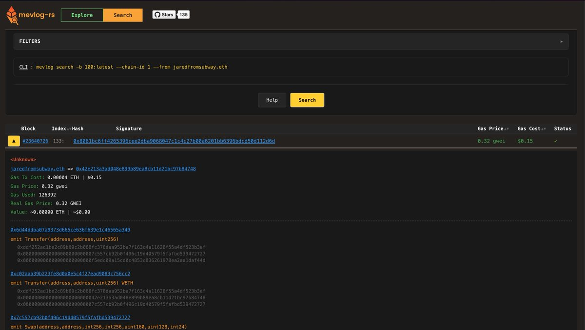
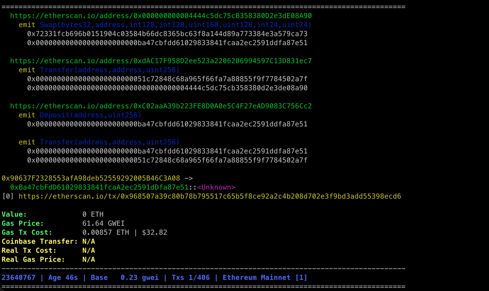

# mevlog-rs：EVM 鏈交易查詢工具

> **來源**: [@0xmomonifty](https://x.com/0xmomonifty/status/1981532463907426791)
>
> **日期**: Fri Oct 24 01:25:29 +0000 2025
>
> **標籤**: `MEV 分析` `交易監控` `開發工具`

---

> **來源**: [@0xmomonifty (0xMomo🕊️)](https://x.com/0xmomonifty)
> **日期**: 2026-02-17
> **標籤**: `區塊鏈開發` `MEV` `交易查詢` `工具分享`

---

## 工具簡介

mevlog-rs 是一個能夠像查找資料庫一樣來搜尋查詢 EVM 鏈交易的工具。

## 使用場景

在學習 Dex / Mev bot 的時候，經常要去查找特定的交易，例如：

- 某個區塊的 Uni sync/swap/mint/burn 交易
- 查找最近幾個區塊高 Gas 價格進行篩選
- 查找如轉帳大於 >1000 個代幣的合約地址

mevlog-rs 都可以輕鬆做到。

## 主要功能

它適合以下用途：

- 研究 MEV 相關的交易行為
- 監控特定鏈上的交易活動
- 挖掘特定類型的交易資料
- 追蹤智能合約儲存變化
- 分析合約呼叫行為

## 版本與支援

目前 mevlog-rs 有兩個版本：

- **網頁版**
- **CLI 版本**

與 ChainList 整合，支援多鏈使用。

## 總結

mevlog-rs 是一個功能強大的工具，非常適合開發者、鏈上愛好者使用！
