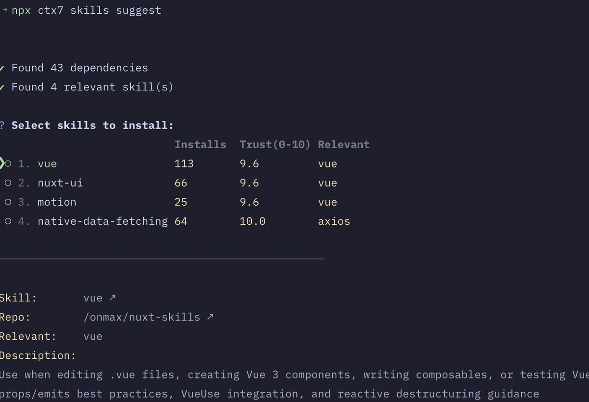

# Context7 Skills 工具：自動掃描專案依賴推薦 AI 編輯器擴展

> **來源**: [@vikingmute](https://x.com/vikingmute/status/2023757650715177246) | [原文連結](https://context7.com/docs/skills#suggest-skills)
>
> **日期**: 
>
> **標籤**: `開發工具` `AI助手` `工作流自動化`

---



> **來源**: [@vikingmute (Viking)](https://twitter.com/vikingmute)
> **日期**: 2026-02-18
> **標籤**: `Context7` `AI工具` `依賴管理` `Skills`

---

## 功能簡介

Context7 新推出的自動依賴掃描工具，可以根據專案的依賴自動推薦適合的 AI 編輯器 Skills。

## 使用方式

在專案資料夾下執行：

```bash
npx ctx7 skills suggest
```

工具會自動掃描 `package.json` 中的依賴，根據專案使用的技術棧推薦相應的 Skills。

## 已知限制

- Monorepo 支援不完整：目前只會掃描根目錄的依賴，無法遞迴掃描子專案

---

## Context7 Skills 完整指南

### 什麼是 Skills？

Skills 是可重複使用的提示詞模板（prompt templates），用於擴展 AI 程式助手的能力。它們遵循 [Agent Skills 開放標準](https://github.com/anthropics/agent-skills)，可跨多個 AI 編程工具使用。

**為什麼使用 Skills？**

- **標準化工作流程**：確保團隊中的程式碼審查、提交訊息或文件保持一致
- **分享專業知識**：將領域知識（例如「我們如何處理身份驗證」）打包為可重複使用的提示詞
- **節省時間**：安裝預建 Skills，而不是重複向 AI 助手解釋相同的模式

**熱門 Skills：**

| Skill | 功能 |
|-------|------|
| `vercel-react-best-practices` | 教導 Claude 現代 React 模式、Server Components 和效能優化 |
| `web-design-guidelines` | 指導 Claude UI/UX 原則、間距、排版和響應式佈局 |
| `pdf` / `docx` / `xlsx` | 讓 Claude 能夠讀取、建立和操作 Office 文件和 PDF |
| `supabase-postgres-best-practices` | 幫助 Claude 編寫優化的 Postgres 查詢、RLS 策略和授權流程 |
| `seo-audit` | 讓 Claude 分析頁面的 SEO 問題並提出改進建議 |
| `browser-use` | 允許 Claude 控制瀏覽器進行測試和自動化 |

### Context7 Skills Registry

Context7 Skills Registry 是一個可搜尋的 Skills 市場，從 GitHub 儲存庫索引。每個 Skill 都由其儲存庫路徑（例如 `/anthropics/skills`）和 Skill 名稱識別。

瀏覽或搜尋 Skills 時，你會看到：

| 欄位 | 說明 |
|------|------|
| Name | 用於安裝的 Skill 識別碼 |
| Description | Skill 的功能和使用時機 |
| Install Count | Skill 的安裝次數 |
| Trust Score | 品質和安全指標（0-10） |

**快速開始：**

```bash
# 搜尋 Skill
npx ctx7 skills search react

# 安裝熱門 Skill
npx ctx7 skills install /vercel-labs/agent-skills vercel-react-best-practices
```

### 信任分數（Trust Scores）

Registry 中的每個 Skill 都有一個 0 到 10 的信任分數，表示 Skill 來源的可靠性和安全性。

| 分數 | 等級 | 意義 |
|------|------|------|
| 7.0 - 10.0 | 高 | 已驗證或知名來源 |
| 3.0 - 6.9 | 中 | 標準社群貢獻 |
| 0.0 - 2.9 | 低 | 新的或未驗證 — 使用前請審查 |

信任分數幫助你做出明智的決定。較高的分數表示來自信譽良好的來源並經過社群驗證。

### 安全功能

Context7 自動掃描 Skills 以發現潛在的安全問題：

- **提示詞注入檢測**：包含潛在惡意指令的 Skills 將被阻止安裝
- **被阻止的 Skill 警告**：查看儲存庫時，你會看到因安全問題被阻止的 Skills 數量
- **清晰的錯誤訊息**：如果你嘗試安裝被阻止的 Skill，會收到具體的警告說明原因

### 前置需求

Skills 需要 Context7 CLI。你需要 Node.js 18 或更高版本。

```bash
# 使用 npx 直接執行（無需安裝）
npx ctx7 skills search pdf

# 或全域安裝以更快存取
npm install -g ctx7
```

## CLI 指令

### 安裝 Skills

從儲存庫安裝 Skills 到你的 AI 編程助手的 Skills 目錄。

```bash
# 從儲存庫互動式選擇
npx ctx7 skills install /anthropics/skills

# 安裝特定 Skill
npx ctx7 skills install /anthropics/skills pdf

# 一次安裝多個 Skills
npx ctx7 skills install /anthropics/skills pdf commit

# 安裝所有 Skills 而不提示
npx ctx7 skills install /anthropics/skills --all
```

**指定特定客戶端：**

```bash
npx ctx7 skills install /anthropics/skills pdf --claude
npx ctx7 skills install /anthropics/skills pdf --cursor
npx ctx7 skills install /anthropics/skills pdf --universal
npx ctx7 skills install /anthropics/skills pdf --antigravity
```

**全域安裝（在所有專案中可用）：**

```bash
npx ctx7 skills install /anthropics/skills pdf --global
```

安裝到多個客戶端時，CLI 會在主要客戶端目錄中建立 Skill 檔案，並建立符號連結到其他客戶端。

### 搜尋 Skills

在 Registry 中所有索引的儲存庫中尋找 Skills。

```bash
npx ctx7 skills search pdf
npx ctx7 skills search typescript
npx ctx7 skills search "react testing"
```

搜尋結果顯示：
- Skill 名稱和儲存庫
- 說明
- 安裝次數
- 信任分數

你可以透過互動式選擇從搜尋結果直接安裝 Skill。

### 推薦 Skills

根據專案的依賴自動發現相關的 Skills。CLI 掃描你的 `package.json`、`requirements.txt` 或 `pyproject.toml` 並從 Registry 推薦相符的 Skills。

```bash
# 掃描目前專案並推薦 Skills
npx ctx7 skills suggest

# 推薦並安裝到特定客戶端
npx ctx7 skills suggest --claude
npx ctx7 skills suggest --cursor
npx ctx7 skills suggest --universal

# 推薦並全域安裝
npx ctx7 skills suggest --global
```

**工作原理：**

1. 掃描專案中的依賴（支援 Node.js 和 Python）
2. 查詢 Context7 以找到與你的依賴相符的 Skills
3. 顯示結果，包含安裝次數、信任分數和相符的依賴
4. 讓你互動式選擇和安裝 Skills

**支援的依賴檔案：**

| 檔案 | 語言 |
|------|------|
| `package.json` | Node.js (dependencies + devDependencies) |
| `requirements.txt` | Python |
| `pyproject.toml` | Python (PEP 621 + Poetry) |

在新專案上執行 `npx ctx7 skills suggest` 以快速找到適合你技術棧的 Skills。

### 列出已安裝的 Skills

查看專案或全域安裝的 Skills。

```bash
# 列出所有已安裝的 Skills
npx ctx7 skills list

# 列出特定客戶端的 Skills
npx ctx7 skills list --claude
npx ctx7 skills list --cursor
npx ctx7 skills list --universal

# 列出全域安裝的 Skills
npx ctx7 skills list --global
```

### 顯示 Skill 資訊

取得儲存庫中所有可用 Skills 的詳細資訊。

```bash
npx ctx7 skills info /anthropics/skills
```

這會顯示：
- 可用的 Skill 名稱
- 說明
- 直接 URL
- 快速安裝指令

### 移除 Skills

從專案或全域目錄解除安裝 Skill。

```bash
# 互動式提示移除
npx ctx7 skills remove pdf

# 從特定客戶端移除
npx ctx7 skills remove pdf --claude
npx ctx7 skills remove pdf --universal

# 從全域目錄移除
npx ctx7 skills remove pdf --global
```

## 生成自訂 Skills

使用 AI 建立針對你特定需求量身定制的自訂 Skills。此功能需要身份驗證。

### 身份驗證

```bash
# 登入（開啟瀏覽器進行 OAuth）
npx ctx7 login

# 檢查登入狀態
npx ctx7 whoami

# 登出
npx ctx7 logout
```

### 生成 Skill

```bash
# 開始互動式生成
npx ctx7 skills generate

# 為特定客戶端生成
npx ctx7 skills generate --cursor
npx ctx7 skills generate --claude
npx ctx7 skills generate --universal

# 生成為全域 Skill
npx ctx7 skills generate --global
```

### 生成工作流程

1. **描述你的專業知識**：輸入你希望 Skill 做什麼（例如「使用 NextAuth.js 的 OAuth 身份驗證最佳實踐」）
2. **選擇文件**：搜尋並選擇相關的函式庫以提供 Skill 資訊
3. **回答問題**：回答 3 個澄清問題以聚焦 Skill
4. **審查**：查看生成的 Skill 並選擇性地請求變更
5. **安裝**：將 Skill 儲存到你選擇的客戶端

**提示**：描述最佳實踐和約束，而不是逐步教程。例如，「TypeScript 嚴格模式模式」比「如何編寫 TypeScript」更好。

## 支援的客戶端

CLI 自動檢測已安裝的 AI 編程助手，並提供為它們安裝 Skills。

| 客戶端 | 專案目錄 | 全域目錄 |
|--------|----------|----------|
| Universal (Amp, Codex, Gemini CLI, GitHub Copilot, OpenCode 等) | `.agents/skills/` | `~/.config/agents/skills/` |
| Claude Code | `.claude/skills/` | `~/.claude/skills/` |
| Cursor | `.cursor/skills/` | `~/.cursor/skills/` |
| Antigravity | `.agent/skills/` | `~/.agent/skills/` |

**專案 vs 全域：**

- **專案 Skills（預設）**：安裝在目前專案目錄中，僅在該專案中可用
- **全域 Skills（`--global`）**：安裝在主目錄中，在所有專案中可用

## Skill 檔案結構

每個 Skill 都是一個至少包含 `SKILL.md` 檔案的目錄：

```
my-skill/
├── SKILL.md       # 主要指令（必需）
├── templates/     # 可選模板
├── examples/      # 可選範例輸出
└── scripts/       # 可選可執行腳本
```

### SKILL.md 格式

Skills 使用 YAML frontmatter，後面接 markdown 指令：

```markdown
---
name: my-skill
description: 這個 Skill 做什麼以及何時使用
---

AI 助手的指令放在這裡。
使用 markdown 格式、程式碼範例和清晰的步驟。
```

| 欄位 | 必需 | 說明 |
|------|------|------|
| `name` | 是 | Skill 的識別碼（小寫，允許連字號） |
| `description` | 是 | 解釋 Skill 的功能 — 用於發現 |

markdown 主體包含你的 AI 助手在呼叫 Skill 時遵循的實際指令。

## 指令快捷方式

為了更快使用，CLI 提供短別名：

| 快捷方式 | 完整指令 |
|----------|----------|
| `npx ctx7 si` | `npx ctx7 skills install` |
| `npx ctx7 ss` | `npx ctx7 skills search` |
| `npx ctx7 ssg` | `npx ctx7 skills suggest` |
| `npx ctx7 skills i` | `npx ctx7 skills install` |
| `npx ctx7 skills s` | `npx ctx7 skills search` |
| `npx ctx7 skills ls` | `npx ctx7 skills list` |
| `npx ctx7 skills rm` | `npx ctx7 skills remove` |
| `npx ctx7 skills gen` | `npx ctx7 skills generate` |
| `npx ctx7 skills g` | `npx ctx7 skills generate` |

## 故障排除

### 權限被拒絕

如果安裝或移除 Skills 時看到權限錯誤：

```bash
# 全域安裝時嘗試使用 sudo
sudo npx ctx7 skills install /anthropics/skills pdf --global
```

或修復目錄權限：

```bash
sudo chown -R $(whoami) ~/.claude/skills
```

### 因提示詞注入被阻止的 Skill

如果 Skill 被阻止，表示它包含被標記為潛在惡意的內容。這是一個安全功能 — 該 Skill 無法安裝。

```
Error: This skill contains potentially malicious content and cannot be installed.
Consider using an alternative skill or contacting the skill author.
```

### 未檢測到客戶端

如果未檢測到你的 AI 編程助手，請確保其設定目錄存在：

```bash
# 對於 Claude Code
mkdir -p .claude

# 對於 Cursor
mkdir -p .cursor
```

### 身份驗證問題

如果登入失敗或令牌過期：

```bash
# 清除儲存的憑證
npx ctx7 logout

# 重新登入
npx ctx7 login
```

### 停用遙測

CLI 收集匿名使用資料以幫助改進產品。要停用遙測，請設定 `CTX7_TELEMETRY_DISABLED` 環境變數：

```bash
# 對於單個指令
CTX7_TELEMETRY_DISABLED=1 npx ctx7 skills search pdf

# 或在 shell 設定檔中匯出（~/.bashrc、~/.zshrc 等）
export CTX7_TELEMETRY_DISABLED=1
```

## 相關連結

- [Context7 Skills Registry](https://context7.com/skills)
- [Claude Code Skills 文件](https://docs.claude.ai/code/skills)
- [Agent Skills 規範](https://github.com/anthropics/agent-skills)
