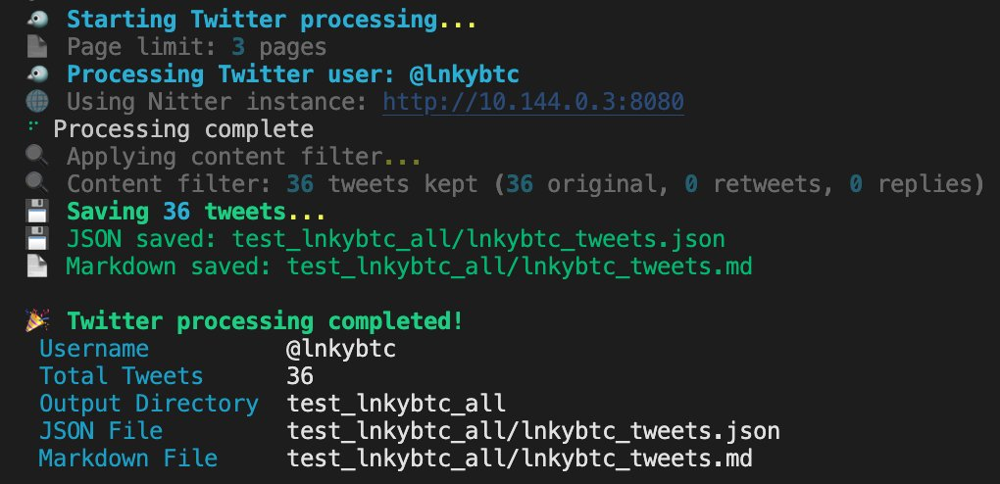

# 打造個人資訊系統：X 推文篩選與學習策略

> **來源**: [@0xLogicLog](https://x.com/0xLogicLog/status/1959498640919294269) | [原文連結](https://twitter.com/jiahao_luo9/status/1959498640919294269/photo/1)
>
> **日期**: Sun Aug 24 06:10:56 +0000 2025
>
> **標籤**: `資訊管理` `知識篩選` `推文工具`

---

> **來源**: [@0xLogicLog (羅格 | Web3安全 & 套利)](https://x.com/0xLogicLog)
> **日期**: 2026-02-18
> **標籤**: `資訊管理` `X推文` `學習策略` `個人成長`

---

準備把我覺得認知超過我的人的 post，都來學習一下。找到真大佬，學習他們看事情的角度。排除干擾，找到寶藏。

刷推很花時間，超過 100 個人，一天其實就看不過來了。全自動刷推，還很好用。

打造個人的資訊系統,我感覺漸入佳境了。
