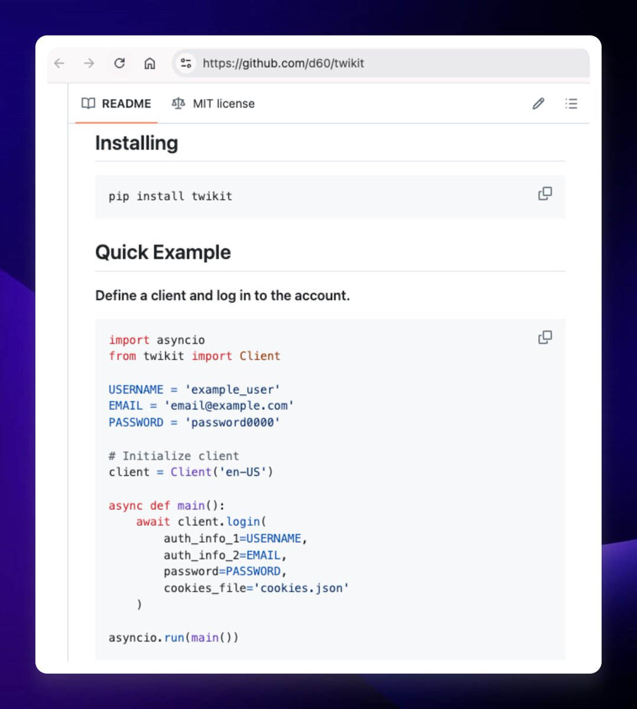

# Twikit：免費的 X API 開源替代方案

> **來源**: [@interjc](https://x.com/interjc/status/1956522631089533334) | [原文連結](https://twitter.com/interjc/status/1956522631089533334/photo/1)
>
> **日期**: Sat Aug 16 01:05:20 +0000 2025
>
> **標籤**: `API` `開發工具` `Python`

---

> **來源**: [@interjc (Justin)](https://x.com/interjc)  
> **日期**: 2026-02-18  
> **標籤**: `API` `開源工具` `Python` `爬蟲` `自動化`

---

## 問題背景

X 的官方 API 價格過高，即便是第三方 API 也要 20 多美元一個月。

## 解決方案：Twikit

Twikit 是一個基於 Python 的開源 X API 替代方案。

**運作原理**：
- 登入一個 X 帳號
- 模擬瀏覽器訪問 https://t.co/JBKJXNyB9i
- 透過自動化方式取得 X 平台的資料

**主要優勢**：
- 完全免費
- 開源專案
- 基於 Python，易於整合到現有專案
